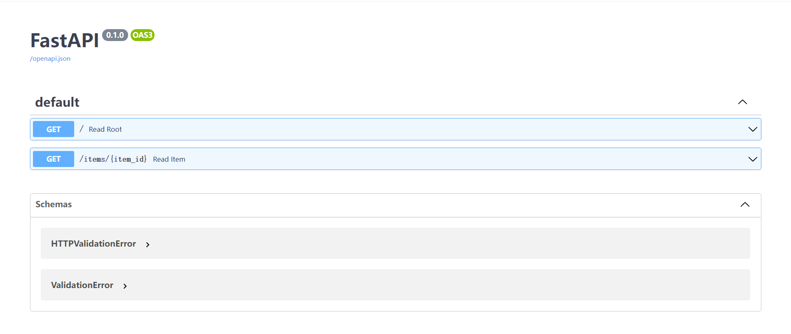

# FastAPI 简单案例

创建一个简单的 FastAPI 示例。首先，确保您已经安装了 FastAPI 和 Uvicorn。如果没有，请于终端下使用以下命令安装：

```bash
pip install fastapi uvicorn
```

:::info

看到'`Successfully installed pip-[版本号]`'证明安装成功

接下来，我们将创建一个简单的 FastAPI 应用。

:::
在您选择的目录中，创建一个名为 example.py 的文件，并将以下代码粘贴到文件中：

```python
from fastapi import FastAPI #导入FastAPI库

app = FastAPI() #创建FastAPI应用实例

@app.get("/") #定义根路由
def read_root():
    return {"Hello": "World"}

@app.get("/items/{item_id}") #定义路由
def read_item(item_id: int, q: str = None):
    return {"item_id": item_id, "q": q}
```

:::info
在这个例子中，我们创建了一个 FastAPI 实例，并定义了两个路由。

第一个路由是根路由，当用户访问应用的根 URL 时，它将返回一个简单的 JSON 响应。

第二个路由是一个带有参数的路由，它接受一个整数 `item_id` 和一个可选的查询参数 q。
:::

要运行此应用，请在终端命令行中导航到包含 example.py 的目录，

```bash
cd [目录路径]
```

运行以下命令：

```bash
uvicorn example:app --reload
```

终端反馈：

```bash
PS E:\Python\FastAPI> uvicorn example:app --reload
INFO:     Will watch for changes in these directories: ['E:\\Python\\FastAPI']
INFO:     Uvicorn running on http://127.0.0.1:8000 (Press CTRL+C to quit)
INFO:     Started reloader process [2908] using StatReload
INFO:     Started server process [31516]
INFO:     Waiting for application startup.
INFO:     Application startup complete.
```

:::tip

现在，同学们的 FastAPI 应用应该在 `http://127.0.0.1:8000` （以实际结果链接）上运行。

同学们可以通过访问 `http://127.0.0.1:8000/items/42?q=test` 来测试带有参数的路由。

此外，FastAPI 自动生成了一个交互式 API 文档，你可以通过访问 `http://127.0.0.1:8000/docs` 来查看和测试您的 API。



退出请在终端中按Ctrl+C.

:::

# 创建 FastAPI 应用实例

在上述简单实例中：

```python
app = FastAPI() #创建一个 FastAPI 应用程序实例
```

:::info
您可以使用这个实例来定义路由、中间件、异常处理程序等。

例如，您可以使用 `app.get()` 方法来定义一个 `GET` 路由，使用 `app.post()` 方法来定义一个 `POST` 路由，以此类推。

在 app 实例上调用这些方法时，您需要提供路由的路径和处理程序函数。处理程序函数应该返回一个响应，例如一个 JSON 对象。
:::

# 路由与 HTTP 方法

在简单实例代码中：

文件中的http方法是使用 FastAPI 库创建的。这个库提供了一种简单的方式来定义 HTTP 路由和处理程序函数。

```python
@app.get("/") # 定义了一个根路由
@app.get("/items/{item_id}") # 定义了一个带有路径参数和可选查询参数的路由。
```

:::info

当请求到达这些路由时，装饰的函数将被调用来处理请求，并返回 JSON 响应。

您可以使用 `@app.post()`、`@app.put()`、`@app.delete()` 和 `@app.patch()` 装饰器来定义其他类型的路由。

您还可以使用 `@app.middleware()` 装饰器来定义中间件函数，使用 `@app.exception_handler()` 装饰器来定义异常处理程序等等。更多关于 FastAPI 的信息和示例，请查看 [FastAPI 文档](https://fastapi.tiangolo.com/) 。

:::

路由：

:::note

这里引入「路径」，指的是 URL 中从第一个 / 起的后半部分。

所以，在一个这样的 URL 中：

```json
https://example.com/items/foo
```

路径会是：

```json
/items/foo
```

「路径」也通常被称为「端点」或「路由」。
:::

操作(HTTP方法)：
:::note

- POST : 创建数据
- GET ：读取数据
- PUT ：更新数据
- DELETE : 删除数据
- OPTIONS
- HEAD
- PATCH
- TRACE
:::

装饰器：

:::note
`@something` 语法在 Python 中被称为「装饰器」。

像一顶漂亮的装饰帽一样，将它放在一个函数的上方（我猜测这个术语的命名就是这么来的）。

装饰器接收位于其下方的函数并且用它完成一些工作。

在我们的例子中，这个装饰器告诉 FastAPI 位于其下方的函数对应着路径 `/` 加上 `get` 操作。

它是一个「路径操作装饰器」。
:::

:::tip
您可以随意使用任何一个操作（HTTP方法）。

FastAPI 没有强制要求操作有任何特定的含义。

此处提供的信息仅作为指导，而不是要求。

比如，当使用 GraphQL 时通常你所有的动作都通过 `post` 一种方法执行。
:::

# 路径参数与查询参数

```python
def read_item(item_id: int, q: str = None):
    return {"item_id": item_id, "q": q}
```

:::info

在提供的代码中，`read_item`函数处理了`GET`请求到`/items/{item_id}`端点。

`{item_id}`部分是路径参数，将作为参数（在这种情况下是`item_id`）传递给函数。

函数签名中的`q`参数是查询参数，可以作为键值对（例如`?q=search_term`）包含在URL中，并作为参数（在这种情况下是`q`）传递给函数。

请注意，q参数具有默认值None，这意味着它是可选的。

因此，`read_item`函数处理了`GET`请求到`/items/{item_id}`端点，其中包括一个路径参数（`item_id`）和一个可选的查询参数（`q`）

:::
