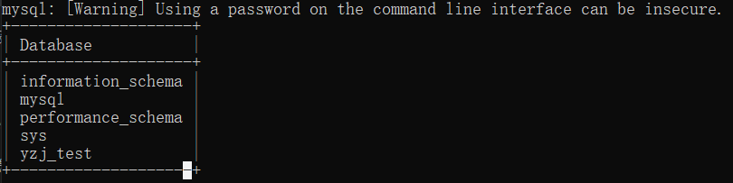

# MySQL 基本操作

## MySQL 命令行工具

MySQL常用的命令行工具主要分为客户端命令行工具和服务器命令行工具两种，分别只能运行在mysql客户端和mysql服务器上，即mysql中的客户端命令行工具使用时需要设置登录选项，而服务器命令行工具可以在服务器上直接使用

### mysql客户端

__以下操作均在命令提示符中运行__

语法：

```MySQL
    mysql [options] [database]
```

常用登录选项：

```MySQL
    -u, --user=name				指定用户名
    -p, --password[=name]		指定密码
    -h, --host=name				指定服务器ip或域名
    -P, --port=port				指定连接端口
```

示例1：

使用 `mysql-root` 用户连接当前主机 mysql 服务器

```MySQL
    mysql -u root -p
```


使用明文密码登录，并连接指定数据库 `db_test01` 

```MySQL    
    mysql -u root -p"******" YZJ_test
```


常用执行选项：

```MySQL
    -e --execute=name			建立连接后执行SQL语句返回结果后退出客户端,可以执行多条SQL语句
```

*此选项常用于 `Shell` 批处理脚本*

示例2：

查看 mysql 服务器上的数据库列表

```MySQL
    mysql -u root -p"******" -e "show databases;"
```



查看 mysql 服务器上的数据库 mysql 中的表信息

```MySQL    
    mysql -u root -p"******" mysql -e "show tables;"
```


### mysqladmin
 `mysqladmin` 是一个执行管理操作的 mysql 客户端命令行工具，需要登录使用，可以用它来检查服务器的配置和当前状态、创建、以及删除数据库等

语法：

```MySQL
    mysqladmin [options] database
```

示例：

查看 `mysqladmin` 帮助文档

```MySQL
    mysqladmin --help
```

使用 `mysqladmin` 创建数据库

```MySQL
    mysqladmin -u root -p"******" create "YZJ_test2"
```

使用 `mysqladmin` 删除数据库

```MySQL
    mysqladmin -u root -p"******" drop "YZJ_test2"
```

### mysqlbinlog
 `mysqlbinlog` 主要用于查看和管理mysql服务器生成的二进制日志bin-log对应的文件，是mysql服务器命令行工具。启动 `bin-log` 日志后会在对应路径下生成日志索引文件(.index)和对应的日志文件，日志索引文件中记录有 `bin-log` 日志文件名。可以使用mysqlbinlog配合二进制文件实现数据恢复，即在最近数据库备份的基础上将二进制文件中的指定范围内逻辑SQL语句再执行一次

语法：

```MySQL
    mysqlbinlog [options] log-files1 log-files2...
```

常用选项：

```MySQL
    -d, --database=name				指定数据库名称
    -o, --offset=n					设置查看的偏移量,即忽略前n行
    -r, --result-file=name			将显示内容输出到指定文件
    -s, --short-from				按照简单格式显示,省略部分信息
    --start-datatime=detel --stop-datatime=date2
    								指定日志显示条目的时间间隔
    --start-position=pos1 --stop-position=pos2
	    							指定日志显示条目的开始和结束位置
```

示例：

查看指定的 `bin-log` 日志文件

```MySQL
    mysqlbinlog mysql-bin.000001
```

### mysqldump

 `mysqldump` 工具主要用于备份数据库或者指定的表数据，以及进行数据迁移。备份内容包含有创建表，及插入表的SQL语句，默认输出到命令行。

在 __数据库备份与恢复__ 中我们会具体了解其用法。

### source

 `source` 是属于mysql客户端的命令，主要是用于在mysql客户端命令行上批量执行sql语句使用的，可以配合 `mysqldump` 工具实现数据库或者表的迁移

同样，在 __数据库备份与恢复__ 中我们会具体了解其用法

## VS Code MySQL 插件

*"什么？您想到通过强大的 `VS Code` 使用 `MySQL?`"* 

*"那我觉得这件事情——泰裤辣!!"* 

首先，我们要安装如下两个插件：


配置连接


根据数据库测试成功对话框信息，

* host = localhost

* user = root

* password = （你自己的密码） 

* port =3306 （一般是）

* certificate file path （可省略）

以 host 为例：


最后对 `VS Code` 中配置链接：

选择数据库，右击，下拉菜单选择 `New Query` 


在写好sql语句之后，在脚本文件窗口右击，选择 `run mysql quary` 选项或者快捷键`ctrl+alt+e`；


至此已完全配置好。

__如果您没有出现错误，请忽视以下内容__

问题就是，在配置完链接后出现错误：

    ER_NOT_SUPPORTED_AUTH_MODE: Client does not support authentication protocol requested by server; consider upgrading MySQL client

这个是MySQL 8 加密模式导致的，以下是解决方法：

登录MySQL，在命令行输入：

```MySQL
    ALTER USER '用户名'@'localhost' IDENTIFIED WITH mysql_native_password BY '密码'
```

在此案例中是

```MySQL
    ALTER USER 'root'@'localhost' IDENTIFIED WITH mysql_native_password BY 'password'
```

再执行如下代码，刷新权限表：

```MySQL
    flush privileges
```

效果如下：


## 数据库基本操作

 *"准备好了吗,孩子们？是的船长！"*

### 创建和删除数据库

我们可以在登陆 MySQL 服务后，使用 `create` 命令创建数据库，语法如下:

```MySQL
    CREATE DATABASE 数据库名;
```

以下命令简单的演示了创建数据库的过程，数据名为 `YZJ_test` :

```MySQL
    CREATE DATABASE YZJ_test:
```

使用普通用户登陆 MySQL 服务器，你可能需要特定的权限来创建或者删除 MySQL 数据库，所以我们这边使用 `root` 用户登录，`root` 用户拥有最高权限。

在删除数据库过程中，务必要十分谨慎，因为在执行删除命令后，所有数据将会消失。

 `DROP` 命令格式：

```MySQL
    DROP DATABASE <数据库名>;
```

例如删除名为 `YZJ_test` 的数据库：

```MySQL
    DROP DATABSE YZJ_test;
```

### 选择和查看数据库

在你连接到 MySQL 数据库后，可能有多个可以操作的数据库，所以你需要选择你要操作的数据库。

从命令提示窗口中选择MySQL数据库

在 `mysql>` 提示窗口中可以很简单的选择特定的数据库。你可以使用SQL命令来选择指定的数据库。

以下实例选取了数据库 `YZJ_test` :

```MySQL
    USE YZJ_test;
    Database changed
```

执行以上命令后，你就已经成功选择了 `YZJ_test` 数据库，在后续的操作中都会在 `YZJ_test` 数据库中执行。

### 数据库备份与恢复

__使用 `mysqldump` 进行备份__

格式：

```MySQL 
    mysqldump -u *用户名* -P *（端口）* -p *（数据库名）* > *(路径)*
```

示例：

```MySQL
    mysqldump -u root -p3308 -p YZJ_test > C:test.sql
```

备份导出示例：


__注意：本操作需在命令提示符而非MySQL中进行！__


__使用 `Source` 进行恢复__

 `source` 命令导入数据库需要先登录到数库终端：

```MySQL
    mysql> create database abc;      # 创建数据库abc
    mysql> use abc;                  # 使用已创建的数据库 
    mysql> source /home/abc/abc.sql  # 导入备份数据库所在的路径
```


__注意：本操作需在符`MySQL`而非`命令提示符`中进行！__
