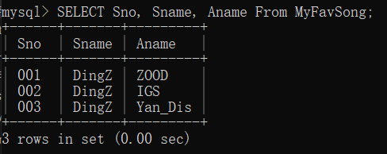
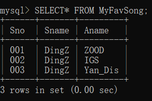

  ---
id: sql
sidebar_position: 4
---

# SQL 语言基础

*捂热你的鼠标，连好你的键盘，接下来我们用的是——真家伙！*

以此表（MyFavSong）为例：

* 键：`Sno`(歌曲编号)

* 列：`Sname`（歌手名），`Aname`（专辑名）

* 表头：`Sno, Sname, Aname`

* 行：例如 `('001', 'DingZ', 'ZOOD')`

## SQL 语言简介

SQL 语言是结构化查询语言 *(Structured Query Language)* 的简称，是一种用于存取数据以及查询、更新和管理关系数据库系统的数据库语言。SQL 是一门 ANSI 的标准计算机语言，可以与不同的数据库程序协同工作，如 MS Access、DB2、Informix、MS SQL Server、Oracle、Sybase 等。SQL 的范围包括数据插入、查询、更新和删除，数据库模式创建和修改，以及数据访问控制。


## 数据插入（`INSERT`）

 `INSERT INTO` 语句用于向表中插入(增)新记录。

 `INSERT INTO` 语句可以有两种编写形式。

第一种形式无需指定要插入数据的列名，只需提供被插入的值即可：

```MySQL
    INSERT INTO table_name
    VALUES (value1,value2,value3,...);
```

第二种形式需要指定列名及被插入的值：

```MySQL
    INSERT INTO table_name (column1,column2,column3,...)
    VALUES (value1,value2,value3,...);
```

参数说明：

* `table_name`：需要插入新记录的表名。
* `column1` , `column2` , ...：需要插入的字段名。
* `value1`, `value2`, ...：需要插入的字段值。

是不是感觉很简单？但如果您感觉不够直观，别急...

### 演示数据库

在本教程中，我们将使用 `YZJ_test` 样本数据库。
下面是选自 "MyFavSong" 表的数据：

<table>
  <tr>
    <th>Sno</th>
    <th>Sname</th>
    <th>Aname</th>
  </tr>
  <tr>
    <td>001</td>
    <td>DingZ</td>
    <td>ZOOD</td>
  </tr>
</table>

### `INSERT INTO` 实例

假设我们要向 "`MyFavSong`" 表中插入一个新行。

我们可以使用下面的 SQL 语句：

```MySQL
    INSERT INTO MyFavSong
    VALUES ('002','DingZ','IGS');
```

<table>
  <tr>
    <th>Sno</th>
    <th>Sname</th>
    <th>Aname</th>
  </tr>
  <tr>
    <td>001</td>
    <td>DingZ</td>
    <td>ZOOD</td>
  </tr>
  <tr>
    <td>002</td>
    <td>DingZ</td>
    <td>IGS</td>
  </tr>
</table>

### 在指定的列插入数据

我们也可以在指定的列插入数据。

下面的 SQL 语句将插入一个新行，在 "`Sno`"、"`Sname`" 和 "`Aname`" 列插入数据：

```MySQL
    INSERT INTO MyFavSong (Sno,Sname,Aname)
    VALUES ('003','DingZ','Yan_Dis');
```

<table>
  <tr>
    <th>Sno</th>
    <th>Sname</th>
    <th>Aname</th>
  </tr>
  <tr>
    <td>001</td>
    <td>DingZ</td>
    <td>ZOOD</td>
  </tr>
  <tr>
    <td>002</td>
    <td>DingZ</td>
    <td>IGS</td>
  </tr>
  <tr>
    <td>003</td>
    <td>DingZ</td>
    <td>Yan_Dis</td>
  </tr>
</table>


## 数据删除（`DELETE`）

`DELETE` 语句用于删除（删）表中的行。

SQL `DELETE` 语法

```MySQL
    DELETE FROM table_name
    WHERE condition;
```

参数说明：

* `table_name`：要删除的表名称。
* `condition`：删除条件，用于指定哪些数据要删除。

还是不够直观？继续有请我们的图片示例...

### 演示数据库

在本教程中，我们将使用 `YZJ_test` 样本数据库。
下面是选自 "`MyFavSong`" 表的数据：

<table>
  <tr>
    <th>Sno</th>
    <th>Sname</th>
    <th>Aname</th>
  </tr>
  <tr>
    <td>001</td>
    <td>DingZ</td>
    <td>ZOOD</td>
  </tr>
  <tr>
    <td>002</td>
    <td>DingZ</td>
    <td>IGS</td>
  </tr>
  <tr>
    <td>003</td>
    <td>DingZ</td>
    <td>Yan_Dis</td>
  </tr>
</table>

### SQL `DELETE` 实例

假设我们要从 "`MyFavSong`" 表中删除歌手名为 "DingZ" 且专辑名为 "IGS"的专辑。

我们使用下面的 SQL 语句：

```MySQL
    DELETE FROM MyFavSong
    WHERE Sname='DingZ' AND Aname='IGS';
```

<table>
  <tr>
    <th>Sno</th>
    <th>Sname</th>
    <th>Aname</th>
  </tr>
  <tr>
    <td>001</td>
    <td>DingZ</td>
    <td>ZOOD</td>
  </tr>
  <tr>
    <td>003</td>
    <td>DingZ</td>
    <td>Yan_Dis</td>
  </tr>
</table>

### 删除所有数据
您可以在不删除表的情况下，删除表中所有的行。这意味着表结构、属性、索引将保持不变：

```MySQL
    DELETE FROM table_name;
```

__注释：在删除记录时要格外小心！因为您不能重来！__


## 数据更新（`UPDATE`）

 `UPDATE` 语句用于更新（改）表中已存在的记录。

SQL `UPDATE` 语法

```MySQL    
    UPDATE table_name
    SET column1 = value1, column2 = value2, ...
    WHERE condition;
```

参数说明：

* `table_name`：要修改的表名称。
* `column1`, `column2`, ...：要修改的字段名称，可以为多个字段。
* `value1`, `value2`, ...：要修改的值，可以为多个值。
* `condition`：修改条件，用于指定哪些数据要修改。

如果您还是没法完全理解，请庆幸我的示例部分写得很完整...

### 演示数据库

在本教程中，我们将使用 `YZJ_test` 样本数据库。
下面是选自 "`MyFavSong`" 表的数据：

<table>
  <tr>
    <th>Sno</th>
    <th>Sname</th>
    <th>Aname</th>
  </tr>
  <tr>
    <td>001</td>
    <td>DingZ</td>
    <td>ZOOD</td>
  </tr>
  <tr>
    <td>002</td>
    <td>DingZ</td>
    <td>IGS</td>
  </tr>
  <tr>
    <td>003</td>
    <td>DingZ</td>
    <td>Yan_Dis</td>
  </tr>
</table>

### SQL `UPDATE` 实例
假设我们要把 "`MyFavSong`" 中 'Mr.DingZ' 的 '002' 号专辑由 'IGS' 改为 'LT_Road'。

我们使用下面的 SQL 语句：

```MySQL
    UPDATE MyFavSong 
    SET Aname = 'LT_Road' 
    WHERE Sno = '002'
    AND Sname = 'DingZ';
```

<table>
  <tr>
    <th>Sno</th>
    <th>Sname</th>
    <th>Aname</th>
  </tr>
  <tr>
    <td>001</td>
    <td>DingZ</td>
    <td>ZOOD</td>
  </tr>
  <tr>
    <td>002</td>
    <td>DingZ</td>
    <td>LT_Road</td>
  </tr>
  <tr>
    <td>003</td>
    <td>DingZ</td>
    <td>Yan_Dis</td>
  </tr>
</table>

### __`Update` 警告！__

在更新记录时要格外小心！在上面的实例中，如果我们省略了 `WHERE` 子句，如下所示：

```MySQL
    UPDATE MyFavSong
    SET Aname = 'LT_Road' 
```
    
执行以上代码会将 "`MyFavSong`" 表中所有数据的 "`Aname`" 改 'LT_Road' 。

执行没有 `WHERE` 子句的 `UPDATE` 要慎重，再慎重。

<table>
  <tr>
    <th>Sno</th>
    <th>Sname</th>
    <th>Aname</th>

  </tr>
  <tr>
    <td>001</td>
    <td>DingZ</td>
    <td>LT_Road</td>
  </tr>
  <tr>
    <td>002</td>
    <td>DingZ</td>
    <td>LT_Road</td>
  </tr>
  <tr>
    <td>003</td>
    <td>DingZ</td>
    <td>LT_Road</td>
  </tr>
</table>

## 数据查询（`SELECT`）

`SELECT` 语句用于从数据库中选取（查）数据。

结果被存储在一个结果表中，称为结果集。

```MySQL
    SELECT column1, column2, ...
    FROM table_name;
```

或者，如果您想一步查询所有字段的话 ~~（可也能您只是很懒）~~ 

```MySQL
    SELECT * 
    FROM table_name;
```

参数说明：

* `column1`, `column2`, ...：要选择的字段名称，可以为多个字段。如果不指定字段名称，则会选择所有字段。
* `table_name`：要查询的表名称。

还不懂？还好本章节的最后这部分的示例质量也足够上乘！

### 演示数据库

在本教程中，我们将使用 `YZJ_test` 样本数据库。
下面是选自 "`MyFavSong`" 表的数据：

<table>
  <tr>
    <th>Sno</th>
    <th>Sname</th>
    <th>Aname</th>
  </tr>
  <tr>
    <td>001</td>
    <td>DingZ</td>
    <td>ZOOD</td>
  </tr>
  <tr>
    <td>002</td>
    <td>DingZ</td>
    <td>IGS</td>
  </tr>
  <tr>
    <td>003</td>
    <td>DingZ</td>
    <td>Yan_Dis</td>
  </tr>
</table>

### SELECT `Column` 实例

下面的 SQL 语句从 "`MyFavSong`" 表中选取 "`Sno`"，"`Sname`"，"`Aname`"列：

```MySQL
    SELECT Sno,Sname,Aname
    FROM MyFavSong;
```



### `SELECT *` 实例

下面的 SQL 语句从 "`MyFavSong`" 表中选取所有列：

```MySQL
    SELECT *
    FROM MyFavSong;
```




