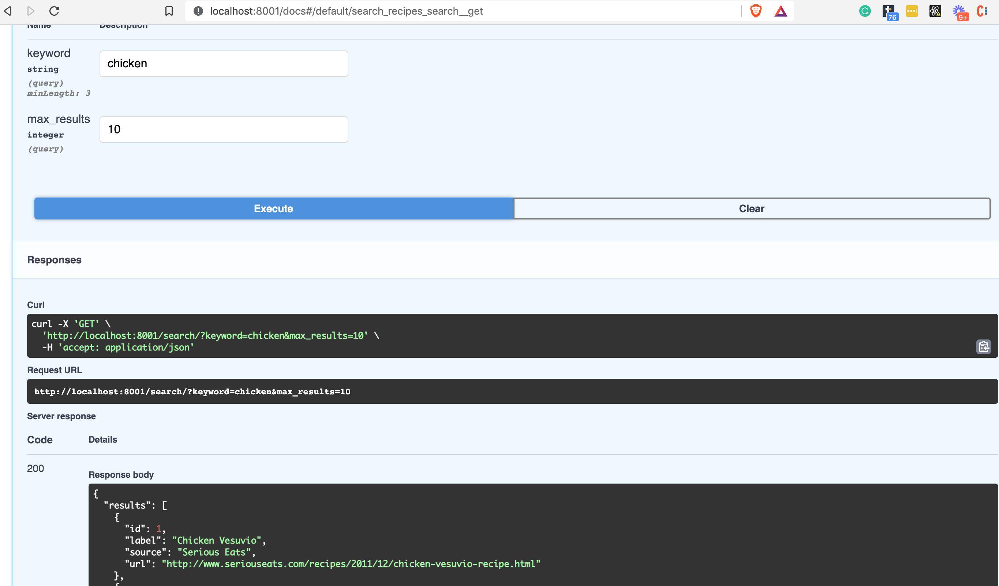

# 第4部分 - Pydantic 架构

*在FastAPI教程的第4部分，我们将看一下带有Pydantic验证的API端点*

## Pydantic简介

Pydantic将自己描述为： *使用python类型注释的数据验证和设置管理。*

它是一种工具，可以使你的数据结构更加精确。例如，到目前为止，我们一直在依靠一个字典来定义我们项目中的典型配方。有了Pydantic，我们可以这样定义一个配方：

```Python
    from pydantic import BaseModel

    class Recipe(BaseModel):
        id: int
        label: str
        source: str

    raw_recipe = {'id': 1, 'label': 'Lasagna', 'source': 'Grandma Wisdom'}
    structured_recipe = Recipe(**raw_recipe)
    print(structured_recipe.id)
    #> 1
```

在这个简单的例子中，该类继承自Pydantic ，而且我们可以使用标准的Python类型提示来定义它的每个预期字段及其类型。`RecipeBaseModel`

除了使用该模块的`标准类型`之外，你还可以像这样递归地使用Pydantic模型：`键入`

```Python
    from pydantic import BaseModel

    class Car(BaseModel):
        brand: str
        color: str
        gears: int


    class ParkingLot(BaseModel):
        cars: List[Car]  # recursively use `Car`
        spaces: int
```

当你结合这些能力时，你可以定义非常复杂的对象。这仅仅是Pydantic能力的表面，下面是对其优点的快速总结：

* 没有新的微观语言需要学习 *（这意味着它与IDEs/linters玩得很好）*

* 对 "验证这个请求/响应数据 "和加载配置都非常好

* 验证复杂的数据结构--Pydantic提供了极其细化的`验证器`
  
* 可扩展的--你可以创建自定义的数据类型

* 与Python数据类一起工作

* 它非常快

## 2. 实用部分 - 使用Pydantic与FastAPI

如果你还没有准备好，请继续克隆`example project repo`请看本地`setup.README`的文件

在该文件中，你会发现以下新代码：`app/main.py`

```Python
    from app.schemas import RecipeSearchResults, Recipe, RecipeCreate
    # skipping...

    # 1 Updated to use a response_model
    @api_router.get("/recipe/{recipe_id}", status_code=200, response_model=Recipe)
    def fetch_recipe(*, recipe_id: int) -> dict:
        """
        Fetch a single recipe by ID
        """

        result = [recipe for recipe in RECIPES if recipe["id"] == recipe_id]
        if result:
            return result[0]

    # skipping...
```

响应模型是从一个新文件中导入的。让我们看看文件的相关部分：`Recipeschemas.pyapp/schemas.py`

```Python
    from pydantic import BaseModel, HttpUrl

    # 2
    class Recipe(BaseModel):
        id: int
        label: str
        source: str
        url: HttpUrl  # 3

    # skipping...
```

让我们把它分解一下：

1. 我们的路径参数端点 ，我们在`第2部分`中介绍的，已经被更新为包括一个字段。在这里，我们定义了JSON响应的结构，我们通过`Pydantic./recipe/{recipe_id}response_model`来做到这一点。

2. 这个新的类继承自pydantic ，而且每个字段都是用标准的类型提示来定义的`......RecipeBaseModel`

3. ...除了字段，它使用了Pydantic帮助器。这将强制执行预期的URL组件，比如存在一个方案（http或https）.`urlHttpUrl`

接下来，我们已经更新了搜索端点：

```Python
    # app/main.py
    from fastapi import FastAPI, APIRouter, Query

    from typing import Optional

    from app.schemas import RecipeSearchResults
    # skipping...

    # 1
    @api_router.get("/search/", status_code=200, response_model=RecipeSearchResults)
    def search_recipes(
        *,
        keyword: Optional[str] = Query(None, min_length=3, example="chicken"),  # 2
        max_results: Optional[int] = 10
    ) -> dict:
        """
        Search for recipes based on label keyword
        """
        if not keyword:
            # we use Python list slicing to limit results
            # based on the max_results query parameter
            return {"results": RECIPES[:max_results]}

        results = filter(lambda recipe: keyword.lower() in recipe["label"].lower(), RECIPES)
        return {"results": list(results)[:max_results]}

    # skipping...
```

现在我们来看看`app/schemas.py`

```Python
    # skipping...

    # 3
    class RecipeSearchResults(BaseModel):
        results: Sequence[Recipe]  # 4
```

1 我们已经在我们的`/search`端点上添加了一个`response_model RecipeSearchResults`。



*请注意，响应格式与模式相匹配（如果不是这样，我们会得到一个Pydantic验证错误）。*

1. 我们引入FastAPI`查询`类，它允许我们为我们的查询参数添加额外的验证和要求，如最小长度。请注意，因为我们已经设置了`示例`字段，所以当你 "试一试 "时，这就会显示在文档页面上。

2. `RecipeSearchResults`类使用Pydantic的递归能力来定义一个字段，该字段指向我们先前定义的另一个Pydantic类，即`Recipe`类。我们指定，`结果`字段将是一个Recipe的`Sequence`（这是一个支持`len`和`__getitem__`的迭代器）。

做完这一切之后（并遵循`README`的设置说明），你就可以用这个命令来运行示例 repo中的代码： `poetry run ./run.sh`

导航到`localhost:8001/docs`

试一试这个端点：

* 点击GET端点，展开它

* 点击 "Try It Out "按钮

* 在关键词中输入 "chicken "这个值

* 按下大的 "Execute "按钮

* 按出现的较小的 "Execute "按钮

## 创建一个POST端点

我们对我们的API所做的另一个补充是能够创建新的`Recipe`。这是通过一个POST请求完成的。以下是`app/main.py`中的更新代码：

```Python
    # skipping...
    # New addition, using Pydantic model `RecipeCreate` to define
    # the POST request body
    # 1
    @api_router.post("/recipe/", status_code=201, response_model=Recipe)
    def create_recipe(*, recipe_in: RecipeCreate) -> dict:  # 2
        """
        Create a new recipe (in memory only)
        """
        new_entry_id = len(RECIPES) + 1
        recipe_entry = Recipe(
            id=new_entry_id,
            label=recipe_in.label,
            source=recipe_in.source,
            url=recipe_in.url,
        )
        RECIPES.append(recipe_entry.dict())  # 3

        return recipe_entry
```

下面是更新后的`app/schemas.py`代码：

```Python
    # 4
    class RecipeCreate(BaseModel):
        label: str
        source: str
        url: HttpUrl
        submitter_id: int
```

有几个关键点需要注意：

1. 为了将该函数设置为处理POST请求，我们只需调整我们的`api_router`装饰器。注意，我们还将HTTP status_code设置为201，因为我们正在创建资源。

2. `recipe_in`字段是POST请求体。通过指定一个Pydantic模式，我们能够自动验证传入的请求，确保其主体符合我们的模式。

3. 为了持久化所创建的配方，我们正在做一个原始的列表追加。当然，这只是一个玩具的例子，当服务器重新启动时，不会持久化数据。在本系列的后面，我们将介绍数据库。

4. `RecipeCreate`模式包含一个新字段，`submitter_id`，所以我们把它与`Recipe`模式区分开来。

请确保在你通过交互式文档在本地运行应用程序时尝试创建一些新的配方。

*写在后面：*

*本教程由20202288严兆骏创建，参考于 The Ultimate FastAPI Tutorial。如有困惑可与原教程一并服用（地址：https://christophergs.com/tutorials/ultimate-fastapi-tutorial-pt-4-pydantic-schemas/）*