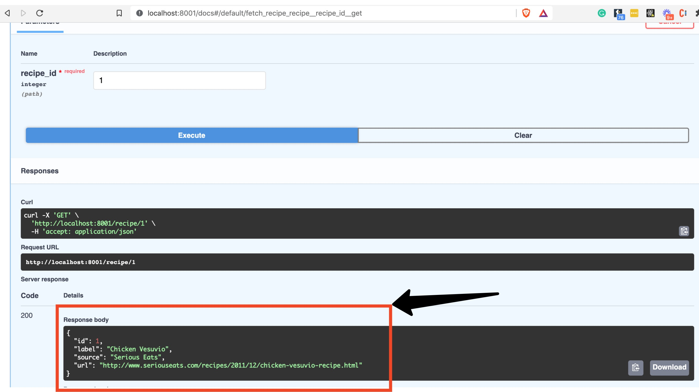
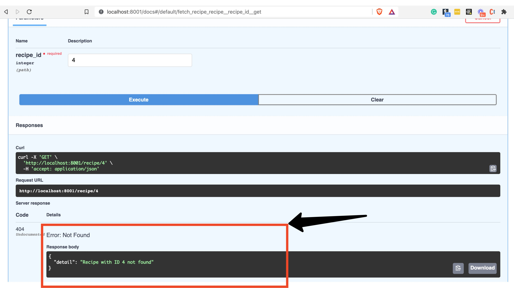

# 第5部分 - 基本错误处理方法

*在FastAPI教程的第5部分，我们将看看基本的错误处理。*

## 实践部分--添加基本的错误处理

如果你还没有准备，请继续克隆`example project repo`请看`README`文件中的本地设置。

在`app/main.py`文件中，你会发现以下新代码：

```Python
    from fastapi import FastAPI, APIRouter, Query, HTTPException  # 1
    # skipping...

    @api_router.get("/recipe/{recipe_id}", status_code=200, response_model=Recipe)
    def fetch_recipe(*, recipe_id: int) -> Any:
        """
        Fetch a single recipe by ID
        """

        result = [recipe for recipe in RECIPES if recipe["id"] == recipe_id]
        if not result:
            # the exception is raised, not returned - you will get a validation
            # error otherwise.
            # 2
            raise HTTPException(
                status_code=404, detail=f"Recipe with ID {recipe_id} not found"
            )

        return result[0]

    # skipping...
```

让我们把它分解一下：

1. 我们从FastAPI导入`HTTPException`

2. 在没有找到配方的情况下，我们引发一个`HTTPException`，传入`status_code`为404，表示没有找到请求的资源。参见列表list of HTTP status codes..。请注意，我们`引发`了一个异常，而 __不是__ 返回。返回异常会导致一个验证错误。

做完这一切后（并遵循`README`的设置说明），你可以用这个命令来运行例子 repo中的代码：`poetry run ./run.sh`

导航到`localhost:8001/docs`

试一试这个端点：

* 点击GET`/recipe/{recipe_id}`端点，展开它

* 点击 "Try It Out"按钮

* 将`recipe_id`设为1

* 点击 "Execute"。

你应该得到 "Chicken Vesuvio "的响应：



然而，如果你将`recipe_id`设置为一个不存在的，例如4，那么你现在会得到一个404：



### 练习一下： 

尝试POST到/recipe端点，创建一个ID为4的配方，然后重试你的GET请求（你不应该再得到404）。记住，在我们目前的应用程序的基本形式下，创建的条目在你CTRL+C和重启服务器后不会被持久化。


*写在后面：*

*本教程由20202288严兆骏创建，参考于 The Ultimate FastAPI Tutorial。如有困惑可与原教程一并服用（地址：https://christophergs.com/tutorials/ultimate-fastapi-tutorial-pt-5-basic-error-handling/）*
