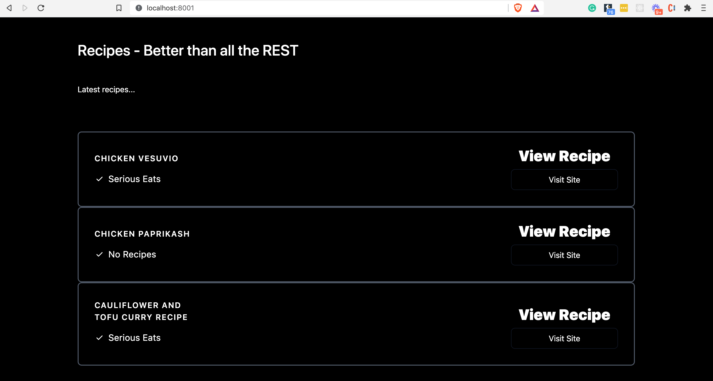
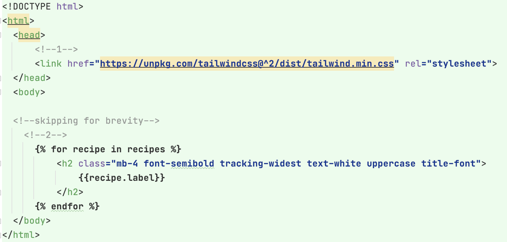

# 第6部分 - 用Jinja模板提供HTML服务

*在FastAPI教程的第6部分，我们将看看如何通过Jinja2模板提供HTML服务*

## 实践部分 - 在FastAPI中服务HTML

到目前为止，在我们的教程系列中，唯一可以查看的HTML是FastAPI开箱即提供的交互式文档用户界面。现在是时候添加一个特别简单的HTML页面了。我们将首先编码并运行它（做的比说的多），然后进一步讨论Jinja2，以及在大型项目中提供HTML的更现实的方法。

如果你还没有，继续克隆示例项目 `repo cd example project repo cd` 到 part-6 目录，本地设置见 `README` 文件。

用 `poetry run ./run.sh` 在本地运行该应用程序。

现在当你导航到 `http://localhost:8001` ，你会看到一个新的屏幕：

jinja-template

试一试吧。

现在，让我们了解一下这是如何工作的。

在 `app/main.py` 文件中，你会发现以下新代码：

```Python
    from fastapi import FastAPI, APIRouter, Query, HTTPException, Request
    from fastapi.templating import Jinja2Templates

    from typing import Optional, Any
    from pathlib import Path

    from app.schemas import RecipeSearchResults, Recipe, RecipeCreate
    from app.recipe_data import RECIPES


    # 1
    BASE_PATH = Path(__file__).resolve().parent
    TEMPLATES = Jinja2Templates(directory=str(BASE_PATH / "templates"))


    app = FastAPI(title="Recipe API", openapi_url="/openapi.json")

    api_router = APIRouter()


    # Updated to serve a Jinja2 template
    # https://www.starlette.io/templates/
    # https://jinja.palletsprojects.com/en/3.0.x/templates/#synopsis
    @api_router.get("/", status_code=200)
    def root(request: Request) -> dict:  # 2
        """
        Root GET
        """
        
        # 3
        return TEMPLATES.TemplateResponse(
            "index.html",
            {"request": request, "recipes": RECIPES},
        )

    # skipping...
```

我们的 `main.py` 模块有三个关键的更新需要强调：

1. 我们通过使用标准库 `pathlib` 模块来指定我们的Jinja模板目录，指向模板目录的完整系统路径。

2. 我们更新了根端点，定义在我们的 `根` 函数中。该函数现在将FastAPI `Request` 类作为一个参数。这相当于 `Starlette’s Request class` ，它对传入的请求提供了直接和较低层次的访问。

3. 我们需要访问请求类的原因是，该函数现在返回FastAPI专用的 `TemplateResponse` 。当实例化这个响应对象时，需要的第一个参数是特定的模板文件（本例中是 `index.html` ），然后是一个包含请求对象和任何模板变量的字典（在我们的例子中，是配方 `RECIPES` 的列表）
当然，在本教程系列的这一点上，示例项目的另一个关键补充是模板本身。它位于 `app/templates/index.html` 中。



从上面的（截短的）样本中，有两个关键的东西需要强调：

1.  `tailwind CSS library` 被用来为HTML设计样式。对tailwind的全面概述超出了本系列的范围，但快速的总结是，HTML元素的类名定义了CSS属性，包括像响应式网格布局。

2. Jinja2的模板语法，由大括号"{"和百分比符号"%"表示 在这里，Jinja允许我们对传递给模板的食谱变量进行循环。
   
__练习一下：__

使用我们在 `第5部分` 中添加的POST端点来创建一个新的食谱，然后刷新主页以看到它的显示。

## 理论部分 - 了解Jinja模板

模板语言允许你借助于变量和有限的编程逻辑来生成HTML/XML或其他标记语言。

变量和逻辑位被标记为标签，正如我们在上面看到的循环。

Jinja2是一种流行的模板语言，被 `Flask` 、`Bottle` 、 `Pelican` 使用，也可被 `Django` 使用。

Real Python has an excellent `primer on using Jinja`

### FastAPI和Jinja

FastAPI实际上是为构建API和微服务而设计的。它 *可以* 用于构建使用Jinja提供HTML服务的Web应用，但这并不是它真正优化的目的。

如果你想建立一个在服务器上渲染大量HTML的大型网站，Django可能是一个更好的选择。

然而，如果你要用React、Angular或Vue等前端框架建立一个现代网站，那么从FastAPI中获取数据就很合适了（我们将在本系列的后面讨论这个问题）。

因此，在这个系列的例子中，我们将相当少地使用Jinja模板，这也是它们在大多数真实项目中的使用方式。我在这个系列中引入一个HTML页面的理由是：

* 它将使示例项目更有吸引力。吸引人的教程是更好的学习工具。

* 知道如何提供临时的HTML页面（例如，用于用户登录/密码确认页面）是一个常见的要求。

*写在后面：*

*本教程由20202288严兆骏创建，参考于 The Ultimate FastAPI Tutorial。如有困惑可与原教程一并服用（地址：https://christophergs.com/tutorials/ultimate-fastapi-tutorial-pt-6-jinja-templates/）*