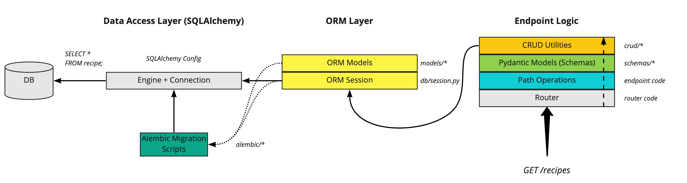
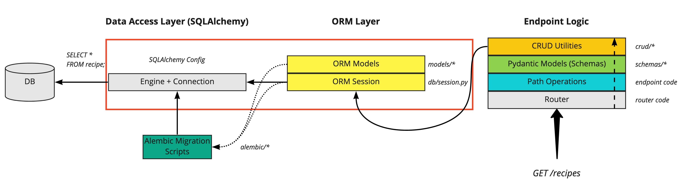
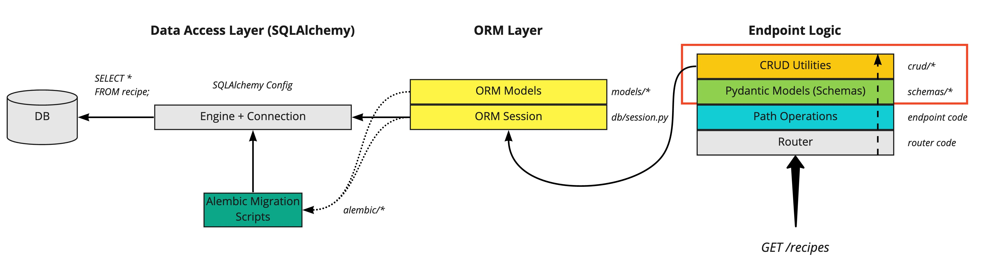
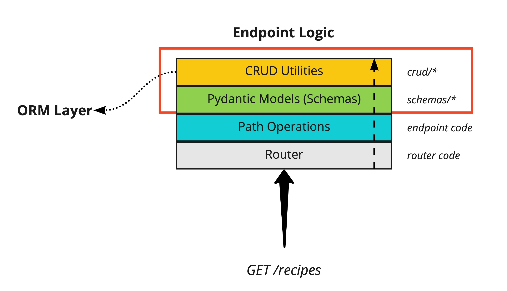
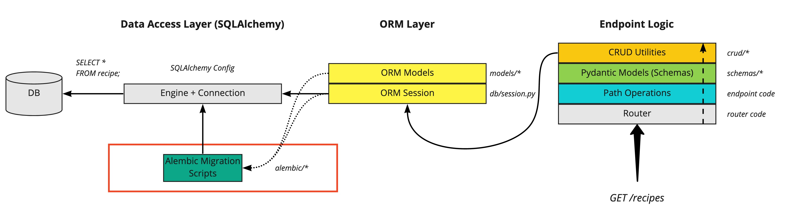
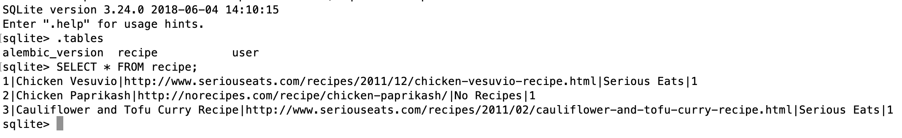
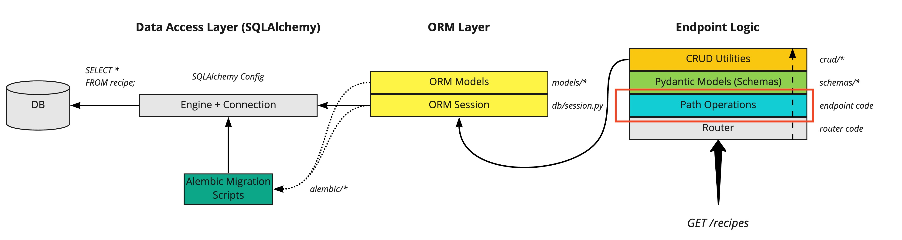
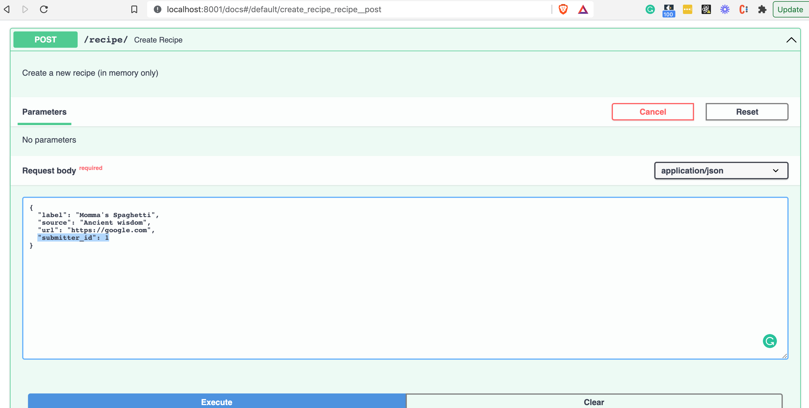
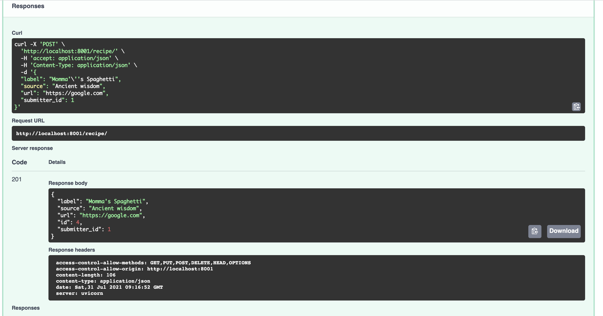
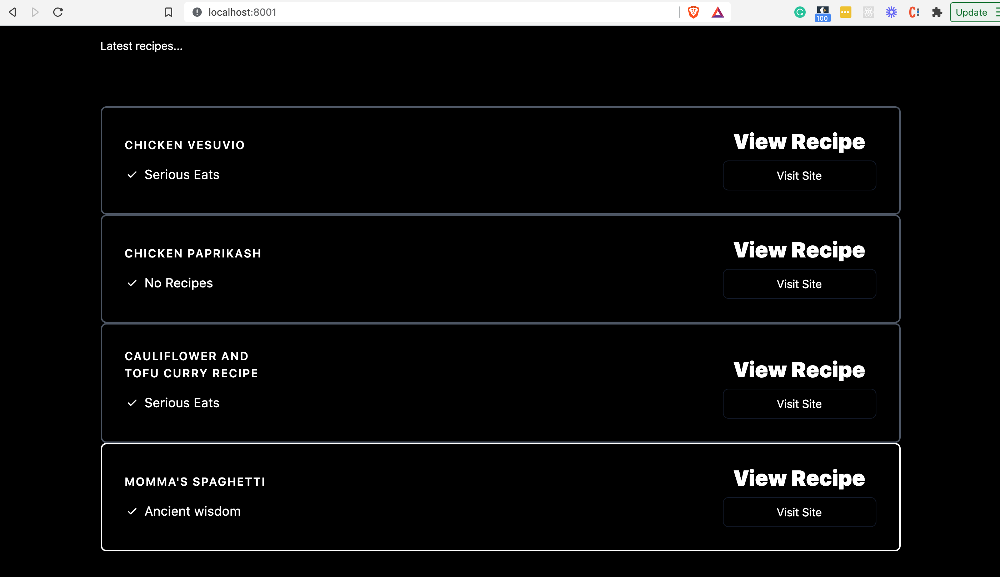

# 第7部分 - 使用SQLAlchemy和Alembic设置数据库

*在FastAPI教程的第7部分，我们将看看如何设置一个数据库* 

这是中级阶段的第一篇文章。我们将在这篇文章中涵盖相当多的内容，因为有很多部分都是一起工作的，因此如果孤立地介绍，会更加令人困惑（因为如果没有所有的部分，你就不能轻易地在本地旋转和运行它）。

## 理论第一节--SQLAlchemy的快速介绍

SQLAlchemy是使用最广泛、质量最高的Python第三方库之一。它为应用程序开发者提供了在他们的Python代码中与关系数据库工作的简单方法。

*SQLAlchemy认为数据库是一个关系代数引擎，而不仅仅是一个表的集合。行不仅可以从表中选择，还可以从连接和其他选择语句中选择；任何这些单元都可以组成一个更大的结构。SQLAlchemy的表达式语言从核心上建立了这个概念。*

SQLAlchemy由两个不同的组件组成：

* 核心--一个功能齐全的SQL抽象工具箱

* ORM（Object Relational Mapper 对象关系映射器）--它是可选的

在本教程中，我们将使用这两个组件，尽管你可以调整方法不使用ORM。


## 实用部分1--用SQLAlchemy设置数据库表

在本教程中，到目前为止，我们还不能在服务器重启后继续保存数据，因为我们所有的POST操作只是更新了内存中的数据结构。我们将通过引入一个关系型数据库来改变这种情况。我们将使用 `SQLite` ，因为它需要最少的设置，所以对学习很有用。只要在配置上稍作修改，你就可以对其他关系型数据库管理系统（RDBMS）使用同样的方法，如PostgreSQL或MySQL。

在 `tutorial repo` 中，打开第7部分目录。你会注意到，与本教程的前几部分相比，有一些新的目录：

    .
    ├── alembic                    ----> NEW
    │  ├── env.py
    │  ├── README
    │  ├── script.py.mako
    │  └── versions
    │     └── 238090727082_added_user_and_recipe_tables.py
    ├── alembic.ini                ----> NEW
    ├── app
    │  ├── __init__.py
    │  ├── backend_pre_start.py    ----> NEW
    │  ├── crud                    ----> NEW
    │  │  ├── __init__.py
    │  │  ├── base.py
    │  │  ├── crud_recipe.py
    │  │  └── crud_user.py
    │  ├── db                      ----> NEW
    │  │  ├── __init__.py
    │  │  ├── base.py
    │  │  ├── base_class.py
    │  │  ├── init_db.py
    │  │  └── session.py
    │  ├── deps.py                 ----> NEW
    │  ├── initial_data.py
    │  ├── main.py
    │  ├── models                  ----> NEW
    │  │  ├── __init__.py
    │  │  ├── recipe.py
    │  │  └── user.py
    │  ├── recipe_data.py
    │  ├── schemas
    │  │  ├── __init__.py
    │  │  ├── recipe.py
    │  │  └── user.py
    │  └── templates
    │     └── index.html
    ├── poetry.lock
    ├── prestart.sh
    ├── pyproject.toml
    ├── README.md
    └── run.sh

我们将在这篇文章中介绍所有这些新增功能，到最后你会明白所有的新模块是如何协同工作的，不仅可以实现一次性的数据库整合，还可以在我们更新数据库模式时进行迁移。更多关于这个问题的内容即将发布。


## FastAPI SQLAlchemy图解

我们正在努力实现的总体图看起来像这样：



首先，我们将看一下ORM和数据访问层：



现在，让我们把注意力转移到新的db目录上。

我们想使用ORM从我们的Python类中定义表和列。在SQLAlchemy中，这可以通过 `declarative mapping` 实现。最常见的模式是使用SQLALchemy  `declarative_base` 函数构造一个基类，然后让所有的DB模型类继承于这个基类。

我们在 `db/base_class.py` 模块中创建这个基类：

```Python
    import typing as t

    from sqlalchemy.ext.declarative import as_declarative, declared_attr


    class_registry: t.Dict = {}


    @as_declarative(class_registry=class_registry)
    class Base:
        id: t.Any
        __name__: str

        # Generate __tablename__ automatically
        @declared_attr
        def __tablename__(cls) -> str:
            return cls.__name__.lower()
```

在其他代码库/例子中，你可能已经看到这样做了：

```Python
    Base = declarative_base()
```

在我们的例子中，我们正在做同样的事情，但是使用一个装饰器（由SQLAlchemy提供），这样我们就可以在我们的 `Base` 类 上声明一些辅助方法--比如自动生成一个 `__tablename__` 。

做完这些后，我们现在可以自由地定义我们的API所需要的表了。到目前为止，我们已经处理了一些存储在内存中的玩具recipe数据：

```Python
    RECIPES = [
        {
            "id": 1,
            "label": "Chicken Vesuvio",
            "source": "Serious Eats",
            "url": "http://www.seriouseats.com/recipes/2011/12/chicken-vesuvio-recipe.html",
        },
        {
            "id": 2,
            "label": "Chicken Paprikash",
            "source": "No Recipes",
            "url": "http://norecipes.com/recipe/chicken-paprikash/",
        },
        {
            "id": 3,
            "label": "Cauliflower and Tofu Curry Recipe",
            "source": "Serious Eats",
            "url": "http://www.seriouseats.com/recipes/2011/02/cauliflower-and-tofu-curry-recipe.html",
        },
    ]
```

因此，我们要定义的第一个表是一个 `recipe` 表，它将存储上述数据。我们通过ORM在 `models/recipe.py` 中定义这个表：

```Python
from sqlalchemy import Column, Integer, String, ForeignKey
from sqlalchemy.orm import relationship

from app.db.base_class import Base

    class Recipe(Base):  # 1
        id = Column(Integer, primary_key=True, index=True)  # 2
        label = Column(String(256), nullable=False)
        url = Column(String(256), index=True, nullable=True)
        source = Column(String(256), nullable=True)
        submitter_id = Column(String(10), ForeignKey("user.id"), nullable=True)  # 3
        submitter = relationship("User", back_populates="recipes")  # 4
```

让我们把它分解一下：

1. 我们用一个Python类来表示我们的数据库 `recipe` 表，该类继承自我们之前定义的 `Base` 类（这使得SQLAlchemy能够检测并将该类映射到数据库表）。

2.  `recipe` 表的每一列（如 `id` 、 `label` ）都在类中定义，用SQLAlchemy类型设置列的类型，如 `Integer` 和 `String` 。

3. 我们通过SQLAlchemy `ForeignKey` 类，在recipe和用户（我们称其为 "submitter"）之间定义了一对多的关系。

4. 为了建立一对多的双向关系，即 "reverse"是多对一的关系，我们指定一个额外的 `relationship()` ，并使用 `relationship.back_populates` 参数将两者连接起来

正如你可以从外键推断的那样，我们还需要定义一个 `user` 表，因为我们希望能够将食谱归属给用户。一个用户表将为我们在本教程的后面部分进行认证做好准备。

我们的 `user` 表被定义在 `models/user.py` 中，并遵循类似的结构：

```Python
    class User(Base):
        id = Column(Integer, primary_key=True, index=True)
        first_name = Column(String(256), nullable=True)
        surname = Column(String(256), nullable=True)
        email = Column(String, index=True, nullable=False)
        is_superuser = Column(Boolean, default=False)
        recipes = relationship(
            "Recipe",
            cascade="all,delete-orphan",
            back_populates="submitter",
            uselist=True,
        )
``` 

很好，我们已经定义了我们的表。现在呢？我们还没有告诉SQLAlchemy如何连接到数据库（例如，数据库叫什么，我们如何连接到它，它是什么风格的SQL）。所有这些都发生在 `SQLALchemy Engine class` 中。

我们在 `db/session.py` 模块中实例化了一个引擎：

```Python
    from sqlalchemy import create_engine
    from sqlalchemy.orm import sessionmaker, Session

    SQLALCHEMY_DATABASE_URI = "sqlite:///example.db"  # 1


    engine = create_engine(  # 2
        SQLALCHEMY_DATABASE_URI,
        # required for sqlite
        connect_args={"check_same_thread": False},  # 3
    )
    SessionLocal = sessionmaker(autocommit=False, autoflush=False, bind=engine)  # 4
```

让我们把这段代码分解一下：

1.  `SQLALCHEMY_DATABASE_URI` 定义了SQLite用于保存数据的文件。

2. 通过 SQLAlchemy `create_engine` 函数，我们实例化我们的引擎，传入DB连接URI - 注意这个连接字符串可以更复杂，包括驱动程序、方言、数据库服务器位置、用户、密码和端口。这里有一个 `postgres` 的例子。

3. `check_same_thread` ： `False` 的配置对于使用SQLite是必要的--这是一个常见的问题，因为FastAPI可以在一个请求中用多个线程访问数据库，所以SQLite需要被配置为允许这样。

4. 最后，我们还要创建一个DB `Session` ，它（与引擎不同）是针对ORM的。当使用ORM工作时，会话对象是我们对数据库的主要访问点。

来自 `the SQLAlchemy Session docs` ：

*在最一般的意义上，Session建立了与数据库的所有对话，并代表了一个 "保存区"，用于保存所有你在其生命周期内加载或与之相关的对象。*

我们正在取得进展! 接下来，我们将再次转向Pydantic，我们在 `第4部分` 中看了它，使我们的Python代码非常容易地进入数据库操作的正确形状。


## 实用部分2 - Pydantic DB模式和CRUD实用程序

现在让我们来看看FastAPI应用程序的端点逻辑，特别是Pydnantic DB模式和CRUD工具：



对于那些已经习惯于SQLAlchemy和其他Python网络框架（如Django或Flask）的人来说，这一部分可能会包含一些与你可能习惯的东西有点不同的东西。让我们把图放大看看：



需要理解的关键顺序是，当需要与数据库互动的REST API请求进来时，会发生以下情况：

* 请求被路由到正确的路径操作（即处理它的函数，例如我们在 `main` py文件中的 `根` 函数）。

* 相关的Pydantic模型被用来验证传入的请求数据，并构建适当的数据结构以传递给CRUD实用程序

* 我们的CRUD工具函数使用ORM会话和成型的数据结构的组合来准备DB查询。
如果这还不完全清楚，请不要担心，我们将通过每一个步骤，并在这篇博文的结尾处将一切都集中起来。

* 我们将创建Pydantic模型，用于从我们的各种API端点读/写数据。术语可能会让人感到困惑，因为我们有SQLAlchemy模型，看起来像这样：

```Python
    name = Column(String)
```

和Pydantic模型，它们看起来像这样：

```Python
    name: str
```

为了帮助区分这两者，我们倾向于将Pydantic类放在 `schemas` 目录中。

让我们来看看 `schemas/recipe.py` 模块：

```Python
    from pydantic import BaseModel, HttpUrl

    from typing import Sequence


    class RecipeBase(BaseModel):
        label: str
        source: str
        url: HttpUrl


    class RecipeCreate(RecipeBase):
        label: str
        source: str
        url: HttpUrl
        submitter_id: int


    class RecipeUpdate(RecipeBase):
        label: str


    # Properties shared by models stored in DB
    class RecipeInDBBase(RecipeBase):
        id: int
        submitter_id: int

        class Config:
            orm_mode = True


    # Properties to return to client
    class Recipe(RecipeInDBBase):
        pass


    # Properties properties stored in DB
    class RecipeInDB(RecipeInDBBase):
        pass
```

其中一些类，比如 `Recipe` 和 `RecipeCreate` ，存在于本教程的前几部分（在旧的 `schema.py` 模块中），其他的，比如那些引用DB的类，是新的。

Pydantic的 `orm_mode`（你可以在 `RecipeInDBBase` 中看到）将告诉Pydantic模型来读取数据，即使它不是一个dict，而是一个ORM模型（或者任何其他具有属性的任意对象）。如果没有 `orm_mode` ，如果你从你的路径操作中返回一个SQLAlchemy模型，它就不会包括关系数据。

*为什么要对 `Recipe` 和 `RecipeInDB` 进行区分？这允许我们在将来把只与DB相关的字段，或者我们不想返回给客户端的字段（如密码字段）分开。*

正如我们在图中所看到的，仅仅拥有Pydantic模式是不够的。我们还需要一些可重用的函数来与数据库互动。这将是我们的数据访问层，而根据FastAPI惯例，这些实用类被定义在crud目录中。

这些CRUD实用类帮助我们做一些事情，比如：

* 通过ID从表中读出

* 通过一个特定的属性（例如，通过用户的电子邮件）从表中读取数据

* 从一个表中读取多个条目（定义过滤器和限制）。

* 在表中插入新行

* 更新表中的某一行

* 删除表中的一条记录

每个表都有自己的CRUD类，它从一个基类中继承了可重用的部分。现在让我们在 `crud/base.py` 中研究这个问题。

```Python
    from typing import Any, Dict, Generic, List, Optional, Type, TypeVar, Union

    from fastapi.encoders import jsonable_encoder
    from pydantic import BaseModel
    from sqlalchemy.orm import Session

    from app.db.base_class import Base


    ModelType = TypeVar("ModelType", bound=Base)
    CreateSchemaType = TypeVar("CreateSchemaType", bound=BaseModel)
    UpdateSchemaType = TypeVar("UpdateSchemaType", bound=BaseModel)


    class CRUDBase(Generic[ModelType, CreateSchemaType, UpdateSchemaType]):  # 1
        def __init__(self, model: Type[ModelType]):  # 2
        """
        CRUD object with default methods to Create, Read, Update, Delete (CRUD).
        **Parameters**
        * `model`: A SQLAlchemy model class
        * `schema`: A Pydantic model (schema) class
        """
        self.model = model

        def get(self, db: Session, id: Any) -> Optional[ModelType]:
            return db.query(self.model).filter(self.model.id == id).first()  # 3

        def get_multi(
            self, db: Session, *, skip: int = 0, limit: int = 100
        ) -> List[ModelType]:
            return db.query(self.model).offset(skip).limit(limit).all()  # 4

        def create(self, db: Session, *, obj_in: CreateSchemaType) -> ModelType:
            obj_in_data = jsonable_encoder(obj_in)
            db_obj = self.model(**obj_in_data)  # type: ignore
            db.add(db_obj)
            db.commit()  # 5
            db.refresh(db_obj)
            return db_obj

    # skipping rest...
```

这是教程的这一部分中比较棘手的代码之一，让我们把它分解一下：

1. 继承自 `CRUDBase` 的模型将以 __SQLAlchemy__ 模型作为第一个参数来定义，然后将用于创建和更新行的 __Pydantic__ 模型（又称模式）作为第二和第三个参数。

2. 当实例化CRUD类时，它期望被传递给相关的SQLAlchemy模型（我们稍后会看一下这个）。

3. 这里是你可能期待的实际DB查询--我们使用ORM会话（ `db` ）.query方法将不同的DB查询连在一起。这些可以是简单的，也可以是复杂的，只要我们需要。这里是关于查询的SQLAlchemy文档。在这个例子中，我们通过 `ID` 过滤，允许我们从数据库中获取单一行。

4. 另一个DB查询，这次我们通过查询和连锁 `.offset` 和 `.limit` 方法来获取多条数据库记录，并以 `.all()` 结束。

5. 在创建DB对象时，有必要运行会话 `commit` 方法（见文档）来完成行的插入。我们将在本系列教程的后半部分（Python 3 asyncio和性能博文）研究在这里和在端点中进行提交调用的权衡。

现在我们已经定义了 `CRUDBase` ，我们可以用它来为每个表定义crud工具。这些子类的代码要简单得多，大部分的逻辑都是从基类继承的：

```Python
    from app.crud.base import CRUDBase
    from app.models.recipe import Recipe
    from app.schemas.recipe import RecipeCreate, RecipeUpdate


    class CRUDRecipe(CRUDBase[Recipe, RecipeCreate, RecipeUpdate]):  # 1
        ...

    recipe = CRUDRecipe(Recipe)  # 2
```

1. 该类是用相关的SQLAlchemyrecipe模型定义的，然后是Pydantic的RecipeCreate和RecipeUpdate模式。

2. 我们对CRUDRecipe类进行实例化

如果这在目前看来有点抽象，请不要担心。在本篇文章的最后一部分中，将展示这一点被用于端点，这样就可以看到（并在本地运行）与数据库交互的API端点，以及Pydantic模式和CRUD工具将如何一起工作。然而，在我们到达那里之前，我们需要处理数据库的初始创建，以及未来的迁移。


## 实用部分3--用Alembic启用迁移功能



本教程的目标是建立一个可用于生产的API，如果不考虑如何随着时间的推移对表进行修改，你根本无法建立一个数据库。这个挑战的一个常见解决方案是 `alembic library` ，它被设计为与SQLAlchemy一起工作。

回顾我们新的第7部分文件树：

    .
    ├── alembic                    ----> NEW
    │  ├── env.py
    │  ├── README
    │  ├── script.py.mako
    │  └── versions
    │     └── 238090727082_added_user_and_recipe_tables.py
    ├── alembic.ini                ----> NEW
    ├── app
    ...etc.

alembic目录包含一些我们要使用的文件：

* `env.py` ，我们在这里传递配置（比如我们的数据库连接字符串，创建SQLAlchemy引擎所需的配置，以及我们的SQLAlchemy `Base` 声明式映射类）。

* `versions` - 一个包含每个要运行的迁移的目录。这个目录中的每一个文件都代表了一个数据库迁移，并且包含了对上一个/下一个迁移的引用，所以它们总是按照正确的顺序运行。

* `script.py.mako` - alembic生成的模板

* `README` - 由alembic生成的模板

* `alembic.ini` - 告诉alembic在哪里寻找其他文件，以及设置日志的配置。

为了触发almbic的迁移，你需要运行 `almbic upgrade head` 命令。当你对数据库表做任何改动时，你可以通过运行 `alembic revision --autogenerate -m "Some description "` 来捕获该改动--这将在版本目录下生成一个新文件，你应该经常检查。

对于我们的recipeAPI，我们已经将这个迁移命令包装在 `prestart.sh bash` 脚本中：

```
    #! /usr/bin/env bash

    # Let the DB start
    python ./app/backend_pre_start.py

    # Run migrations
    alembic upgrade head    <---- ALEMBIC MIGRATION COMMAND

    # Create initial data in DB
    python ./app/initial_data.py
```

运行almbic迁移不仅会对数据库进行修改，而且还会首先创建表和列。这就是为什么你没有发现像 `Base.metadata.create_all(bind=engine)` 这样的表创建命令，你经常会在不涉及迁移的教程中看到这样的命令。

你会注意到，在我们的 `prestart.sh` 脚本中还有其他几个脚本：

*  `backend_pre_start.py` ，它简单地执行了一个 `SQL SELECT 1` 查询，以检查我们的数据库是否正常。

*  `initial_data.py` - 它使用 `db/init_db.py` 中的 `init_db` 函数，我们现在将进一步分解它

`db/init_db.py`

```Python
    from app import crud, schemas
    from app.db import base  # noqa: F401
    from app.recipe_data import RECIPES

    logger = logging.getLogger(__name__)

    FIRST_SUPERUSER = "admin@recipeapi.com"


    def init_db(db: Session) -> None:  # 1
        if FIRST_SUPERUSER:
            user = crud.user.get_by_email(db, email=FIRST_SUPERUSER)  # 2
            if not user:
                user_in = schemas.UserCreate(
                    full_name="Initial Super User",
                    email=FIRST_SUPERUSER,
                    is_superuser=True,
                )
                user = crud.user.create(db, obj_in=user_in)
            else:
                logger.warning(
                    "Skipping creating superuser. User with email "
                    f"{FIRST_SUPERUSER} already exists. "
                )
            if not user.recipes:
                for recipe in RECIPES:
                    recipe_in = schemas.RecipeCreate(
                        label=recipe["label"],
                        source=recipe["source"],
                        url=recipe["url"],
                        submitter_id=user.id,
                    )
                    crud.recipe.create(db, obj_in=recipe_in)  # 3
```

1. `init_db` 函数的唯一参数是一个SQLAlchemy `Session` 对象，我们可以从我们的 `db/session.py` 中导入该对象。

2. 然后，我们利用我们在这部分教程中早先创建的 `crud` 工具函数来获取或创建一个用户。我们需要一个用户，这样我们就可以为最初的recipe分配一个`submitter` （回顾一下从recipe表到用户表的外键查找）。

3. 我们遍历 `app/recipe_data.py RECIPE` 字典列表中硬编码的食谱，使用这些数据来创建一系列Pydantic `RecipeCreate` 模式，然后我们可以将其传递给 `crud.recipe.create` 函数来向数据库 `INSERT` 行。

在你的克隆副本中试一试吧：

* cd into the part-7 directory

* pip install poetry

* run poetry install to install the dependencies

* run poetry run ./prestart.sh

在终端，你应该看到迁移正在被应用。你还应该看到一个新的文件被创建：`part-7-database/example.db` 。这就是SQLite DB，通过运行来检查它：

* Install sqlite3

* run the command sqlite3 example.db

* run the command .tables

你应该看到3个表：alembic_version，recipe，和user。用一个简单的SQL查询来检查初始的recipe数据是否已经创建： SELECT * FROM recipe；

你应该在sqlite DB中看到3条recipe行：



你可以用 `.exit` 命令退出SQLite3的外壳。

很好！现在剩下的就是把所有的东西集中到我们的API端点中！现在剩下的就是把所有的东西集中到我们的API端点中。

## 实践部分4--把所有东西都放在我们的API端点中



如果你看一下 `app/main.py` ，你会发现所有的端点函数都已更新，以接受一个额外的db参数：

```Python
    from fastapi import Request, Depends
    # skipping...

    @api_router.get("/", status_code=200)
    def root(
        request: Request,
        db: Session = Depends(deps.get_db),
    ) -> dict:
        """
        Root GET
        """
        recipes = crud.recipe.get_multi(db=db, limit=10)
        return TEMPLATES.TemplateResponse(
            "index.html",
            {"request": request, "recipes": recipes},
        )

    # skippping...
```

这是对FastAPI `强大的依赖注入功能` 的首次介绍，对我来说，这是该框架最好的功能之一。依赖注入（DI）是一种让你的函数和类声明它们需要工作的东西的方法（在FastAPI上下文中，通常是我们的端点函数，称为路径操作函数）。

在本教程的后面，我们将更详细地探讨依赖性注入。现在，你需要了解的是，FastAPI的 `Depends` 类在我们的函数参数中是这样使用的：

`db： Session = Depends(deps.get_db)`

而我们传入 `Depends` 的是一个指定依赖关系的函数。在这部分教程中，我们已经在 `deps.py` 模块中添加了这些函数：

```Python
    from typing import Generator

    from app.db.session import SessionLocal  # 1


    def get_db() -> Generator:
        db = SessionLocal()  # 2
        try:
            yield db  # 3
        finally:
            db.close()  # 4
```

快速分解：

1. 我们从 `app/db/session.py` 导入ORM会话类 `SessionLocal `。

2. 我们实例化该会话

3. 我们 `yield` 会话，它返回一个生成器。为什么要这样做？好吧，`yield` 语句暂停了函数的执行，并将一个值送回给调用者，但保留了足够的状态，以使函数能够恢复到它离开的地方。简而言之，这是与我们的数据库连接工作的一种有效方式。

4. 我们通过使用 `try` 块的 `finally` 子句来确保关闭数据库连接--这意味着数据库会话总是被 `关闭` 。这就释放了与会话相关的连接对象，使会话可以再次被使用。

好了，现在明白了我们的DB会话是如何在我们的各种端点中被使用的了。让我们来看看一个更复杂的例子：

```Python
    @api_router.get("/recipe/{recipe_id}", status_code=200, response_model=Recipe)  # 1
    def fetch_recipe(
        *,
        recipe_id: int,
        db: Session = Depends(deps.get_db),
    ) -> Any:
        """
        Fetch a single recipe by ID
        """
        result = crud.recipe.get(db=db, id=recipe_id)  # 2
        if not result:
            # the exception is raised, not returned - you will get a validation
            # error otherwise.
            raise HTTPException(
                status_code=404, detail=f"Recipe with ID {recipe_id} not found"
            )

        return result
```

请注意以下变化：

1. `response_model=Recipe` 现在指的是我们更新的Pydantic `Recipe` 模型，这意味着它将与我们的ORM调用一起工作。

2. 我们使用 `crud` 实用程序来按id获取recipe，将我们指定的 `db` 会话对象作为依赖关系传给端点。

额外的 `crud` 工具需要更多的时间来理解--但是你能看到现在我们有一个优雅的关注点分离--在端点代码中不需要任何DB查询，它都是在我们的CRUD工具函数中处理。

我们在其他端点也看到了类似的模式，当我们返回多个recipe时，将 `crud.recipe.get` 换成 `crud.recipe.get_multi` ，当我们返回多个recipe时，crud.recipe.create会在POST端点中创建新 recipes 。

让我们试一试吧!

从顶部（如果你已经运行了 `prestart.sh` 命令，你可以跳过它）

1. `pip install poetry`

2. 安装依赖项 `cd` 到part-7目录然后 `poetry install`

3. 通过poetry运行DB迁移 `./prestart.sh`（只需要一次）。

4. 通过poetry运行FastAPI服务器 `poetry run ./run.sh`

5. 打开 `http://localhost:8001/docs` 

继续使用交互式文档的 `try me` 按钮创建一个新的recipe，你需要将 `submitter_id` 设置为1，以匹配我们通过 `prestart.sh` 创建的初始用户：



*问题：`url` 字段必须是一个有效的URL，并带有 `http/https` *

向下滚动响应，你应该看到HTTP 201状态代码的JSON响应体：



现在到了关键时刻。停止服务器（CTRL-C）。然后用 `poetry./run.sh` 重新启动它

导航到主页： `http://localhost:8001`

你应该看到你刚刚创建的配方在配方列表中持续存在：



数据库现在已经与我们的API连接起来了!


*写在后面：*

*本教程由20202288严兆骏创建，参考于 The Ultimate FastAPI Tutorial。如有困惑可与原教程一并服用（地址：https://christophergs.com/tutorials/ultimate-fastapi-tutorial-pt-7-sqlalchemy-database-setup/）*