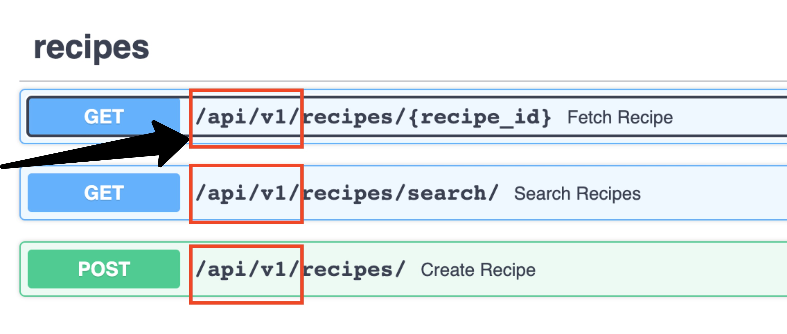

# 第8部分 - 项目结构、设置和API版本管理

*在FastAPI教程的第8部分，我们将看看我们的API的版本问题。*

与第8部分相比，这是一篇更轻量级的文章，在该部分中我们探讨了数据库设置。尽管如此，通过很好地构建你的FastAPI项目，你将为你的REST APIs设置方便的扩展性和后期维护。

这篇文章在很大程度上借用了官方的 full-stack FastAPI postgresql cookie-cutter repo的内容。对于学习来说，cookie cutter repo有点复杂，所以我们在这个系列中简化了东西。然而，在本教程结束时，我们将拥有类似的东西。

## 实用部分1--FastAPI项目结构和配置

让我们来看看应用程序目录中的新添加内容：

    ├── app
    │  ├── __init__.py
    │  ├── api                     ----> NEW
    │  │  ├── __init__.py
    │  │  ├── api_v1               ----> NEW
    │  │  │  ├── __init__.py
    │  │  │  ├── api.py            ----> NEW
    │  │  │  └── endpoints         ----> NEW
    │  │  │     ├── __init__.py
    │  │  │     └── recipe.py      ----> NEW
    │  │  └── deps.py
    │  ├── backend_pre_start.py
    │  ├── core                    ----> NEW
    │  │  ├── __init__.py
    │  │  └── config.py            ----> NEW
    │  ├── crud
    │  │  ├── __init__.py
    │  │  ├── base.py
    │  │  ├── crud_recipe.py
    │  │  └── crud_user.py
    │  ├── db
    │  │  ├── __init__.py
    │  │  ├── base.py
    │  │  ├── base_class.py
    │  │  ├── init_db.py
    │  │  └── session.py
    │  ├── initial_data.py
    │  ├── main.py                  ----> UPDATED
    │  ├── models
    │  │  ├── __init__.py
    │  │  ├── recipe.py
    │  │  └── user.py
    │  ├── schemas
    │  │  ├── __init__.py
    │  │  ├── recipe.py
    │  │  └── user.py
    │  └── templates
    │     └── index.html
    ├── poetry.lock
    ├── prestart.sh
    ├── pyproject.toml
    ├── README.md
    └── run.sh

正如你所看到的，我们已经添加了一个新的 `api` 目录。我们在这里的目的是疏通 `main.py` 文件，并允许API版本化，我们将在本博文的第二部分（版本化）中看一下。

我们现在还添加了 `core/config.py` 模块，它是一个标准的FastAPI结构。我们在这里使用Pydantic模型（正如我们对模式所做的那样）来定义应用程序的配置。这使得我们能够利用Pydantics的类型推理和验证器。让我们看一下 `core/config.py` 的代码来说明一下：

```Python
    from pydantic import AnyHttpUrl, BaseSettings, EmailStr, validator
    from typing import List, Optional, Union


    class Settings(BaseSettings):  # 1
        API_V1_STR: str = "/api/v1"  # 2
        # BACKEND_CORS_ORIGINS is a JSON-formatted list of origins
        # e.g: '["http://localhost", "http://localhost:4200", "http://localhost:3000", \
        # "http://localhost:8080", "http://local.dockertoolbox.tiangolo.com"]'
        BACKEND_CORS_ORIGINS: List[AnyHttpUrl] = []

        @validator("BACKEND_CORS_ORIGINS", pre=True)  # 3
        def assemble_cors_origins(cls, v: Union[str, List[str]]) -> Union[List[str], str]:
            if isinstance(v, str) and not v.startswith("["):
                return [i.strip() for i in v.split(",")]
            elif isinstance(v, (list, str)):
                return v
            raise ValueError(v)

        SQLALCHEMY_DATABASE_URI: Optional[str] = "sqlite:///example.db"
        FIRST_SUPERUSER: EmailStr = "admin@recipeapi.com"

        class Config:
            case_sensitive = True  # 4


    settings = Settings()  # 5
```

1. `Settings` 类继承于 `Pydantic BaseSettings` 类。这个模型将试图通过从同名的环境变量中读取，来确定未作为关键字参数传递的任何字段的值。这就是为什么你 `不会` 看到像这样的代码 `API_V1_STR: str = os.environ['API_V1_STR']` ，因为它在引擎盖下已经在这样做了。

2. 与其他Pydantic模型一样，我们使用类型提示来验证配置--这可以使我们避免很多错误，因为配置代码是出了名的测试不力。

3. 使用 `Pydantic validator decorators` ，就有可能使用函数来验证配置字段。

4. pydantic的行为可以通过 `模型上的Config类` 来控制，在这个例子中，我们指定我们的设置是大小写敏感的。

5. 最后，我们将 `Settings` 类实例化，以便 `app.core.config.settings` 可以在整个项目中被导入。

你会看到，这部分教程的代码现在已经更新了，所以所有重要的全局变量都在配置中（例如 `SQLALCHEMY_DATABASE_URI, FIRST_SUPERUSER` ）。

随着项目的发展，配置的复杂性也会增加（我们很快就会在本教程的未来部分看到这一点）。这是一个有用的起点，有足够的真实性，可以让人感觉到这里可以有什么。


## 实用部分2--API版本管理

对你的API进行版本管理是最好的做法。这使您能够以一种更有规律和结构化的方式与您的客户一起管理突发的API变化。Stripe API是这方面的黄金标准，如果你想要 `一些灵感` 的话。

让我们先观察一下本教程这部分介绍的新的API版本：

* 克隆本教程的项目 `project repo`

* cd into part-8

* pip install poetry (如果你还没有的话)

* poetry 安装

* poetry run ./prestart.sh (在这个目录下建立一个新的数据库)

* poetry run ./run.sh

* 打开 http://localhost:8001

你应该会看到我们常用的服务器端渲染的HTML：


到目前为止没有变化。现在导航到交互式用户界面文档，网址是 `http://localhost:8001/docs`。你会注意到，现在的配方端点都是以 `/api/v1` 开头的：



来吧，玩一玩这些端点（它们的工作原理应该和教程的前一部分完全一样）。我们现在有了版本控制。让我们看一下导致这一改进的代码变化：

`app/api_v1/api.py`

```Python
    from fastapi import APIRouter

    from app.api.api_v1.endpoints import recipe


    api_router = APIRouter()
    api_router.include_router(recipe.router, prefix="/recipes", tags=["recipes"])
```

注意配方端点逻辑是如何从 `app/api.api_v1.endpoints.recipe.py` （我们从 `app/main.py` 中提取了配方端点的代码）拉过来的。然后我们使用 `include_router` 方法，传入前缀为 `/recipes` 。这意味着在 `recipes.py` 文件中定义的、指定了/路线的端点将以 `/recipes` 为前缀。

然后在 `app/main.py` 中我们继续堆叠FastAPI路由器：

```Python
    # skipping...

    root_router = APIRouter()
    app = FastAPI(title="Recipe API", openapi_url="/openapi.json")


    @root_router.get("/", status_code=200)
    def root(
        request: Request,
        db: Session = Depends(deps.get_db),
    ) -> dict:
        """
        Root GET
        """
        recipes = crud.recipe.get_multi(db=db, limit=10)
        return TEMPLATES.TemplateResponse(
            "index.html",
            {"request": request, "recipes": recipes},
        )


    app.include_router(api_router, prefix=settings.API_V1_STR)  # <----- API versioning
    app.include_router(root_router)

    # skipping...
```

我们再次使用 `prefix` 参数，这次是使用我们配置中的 `API_V1_STR`。简而言之，我们把 `/api/v1` 的前缀（来自 `main.py` ）和recipes（来自api.py）堆叠在一起。这就形成了我们在文档界面中看到的版本化路由。

现在只要我们想添加新的逻辑（例如用户的API），我们可以简单地在 `app/api/api_v1/endpoints` 中定义一个新的模块。如果我们想创建一个v2版的API，我们有一个允许这样做的结构。

从上面的代码片段中需要注意的另一点是，因为我们 __没有__ 对我们的根路由（home route Jinja模板）应用任何版本化前缀，那么这一个端点就没有版本化。


*写在后面：*

*本教程由20202288严兆骏创建，参考于 The Ultimate FastAPI Tutorial。如有困惑可与原教程一并服用（地址：https://christophergs.com/tutorials/ultimate-fastapi-tutorial-pt-8-project-structure-api-versioning/）*