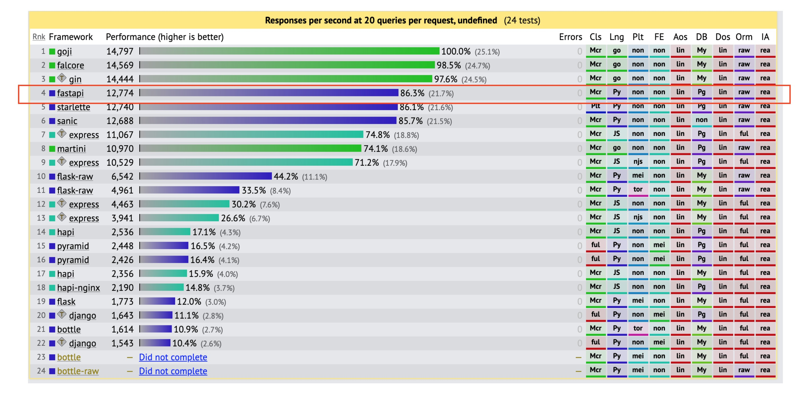
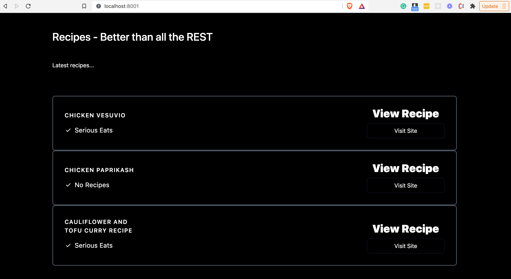
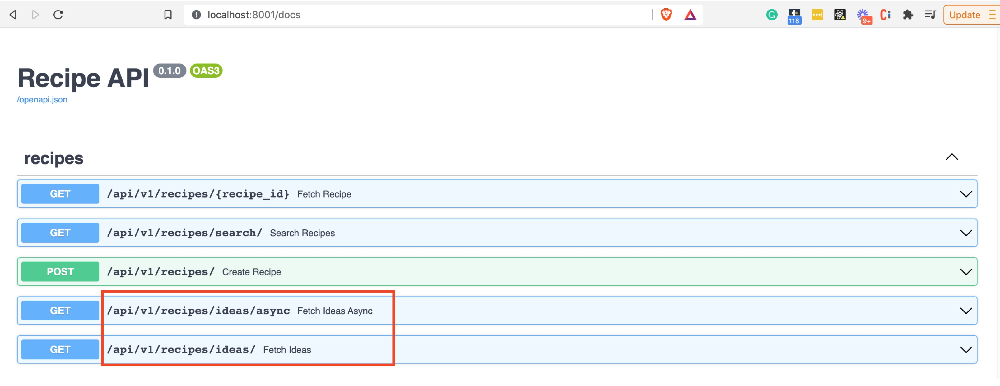
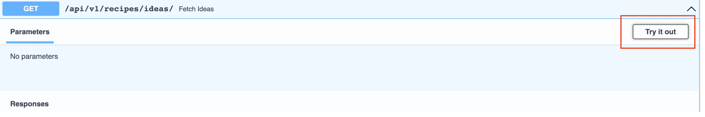
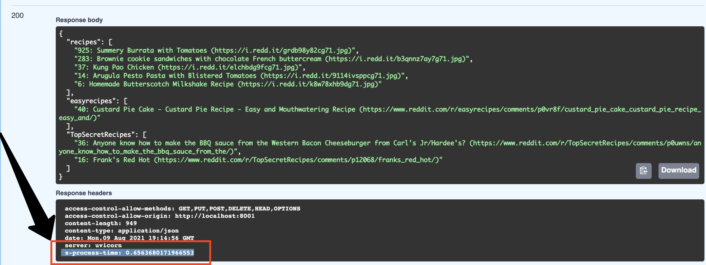

# 第9部分 - 异步性能改进

*在FastAPI教程的第9部分，我们将研究如何利用async IO来提高性能*

FastAPI之所以被称为 "快速"，主要有两个原因：

1. 令人印象深刻的框架性能

2. 改进开发人员的工作流程

在这篇文章中，我们将探讨性能要素。如果你对Python的 `异步IO（async IO）` 模块很熟悉，你可以跳到文章的实践部分。如果不是，我们先来谈一下理论。

## 理论部分 - Python Asyncio和并发代码

简单介绍一下术语。在编程中，并发性意味着：

*在同一时间执行多个任务，但不一定同时进行*

另一方面，并行做事意味着：

*并行意味着一个应用程序将其任务分割成更小的子任务，这些子任务可以被并行处理，例如在同一时间在多个CPU上处理。*

更精辟地说：

*并发是指一次处理很多事情。平行性是指一次做很多事情。*

这个 `stackoverflow thread` 的答案/评论中有一些很棒的进一步阅读。

多年来，在Python中编写异步代码的选择是次优的--依靠有限的asyncore和asynchat模块（现在都已废弃）或第三方库，如 `gevent` 或 `Twisted`。然后在Python 3.4中引入了 `asyncio` 库。这是Python语言历史上最重要的补充之一，从最初的 `PEP-3156`（非常值得一读）开始，有很多后续的改进，比如在 `PEP-492` 中引入了 `async` 和 `await` 语法。语言的这些变化导致了Python生态系统的突然复兴，因为利用 `asyncio` 的新工具已经（并将继续）被引入，其他库也被更新以利用新功能。FastAPI和Starlette（它是FastAPI的基础）就是这些新项目的例子。

通过利用Python新的异步IO范式（存在于许多其他语言中），FastAPI已经能够拿出非常惊人的基准（与nodejs或golang相当）：



当然，应该谨慎对待这些基准。

异步IO非常适用于受IO约束的网络代码（也就是大多数API），比如说你必须要等待什么：

* 从其他API中获取数据

* 通过网络接收数据（例如，从客户端浏览器）。

* 查询一个数据库

* 读取一个文件的内容

异步IO不是线程，也不是多进程。事实上，异步IO是一种单线程、单进程的设计：它使用合作式多任务。

如果你仍然感到困惑，可以看看两个伟大的类比：

* Miguel Grinberg’s multiple chess games analogy （Miguel Grinberg的多个国际象棋游戏类比）

* Sebastián Ramírez (Tiangolo)’s fast food analogy。 （Sebastián Ramírez (Tiangolo)的快餐比喻）

在任何使用asyncio的Python程序中，都会有一个 `asycio事件循环`。

*事件循环是每个asyncio应用程序的核心。事件循环运行异步任务和回调，执行网络IO操作，并运行子进程。*

通过基本的例子，你会看到这样的代码：

    async def main():
        await asyncio.sleep(1)
        print('hello')

    asyncio.run(main())

当你看到一个用 `async def` 定义的函数时，它是一个被称为 `coroutine` 的特殊函数。COROUTINE之所以特殊，是因为它们可以在内部暂停，允许程序通过多个入口点暂停和恢复执行，以递增的方式执行它们。这与普通的函数相反，后者只有一个执行的入口点。

在你看到 `await` 关键字的地方，这是在指示程序，这是 coroutine 中的一个 "可暂停点"。这是你告诉 Python "这部分可能需要一段时间，请放心去做别的事情 "的一种方式。

在上面的代码片段中，`asyncio.run` 是执行循环程序的高级API，也是管理asyncio事件循环的。

有了FastAPI（和uvicorn我们的ASGI服务器），事件循环的管理就为你解决了。这意味着，我们需要关注的主要事情是：

* 适当时通过 `async def` 将API路径操作端点函数（以及它们依赖的任何下游函数）声明为coroutines。如果你做错了，FastAPI仍然能够处理它，只是你不会得到性能上的好处。

* 通过coroutines中的 `await` 关键字将特定点声明为可等待的。

让我们试试吧!


## 实用部分--异步IO路径操作

让我们来看看第9部分中的应用程序目录的新添加内容：

    ├── app
    │  ├── __init__.py
    │  ├── api
    │  │  ├── __init__.py
    │  │  ├── api_v1               
    │  │  │  ├── __init__.py
    │  │  │  ├── api.py            
    │  │  │  └── endpoints         
    │  │  │     ├── __init__.py
    │  │  │     └── recipe.py      ----> UPDATED
    │  │  └── deps.py
    │  ├── backend_pre_start.py
    │  ├── core                    
    │  │  ├── __init__.py
    │  │  └── config.py            
    │  ├── crud
    │  │  ├── __init__.py
    │  │  ├── base.py
    │  │  ├── crud_recipe.py
    │  │  └── crud_user.py
    │  ├── db
    │  │  ├── __init__.py
    │  │  ├── base.py
    │  │  ├── base_class.py
    │  │  ├── init_db.py
    │  │  └── session.py
    │  ├── initial_data.py
    │  ├── main.py                 ----> UPDATED
    │  ├── models
    │  │  ├── __init__.py
    │  │  ├── recipe.py
    │  │  └── user.py
    │  ├── schemas
    │  │  ├── __init__.py
    │  │  ├── recipe.py
    │  │  └── user.py
    │  └── templates
    │     └── index.html
    ├── poetry.lock
    ├── prestart.sh
    ├── pyproject.toml
    ├── README.md
    └── run.sh

为了跟上进度：

* 克隆该教程的 `project repo`

* cd into part-9

* pip install poetry （如果你还没有他的话）

* poetry install

* poetry run ./prestart.sh （在这个目录下建立一个新的数据库）

* poetry run ./run.sh

迎接你的应该是我们常用的服务器端渲染的HTML：



到目前为止没有变化。现在导航到交互式swagger UI文档，网址是 `http://localhost:8001/docs`。你会注意到，现在的配方REST API端点包括：

* /api/v1/recipes/ideas/async

* /api/v1/recipes/ideas



这是两个新的端点，它们都做同样的事情：从三个不同的子reddits中获取顶级菜谱，并将它们返回给客户端。显然，这是为了学习，但你可以想象这样一个场景：我们想象中的菜谱API业务想要为API用户提供一个 "菜谱创意 "功能。

让我们看看非同步新端点的代码：`app/api_v1/endpoints/recipe py` 文件

```Python
    import httpx  # 1
    # skipping...

    def get_reddit_top(subreddit: str, data: dict) -> None:
        response = httpx.get(
            f"https://www.reddit.com/r/{subreddit}/top.json?sort=top&t=day&limit=5",
            headers={"User-agent": "recipe bot 0.1"},
        )  # 2
        subreddit_recipes = response.json()
        subreddit_data = []
        for entry in subreddit_recipes["data"]["children"]:
            score = entry["data"]["score"]
            title = entry["data"]["title"]
            link = entry["data"]["url"]
            subreddit_data.append(f"{str(score)}: {title} ({link})")
        data[subreddit] = subreddit_data


    @router.get("/ideas/")
    def fetch_ideas() -> dict:
        data: dict = {}  # 3
        get_reddit_top("recipes", data)
        get_reddit_top("easyrecipes", data)
        get_reddit_top("TopSecretRecipes", data)

        return data

    # skipping...
```

让我们把它分解一下：

1. 我们将引入一个新的库，叫做 `httpx` 。这是一个HTTP客户端，类似于你可能更熟悉的 `requests library`。然而，与request不同，httpx可以处理异步调用，所以我们在这里使用它。

2. 我们对reddit进行一个GET HTTP调用，抓取前5个结果。

3. `data`在每次调用 `get_reddit_top` 时被更新，然后在路径操作结束时返回。

一旦你了解了reddit的API调用，这类代码就应该很熟悉了（如果不熟悉，可以回溯到本系列教程的几个部分）。

现在让我们来看看异步等效的端点：

`app/api_v1/endpoints/recipe.py`

```Python
    import httpx  
    import asyncio  # 1
    # skipping...

    async def get_reddit_top_async(subreddit: str, data: dict) -> None:  # 2
        async with httpx.AsyncClient() as client:  # 3
            response = await client.get(  # 4
                f"https://www.reddit.com/r/{subreddit}/top.json?sort=top&t=day&limit=5",
                headers={"User-agent": "recipe bot 0.1"},
            )

        subreddit_recipes = response.json()
        subreddit_data = []
        for entry in subreddit_recipes["data"]["children"]:
            score = entry["data"]["score"]
            title = entry["data"]["title"]
            link = entry["data"]["url"]
            subreddit_data.append(f"{str(score)}: {title} ({link})")
        data[subreddit] = subreddit_data


    @router.get("/ideas/async")
    async def fetch_ideas_async() -> dict:
        data: dict = {}

        await asyncio.gather(  # 5
            get_reddit_top_async("recipes", data),
            get_reddit_top_async("easyrecipes", data),
            get_reddit_top_async("TopSecretRecipes", data),
        )

        return data

    # skipping...
```

好，让我们来分析一下：

1. 尽管并不总是必要的，但在这种情况下，我们确实需要导入 `asyncio`

2. 注意 `get_reddit_top_async` 函数是用 `async` 关键字声明的，将其定义为一个coroutine。

3. `async with httpx.AsyncClient()` 是 `httpx` 的上下文管理器，用于进行异步HTTP调用。

4. 每个GET请求都用 `await` 关键字，告诉Python这是一个可以暂停执行的点，去做别的事情。

5. 我们使用 `asyncio.gather` 来并发地运行一系列可等待的对象（即我们的coroutines）。

第5点在FastAPI文档中没有明确显示，因为它与asyncio的使用有关，而不是FastAPI。但很容易忽略的是，你需要这种额外的代码来真正利用并发性。

为了测试我们的新端点，我们将添加一个小的中间件来跟踪响应时间。`Middleware` 是一个函数，在每个请求被任何特定的路径操作处理之前对其进行处理。我们将在本系列教程的后面看更多的中间件。现在你只需要知道，它将为我们的新端点计时。

在 `app/main.py` 中

```Python
    # skipping...

    @app.middleware("http")
    async def add_process_time_header(request: Request, call_next):
        start_time = time.time()
        response = await call_next(request)
        process_time = time.time() - start_time
        response.headers["X-Process-Time"] = str(process_time)
        return response

    # skipping...
```

很好! 现在让我们在 `http://localhost:8001/docs` ，打开我们的交互式API文档，试试新的端点：



当你点击 `execute` 按钮时，你会看到响应标题中增加了一个新内容：



注意 `x-process-time` 标题（在上面的截屏中突出显示）。这就是我们如何轻松地比较两个端点的时间。如果你同时尝试 `/api/v1/recipes/ideas/async` 和 `/api/v1/recipes/ideas` ，你应该看到 `async` 端点要快2-3倍。

我们刚刚挖掘了FastAPI的高性能能力!


## 关于异步IO和第三方依赖的说明，如SQLAlchemy

在上一节的兴奋之后，你可能会认为你可以为任何和所有的IO调用插入 `async` 和 `await` 来获得性能的提升。一个明显的地方是数据库查询（另一个典型的IO操作）。

恐怕没那么快。

你试图 `await` 的每个库都需要支持异步IO。很多都不支持。SQLAlchemy在 `1.4版本` 中才引入这种兼容性，而且有很多新的东西需要考虑，比如：

支持异步查询的数据库驱动
新的查询语法
用新的异步方法创建引擎和会话
我们将在本系列教程的后期高级部分中关注这个问题。


*写在后面：*

*本教程由20202288严兆骏创建，参考于 The Ultimate FastAPI Tutorial。如有困惑可与原教程一并服用（地址：https://christophergs.com/tutorials/ultimate-fastapi-tutorial-pt-9-asynchronous-performance-basics/）*