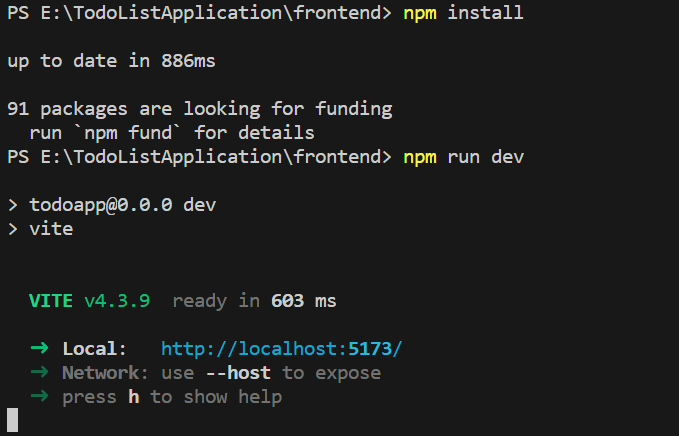
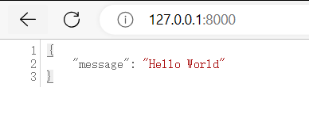
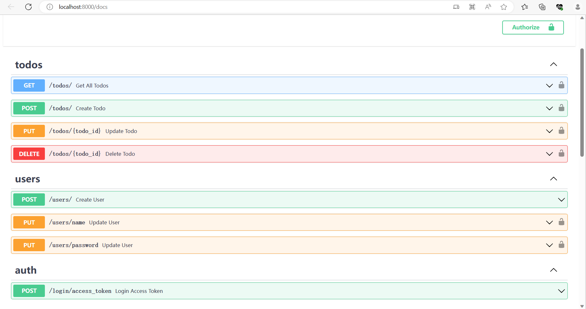
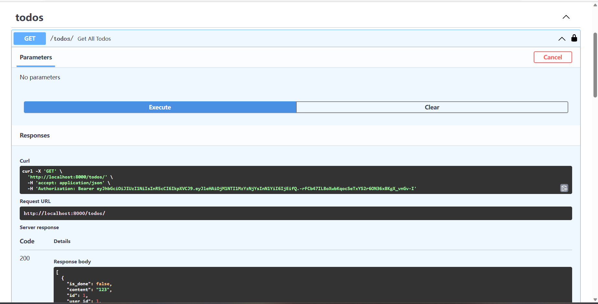

# default 主界面 hello world

在文件中，您将找到以下代码：backend/main.py

```python
import uvicorn
from fastapi import FastAPI
from fastapi.middleware.cors import CORSMiddleware
from api.api import api_router

app = FastAPI()
app.include_router(api_router)

app.add_middleware(
    CORSMiddleware,
    allow_origins=["*"],
    allow_credentials=True,
    allow_methods=["*"],
    allow_headers=["*"],
)


@app.get("/")
async def root():
    return {"message": "Hello World"}

if __name__ == "__main__":
    uvicorn.run("main:app", reload=True, host="0.0.0.0", port=8000)

```
让我们分解一下：

- 我们实例化一个 FastAPI 对象，它是一个 Python 类，提供 API 的功能。`app`

- 我们实例化一个 这就是我们如何对 API 端点进行分组（和 指定我们稍后将查看的版本和其他配置）`APIRouter`
通过将装饰器添加到函数中，我们为 API 定义了一个基本的 GET 端点。`@api_router.get("/", status_code=200)` `root`

- 我们使用对象的方法注册路由器 在步骤 2 中在 FastAPI 对象上创建。`include_routerapp`

- 当直接调用模块时，条件适用，即如果 我们运行.在这种情况下，我们需要导入，因为 FastAPI 取决于这个 Web 服务器（我们将在后面详细讨论）`__name__ == "__main__"python backend/main.pyuvicorn`

完成所有这些操作（并按照设置说明进行操作）后，您可以点击运行按钮或者使用以下命令的示例存储库中的代码：

```bash
uvicorn main:app --reload
```

得到结果：



如果您导航到本地主机：

[应用程序主界面](http://127.0.0.1:8000/)



需要同学们自己注册一个账号。

[测试API界面](http://localhost:8000/docs)



右上角Authorize按钮登录自己的账号，这是 FastAPI 提供的开箱即用的交互式文档，因为框架 是围绕OpenAPI标准构建的。这些文档页面是交互式的，并且会增加 详细地介绍我们添加更多端点并描述预期的输入/输出值 我们的代码。

尝试您的终端节点：

- 通过单击展开 GET 端点
- 点击“试用”按钮
- 按下大的“执行”按钮
- 按出现的较小的“执行”按钮



您可以看到 API 响应正文（“Hello， World！”消息）以及命令 FastAPI 已经在引擎盖下为您运行。我们将在整个过程中使用此功能 教程系列可轻松检查我们的端点。`curl`.

