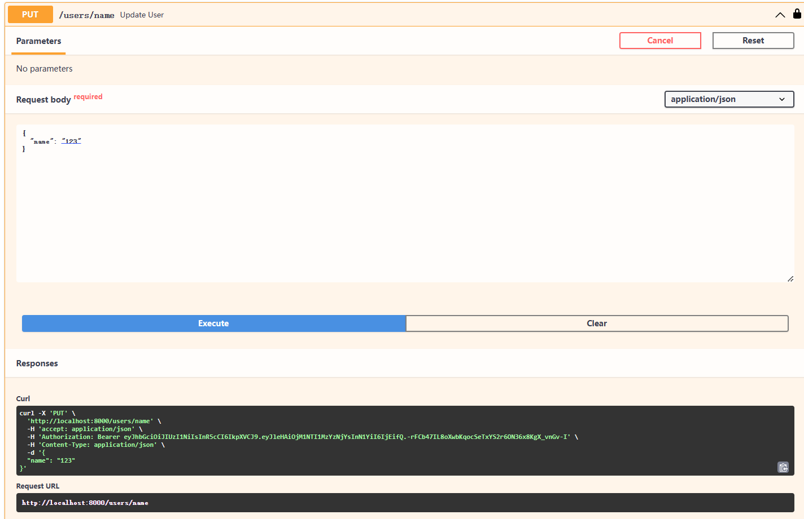

# 具有SRC的端点

让我们继续上面的api代码分解：

1. 我们有我们的玩具数据集（稍后将进入数据库并进行扩展）
2. 我们创建了一个新的端点。请注意，它没有路径参数。
3. 该函数定义新终结点的逻辑。其 参数表示终结点的查询参数。
4. 请注意，对于每个参数，我们指定其类型和默认值。两者都是 来自 Python 标准库模块。
5. 我们使用 Python 列表切片来实现一些基本的搜索功能来限制结果
6. 我们使用 Python 过滤器功能 在我们的玩具数据集上进行非常基本的关键字搜索。搜索完成后，数据将被序列化 通过框架到 JSON。

之后，导航到位于localhost:8001/docs

尝试使用终结点：

- 通过单击展开 PUT 端点
- 点击“试用”按钮
- 为关键字输入值“123”
- 按下大的“执行”按钮
- 按出现的较小的“执行”按钮

后面需要同学们自行调试。
