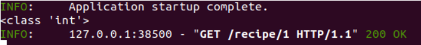

# URL路径参数和类型提示

本节内容，我们会定义带参数的API，并对其进行测试，为此我们在前一节的`main.py`文件中进行小部分修改：

:::note 步骤

1. 我们在字典列表中创建了一些示例配方数据。目前，这是最简单的数据，但符合我们的学习目的。在本教程系列的后面部分，我们将展开 此数据集并将其存储在数据库中。`RECIPE`

```python
# 1
RECIPES = [
    {
        "id": 1,
        "label": "Chicken Vesuvio",
        "source": "Serious Eats",
        "url": "http://www.seriouseats.com/recipes/2011/12/chicken-vesuvio-recipe.html",
    },
    {
        "id": 2,
        "label": "Chicken Paprikash",
        "source": "No Recipes",
        "url": "http://norecipes.com/recipe/chicken-paprikash/",
    },
    {
        "id": 3,
        "label": "Cauliflower and Tofu Curry Recipe",
        "source": "Serious Eats",
        "url": "http://www.seriouseats.com/recipes/2011/02/cauliflower-and-tofu-curry-recipe.html",
    },
]

# skipping ahead ...
```

将上述代码插入到`main.py`的导入语句之后。

2. 我们创建了一个新的端点。这里的大括号表示 参数值，需要与端点函数采用的参数之一匹配。`GET/recipe/{recipe_id}fetch_recipe`

```python
# 2 - New addition, path parameter
# https://fastapi.tiangolo.com/tutorial/path-params/
@api_router.get("/recipe/{recipe_id}", status_code=200)
```

将上述代码插入到根路由资源之后。

3. 该函数定义新终结点的逻辑。函数的类型提示 FastAPI 使用与 URL 路径参数匹配的参数来执行自动验证和转换。 我们稍后会看看这个实际操作。`fetch_recipe`

```python
def fetch_recipe(*, recipe_id: int) -> dict:  # 3
    """
    Fetch a single recipe by ID
    """

```

将上述代码接入第二步之后。

4. 我们模拟通过 ID 从数据库中按 ID 获取数据，并使用 ID 条件检查进行简单的列表推导。 然后，数据被序列化，并由 FastAPI 作为 JSON 返回。

```python
# 4
    result = [recipe for recipe in RECIPES if recipe["id"] == recipe_id]
    if result:
        return result[0]
```

最后将第四步代码接入第三步之后。

访问前记得保证自己的API处于运行状态。
:::

:::info 访问

导航到localhost:8000/docs,我们可以看到：


您发现比起前一节，此时多出了一个带参数路由的API。

尝试使用终结点：

- 通过单击展开 GET 端点
- 点击“试用”按钮
- 输入值“1”作为recipe_id
- 按下大的“执行”按钮
- 按出现的较小的“执行”按钮


试试其他参数得到的反应叭~
:::

:::tip 基本类型提示问题

让我们添加一个 print 语句来进一步了解端点中发生的情况：

```python
@api_router.get("/recipe/{recipe_id}", status_code=200)
def fetch_recipe(*, recipe_id: int) -> dict:
    """
    Fetch a single recipe by ID
    """
    print(type(recipe_id))  # ADDED

    result = [recipe for recipe in RECIPES if recipe["id"] == recipe_id]
    if result:
        return result[0]
```

现在，当您试用端点时，您将在终端中看到：



现在将类型提示更改为字符串：

```python
def fetch_recipe(*, recipe_id: str) -> dict:
# skipping...
```

现在，在终端中，当您调用端点时，您将看到正在打印的字符串。

这是因为 FastAPI 根据函数参数类型提示强制输入参数类型。 这是防止输入错误的便捷方法。 您会注意到，将recipe_id更改为字符串后，您将不再获得对 API 调用的响应。

请思考为什么会有这样的结果。
:::

:::warning 答案
由于 是字符串，因此列表推导式中的匹配项不再与整数 ID 匹配 字典列表中的值。这是一个非常简单的例子，说明 FastAPI 如何与类型提示集成 可以防止许多输入错误，而无需我们在代码中编写额外的检查（更少的代码意味着更少的错误）。`recipe_id==RECIPES`
:::

我们只是触及了 FastAPI 如何使用类型提示的表面，在接下来的几个中将对此进行更多介绍教程的部分内容。
