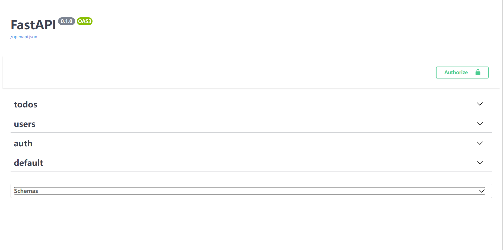
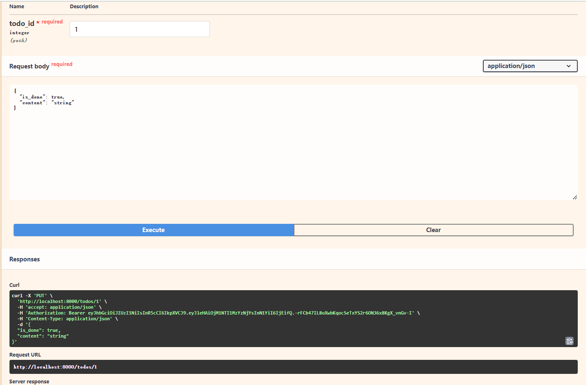

# 具有URL的端点
在路径`backend/api/……`文件夹中我们采用了封装的特性，使用`api.py`调用`auth.py`,`todos.py`,`users.py`,分别对应UI界面的各部分



```python
api.py
from fastapi import APIRouter
from api.todos import router as todos_router
from api.users import router as users_router
from api.auth import router as auth_router

api_router = APIRouter()
api_router.include_router(todos_router, prefix="/todos", tags=["todos"])
api_router.include_router(users_router, prefix="/users", tags=["users"])
api_router.include_router(auth_router, tags=["auth"])
```

```python
auth.py
from fastapi import APIRouter, Depends, HTTPException
from fastapi.security import OAuth2PasswordRequestForm
from sqlalchemy.orm import Session
from api import deps
from crud import crud_user
from schemas import token as schemas_token
from core import security

router = APIRouter()


@router.post("/login/access_token", response_model=schemas_token.Token)
def login_access_token(
    db: Session = Depends(deps.get_db), form_data: OAuth2PasswordRequestForm = Depends()
):

    user = crud_user.authenticate(
        db, email=form_data.username, password=form_data.password
    )

    if not user:
        raise HTTPException(
            status_code=400,
            detail="Incorrect email or password"
        )
    access_token = security.create_access_token(user.id)
    return {
        "access_token": access_token,
        "token_type": "bearer"
    }

```

```python
deps.py
from typing import Generator
from db.config import SessionLocal
from fastapi import Depends, HTTPException, status
from fastapi.security import OAuth2PasswordBearer
from pydantic import ValidationError
from sqlalchemy.orm import Session
from jose import jwt
from core import security
from crud import crud_user
from schemas import token as schemas_token

reusable_oauth2 = OAuth2PasswordBearer(
    tokenUrl="/login/access_token"
)


def get_db() -> Generator:
    db = SessionLocal()
    try:
        yield db
    finally:
        db.close()


def get_current_user(
    db: Session = Depends(get_db),
    token: str = Depends(reusable_oauth2)
):
    try:
        payload = jwt.decode(
            token, security.SECRET_KEY, algorithms=[security.ALGORITHM]
        )
        token_data = schemas_token.TokenPayload(**payload)
    except (jwt.JWTError, ValidationError):
        raise HTTPException(
            status_code=status.HTTP_403_FORBIDDEN,
            detail="Could not validate credentials"
        )

    user = crud_user.get_by_id(db, id=token_data.sub)

    if not user:
        raise HTTPException(
            status_code=status.HTTP_404_NOT_FOUND,
            detail="User not found"
        )

    return user

```

```python
todos.py
from fastapi import APIRouter, Depends, HTTPException
from sqlalchemy.orm import Session
from api import deps
from crud import crud_todo
from schemas import todo as schemas_todo


router = APIRouter()


@router.get("/", response_model=list[schemas_todo.TodoInDB])
def get_all_todos(
    db: Session = Depends(deps.get_db),
    current_user = Depends(deps.get_current_user)
):
    todos = crud_todo.get_all_by_user_id(db=db, user_id=current_user.id)
    return todos


@router.post("/", response_model=schemas_todo.TodoInDB)
def create_todo(
    todo_params: schemas_todo.TodoCreate,
    db: Session = Depends(deps.get_db),
    current_user = Depends(deps.get_current_user)
):
    todo = crud_todo.create(db=db, user_id=current_user.id, todo_params=todo_params)
    return todo


@router.put("/{todo_id}", response_model=schemas_todo.TodoInDB)
def update_todo(
    todo_id: int,
    todo_params: schemas_todo.TodoCreate,
    db: Session = Depends(deps.get_db),
    current_user = Depends(deps.get_current_user)
):
    todo = crud_todo.get_by_id_with_user_id(db=db, id=todo_id, user_id=current_user.id)

    if not todo:
        raise HTTPException(status_code=404, detail="Todo not found")

    todo = crud_todo.update(db=db, id=todo_id, user_id=current_user.id, todo_params=todo_params)
    return todo


@router.delete("/{todo_id}", response_model=schemas_todo.TodoInDB)
def delete_todo(
    todo_id: int,
    db: Session = Depends(deps.get_db),
    current_user = Depends(deps.get_current_user)
):

    todo = crud_todo.get_by_id_with_user_id(db=db, id=todo_id, user_id=current_user.id)

    if not todo:
        raise HTTPException(status_code=404, detail="Todo not found")
    todo = crud_todo.remove(db=db, id=todo_id)

    return todo

```

```python
users.py

from fastapi import APIRouter, Depends, HTTPException
from sqlalchemy.orm import Session
from api import deps
from crud import crud_user
from schemas import user as schemas_user


router = APIRouter()


@router.post("/", response_model=schemas_user.UserInDB)
def create_user(
    user_params: schemas_user.UserCreate,
    db: Session = Depends(deps.get_db)
):
    user = crud_user.get_by_email(db=db, email=user_params.email)
    if user:
        raise HTTPException(
            status_code=400,
            detail="The user with this email already exists in the system."
        )
    user = crud_user.create(db=db, user_params=user_params)
    return user


@router.put("/name", response_model=schemas_user.UserInDB)
def update_user(
    user_params: schemas_user.UserUpdateName,
    db: Session = Depends(deps.get_db),
    current_user = Depends(deps.get_current_user)
):
    user = crud_user.update_name(db=db, id=current_user.id, user_params=user_params)
    return user


@router.put("/password", response_model=schemas_user.UserInDB)
def update_user(
    user_params: schemas_user.UserUpdatePassword,
    db: Session = Depends(deps.get_db),
    current_user = Depends(deps.get_current_user)
):
    user = crud_user.update_password(db=db, id=current_user.id, user_params=user_params)
    return user

```

让我们分解一下：

我们在字典列表中创建了一些示例配方数据。目前，这是基本的 和最小，但符合我们的学习目的。在本教程系列的后面部分，我们将展开 此数据集并将其存储在数据库中。

我们创建了一个新的端点。这里的大括号表示 参数值，需要与端点函数采用的参数之一匹配。

该函数定义新终结点的逻辑。函数的类型提示 FastAPI 使用与 URL 路径参数匹配的参数来执行自动验证和转换。 我们稍后会看看这个实际操作。
我们模拟通过 ID 从数据库中按 ID 获取数据，并使用 ID 条件检查进行简单的列表推导。 然后，数据被序列化，并由 FastAPI 作为 JSON 返回。

之后，导航到`localhost:8001/docs`

尝试使用终结点：

- 通过单击展开 PUT 端点
- 点击“试用”按钮
- 输入值“1”作为todo_id
- 按下大的“执行”按钮
- 按出现的较小的“执行”按钮



