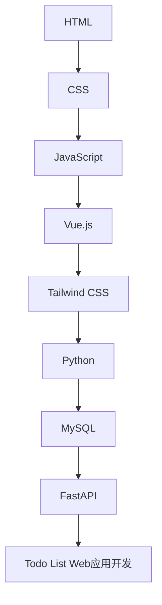

# 预学习

:::tip

本课程网站内容请仔细阅读后再进行实操。因未仔细阅读内容，出现任何错误后果自负（逃～～～逃～～～逃

:::

## 必读材料读后感

课程必读材料，需提交不少于 200 字的读后感（写在课程实验报告里面，该项内容占最终成绩一定比例）。

1. 提问的智慧：https://github.com/ryanhanwu/How-To-Ask-Questions-The-Smart-Way/blob/main/README-zh_CN.md
2. 别像弱智一样提问：https://github.com/tangx/Stop-Ask-Questions-The-Stupid-Ways/blob/master/README.md
3. 学术诚信准则：http://integrity.mit.edu/
4. 关于写代码的学术诚信：http://integrity.mit.edu/handbook/writing-code
5. 南京大学 ICS PA 常见问题：https://nju-projectn.github.io/ics-pa-gitbook/ics2022/FAQ.html
6. 如何科学提问：https://ysyx.oscc.cc/docs/prestudy/0.1.html
7. 什么样的问题我不想回答：https://zhuanlan.zhihu.com/p/381820481
8. 提问模版：https://ysyx.oscc.cc/docs/misc/ask.html
9. “大学除了专业知识，还应该学些什么？” 南京大学《SICP》课堂李樾老师的絮絮叨叨：https://www.bilibili.com/video/BV1uR4y167pA/
10. 读完《上海交通大学生存手册》立志篇：https://survivesjtu.gitbook.io/survivesjtumanual/

:::caution
课程所有实验需严格准守学术诚信原则，如果不能遵守学术诚信原则，作为一个成年人你应该感到 Shame（[什么是 Shame?](https://en.wikipedia.org/wiki/Shame)）。
:::

## 现代 Web Application 开发学习路径

:::tip

本课程采用的 Web 前后端开发的技术栈为：`Vue.js + Tailwind CSS + FastAPI + MySQL` 。
使用 git 进行代码版本管理，GitHub 为代码远程仓库，Docker 进行应用部署。
(受限于课程实践和课改内容未完全准备好，本学期课程不教授 git 代码版本管理和 docker 进行
应用部署的内容，请同学们自行学习相关内容。)

:::

:::info

**请仔细阅读：Nodejs、Python、git、MySQL、VS Code 的安装教程，并安装对应的环境。**

:::

### 技术栈的官方文档

:::tips

**官方文档是最好的学习资料，本课程网站受限多种原因，可能部分教程未能及时更新到最新版本，如有问题请以官方文档为准**

:::

- HTML：https://developer.mozilla.org/en-US/docs/Web/HTML
- CSS：https://developer.mozilla.org/en-US/docs/Web/CSS
- JavaScript：https://developer.mozilla.org/en-US/docs/Web/JavaScript
- Vue.js：https://cn.vuejs.org/
- Tailwind CSS：https://tailwindcss.com/docs/utility-first
- Python：https://docs.python.org/3.10/tutorial/index.html
- FastAPI：https://fastapi.tiangolo.com/lo/
- Alembic：https://alembic.sqlalchemy.org/en/latest/tutorial.html
- SQLAlchemy：https://docs.sqlalchemy.org/en/14/orm/tutorial.html

## 关于遇到问题的搜索

我们想通过必读材料的阅读，你应该知道搜索的重要性了。你会发现你不太容易搜索到相关的中文资料，所以你需要适应查阅英文资料。

如何适应查阅英文资料? 方法是尝试并坚持查阅**英文资料**。

|            |                                         搜索引擎 |            百科            |         问答网站         |
| :--------- | -----------------------------------------------: | :------------------------: | :----------------------: |
| 推荐使用   | [这里](https://dir.scmor.com/)有 Google 搜索镜像 |  http://en.wikipedia.org   | http://stackoverflow.com |
| 不推荐使用 |                         ~~http://www.baidu.com~~ | ~~http://baike.baidu.com~~ | ~~https://www.csdn.net~~ |

一些说明:

1. 一般来说, 百度对英文关键词的处理能力比不上 Google。同时百度的广告太多，关键词检索首页命中率太低，我们认为用百度搜索技术问题纯属在浪费生命，而且是大大的浪费生命。强烈推荐 Google 搜索，至于如何访问 Google 搜索，请自行了解相关知识，或者使用我们表格中提供的 Google 搜索镜像。
2. 通常来说, 英文维基百科比中文维基百科和百度百科包含更丰富的内容. 为了说明为什么要使用英文维基百科, 请你对比词条前束范式分别在[百度百科](https://baike.baidu.com/item/%E5%89%8D%E6%9D%9F%E8%8C%83%E5%BC%8F), [中文维基百科](http://zh.wikipedia.org/wiki/%E5%89%8D%E6%9D%9F%E8%8C%83%E5%BC%8F)和[英文维基百科](https://en.wikipedia.org/wiki/Prenex_normal_form)中的内容。
3. [stackoverflow](https://stackoverflow.com/)是一个程序设计领域的问答网站, 里面除了技术性的问题([What is ":-!!" in C code?](https://stackoverflow.com/questions/9229601/what-is-in-c-code/9229793))之外, 也有一些学术性([Is there a regular expression to detect a valid regular expression?](https://stackoverflow.com/questions/172303/is-there-a-regular-expression-to-detect-a-valid-regular-expression)) 和一些有趣的问题([What is the “-->” operator in C++?](https://stackoverflow.com/questions/1642028/what-is-the-operator-in-c))。
4. AI 时代，强烈推荐使用 ChatGPT 来辅助你学习 。ChatGPT 可以回答你包括数学作业、编程等等几乎你能想到的一切问题。至于如何使用 ChatGPT，可以阅读[ChatGPT 中文指南](https://github.com/yzfly/awesome-chatgpt-zh)。

:::caution
由于 ChatGPT 极其强大，我们也深知本课程作业 ChatGPT 可以帮你完成，但是作为一个成年人以及一位合格的大学本科生，你应该遵守**学术诚信**原则自己完成作业。ChatGPT 只是辅助你学好这门课所要教给你的知识。
:::

### Google 搜索技巧

[如何高效地使用 Google 搜索](../notes/google.md)
