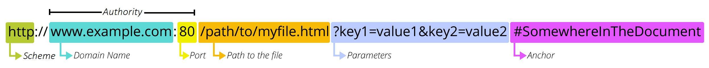

# 什么是 URL

本文复制于：
  1. https://developer.mozilla.org/zh-CN/docs/Learn/Common_questions/Web_mechanics/What_is_a_URL

## 概述

URL 是 Web 中的一个核心概念。它是浏览器用来检索 web 上公布的任何资源的机制。

URL 代表着是统一资源定位符（Uniform Resource Locator）。URL 无非就是一个给定的独特资源在 Web 上的地址。理论上说，每个有效的 URL 都指向一个唯一的资源。这个资源可以是一个 HTML 页面，一个 CSS 文档，一幅图像，等等。而在实际中，也有一些例外，最常见的情况就是一个 URL 指向了不存在的或是被移动过的资源。由于通过 URL 呈现的资源和 URL 本身由 Web 服务器处理，因此 web 服务器的拥有者需要认真地维护资源以及与它关联的 URL。

## 深入探索

下面是一些URL的示例：

```bash
https://developer.mozilla.org
https://developer.mozilla.org/en-US/docs/Learn/
https://developer.mozilla.org/en-US/search?q=URL
```
您可以将上面的这些网址输进您的浏览器地址栏来告诉浏览器加载相关联的页面（或资源）。

一个 URL 由不同的部分组成，其中一些是必须的，而另一些是可选的。让我们以下面这个 URL 为例看看其中最重要的部分：



### 协议


`http` 是协议。它表明了浏览器必须使用何种协议。它通常都是 HTTP 协议或是 HTTP 协议的安全版，即 HTTPS。Web 需要它们二者之一，但浏览器也知道如何处理其他协议，比如 `mailto`:（打开邮件客户端）或者 `ftp`:（处理文件传输），所以当你看到这些协议时，不必惊讶。


### Authority


- `www.example.com` 是域名。它表明正在请求哪个 Web 服务器。或者，可以直接使用IP地址，但是因为它不太方便，所以它不经常在网络上使用。
- `:80` 是端口。它表示用于访问 Web 服务器上的资源的技术“门”。如果 Web 服务器使用 HTTP 协议的标准端口（HTTP 为 80，HTTPS 为 443）来授予其资源的访问权限，则通常会被忽略。否则是强制性的。


### 资源路径


`/path/to/myfile.html` 是网络服务器上资源的路径。在 Web 的早期阶段，像这样的路径表示 Web 服务器上的物理文件位置。如今，它主要是由没有任何物理现实的 Web 服务器处理的抽象。

### 参数


`?key1=value1&key2=value2` 是提供给网络服务器的额外参数。这些参数是用 `&` 符号分隔的键/值对列表。在返回资源之前，Web 服务器可以使用这些参数来执行额外的操作。每个 Web 服务器都有自己关于参数的规则，唯一可靠的方式来知道特定 Web 服务器是否处理参数是通过询问 Web 服务器所有者。

### 锚点


`#SomewhereInTheDocument` 是资源本身的另一部分的锚点。锚点表示资源中的一种“书签”，给浏览器显示位于该“加书签”位置的内容的方向。例如，在 HTML 文档上，浏览器将滚动到定义锚点的位置;在视频或音频文档上，浏览器将尝试转到锚代表的时间。值得注意的是，＃后面的部分（也称为片段标识符）从来没有发送到请求的服务器。

你可能想到一个 URL 类似普通信件的地址：协议代表你要使用的邮政服务，域名是城市或者城镇，端口则像邮政编码；路径代表着你的信件所有递送的大楼；参数则提供额外的信息，如大楼所在单元；最后，锚点表示信件的收件人。