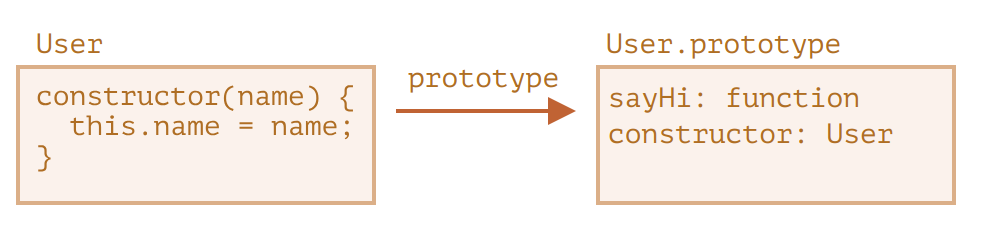
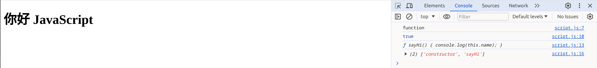

# 类
在面向对象的编程中，class 是用于创建对象的可扩展的程序代码模版，它为对象提供了状态（成员变量）的初始值和行为（成员函数或方法）的实现。

在日常开发中，我们经常需要创建许多相同类型的对象，例如用户（users）、商品（goods）或者任何其他东西。

但在现代 JavaScript 中，还有一个更高级的“类（class）”构造方式，它引入许多非常棒的新功能，这些功能对于面向对象编程很有用。

基本的类语法看起来像这样：
```js showLineNumbers title="script.js"
class MyClass {
  prop = value; // 属性

  constructor(...) { // 构造器
    // ...
  }

  method(...) {} // method

  get something(...) {} // getter 方法
  set something(...) {} // setter 方法

  [Symbol.iterator]() {} // 有计算名称（computed name）的方法（此处为 symbol）
  // ...
}
```
MyClass 是一个函数（我们提供作为 constructor 的那个），而 methods、getters 和 setters 都被写入了 MyClass.prototype。

## class 语法
基本语法是：
```js showLineNumbers title="script.js"
class MyClass {
  // class 方法
  constructor() { ... }
  method1() { ... }
  method2() { ... }
  method3() { ... }
  ...
}
```
使用 new MyClass() 来创建具有上述列出的所有方法的新对象。

new 会自动调用 constructor() 方法，因此我们可以在 constructor() 中初始化对象。

```js showLineNumbers title="script.js"
class User {

  constructor(name) {
    this.name = name;
  }

  sayHi() {
    alert(this.name);
  }

}

// 用法：
let user = new User("John");
user.sayHi();
```
当 new User("John") 被调用：

- 1、一个新对象被创建。
- 2、constructor 使用给定的参数运行，并将其赋值给 this.name。
  
然后我们就可以调用对象方法了，例如 user.sayHi。
:::tip 
类的方法之间没有逗号

对于新手开发人员来说，常见的陷阱是在类的方法之间放置逗号，这会导致语法错误。

不要把这里的符号与对象字面量相混淆。在类中，不需要逗号。
:::

在 JavaScript 中，类是一种函数。
```js showLineNumbers title="script.js"
Class User {
  constructor(name) { this.name = name; }
  sayHi() { alert(this.name); }
}

// 佐证：User 是一个函数
alert(typeof User); // function
```
Class 是类，User是一个函数名，该函数成为类声明的结果。该函数的代码来自于 constructor 方法（如果我们不编写这种方法，那么它就被假定为空）。

我们可以将 class User 声明的结果解释为：


再举个例子：
```js showLineNumbers title="script.js"
class User {
  constructor(name) { this.name = name; }
  sayHi() { console.log(this.name); }
}

// class 是一个函数
console.log(typeof User); // function

// ...或者，更确切地说，是 constructor 方法
console.log(User === User.prototype.constructor); // true

// 方法在 User.prototype 中，例如：
console.log(User.prototype.sayHi); // sayHi 方法的代码

// 在原型中实际上有两个方法
console.log(Object.getOwnPropertyNames(User.prototype)); // constructor, sayHi
```


## 类表达式
就像函数一样，类可以在另外一个表达式中被定义，被传递，被返回，被赋值等。

类似于命名函数表达式（Named Function Expressions），类表达式可能也应该有一个名字。

如果类表达式有名字，那么该名字仅在类内部可见：
```js showLineNumbers title="script.js"
// “命名类表达式（Named Class Expression）”
// (规范中没有这样的术语，但是它和命名函数表达式类似)
let User = class MyClass {
  sayHi() {
    alert(MyClass); // MyClass 这个名字仅在类内部可见
  }
};

new User().sayHi(); // 正常运行，显示 MyClass 中定义的内容

alert(MyClass); // error，MyClass 在外部不可见
```


## Getters/setters
类可能包括 getters/setters，计算属性（computed properties）等
```js showLineNumbers title="script.js"
class User {

  constructor(name) {
    // 调用 setter
    this.name = name;
  }

  get name() {
    return this._name;
  }

  set name(value) {
    if (value.length < 4) {
      alert("Name is too short.");
      return;
    }
    this._name = value;
  }

}

let user = new User("John");
alert(user.name); // John

user = new User(""); // Name is too short.
```

## Class 字段
:::tip 
旧的浏览器可能需要 polyfill

类字段（field）是最近才添加到语言中的。

建议使用Google。
:::

“类字段”是一种允许添加任何属性的语法。

类字段 click = () => {} 是基于每一个对象被创建的，在这里对于每一个 Button 对象都有一个独立的方法，在内部都有一个指向此对象的 this。我们可以把 button.click 传递到任何地方，而且 this 的值总是正确的。
```js showLineNumbers title="script.js"
class Button {
  constructor(value) {
    this.value = value;
  }
  click = () => {
    alert(this.value);
  }
}

let button = new Button("hello");

setTimeout(button.click, 1000); // hello
```


