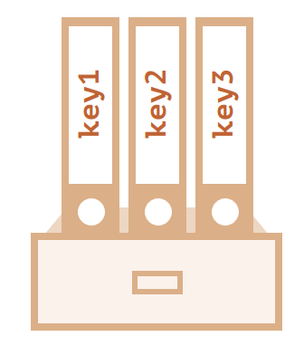

# JavaScript 语句
JavaScript 语句向浏览器发出的命令。语句的作用是告诉浏览器该做什么。

## Array 数组

数据结构数组，它能存储有序的集合，可以用一个变量名存储所有的值，并且可以用变量名访问任何一个值。

数组中的每个元素都有自己的的ID，以便它可以很容易地被访问到，元素从 0 开始编号，我们可以通过方括号中的数字获取元素：
```js showLineNumbers title="script.js"
let fruits = ["Apple", "Orange", "Plum"];

alert( fruits[0] ); // Apple
alert( fruits[1] ); // Orange
alert( fruits[2] ); // Plum
``` 

可以替换元素，或者向数组新加一个元素，也可以用 alert 来显示整个数组，length 属性的值是数组中元素的总个数，数组可以使用 “at” 获取最后一个元素：
```js showLineNumbers title="script.js"
let fruits = ["Apple", "Orange", "Plum"];
fruits[2] = 'Pear'; // 现在变成了 ["Apple", "Orange", "Pear"]
fruits[3] = 'Lemon'; // 现在变成 ["Apple", "Orange", "Pear", "Lemon"]
console.log(`fruits.length:${fruits.length}!` );//控制台：fruits.length:4!
alert( fruits );//Apple,Orange,Pear,Lemon!
alert( fruits.at(-1) ); // Lemon
``` 


:::tip 代码注释
arr.at(i)：如果 i >= 0，则与 arr[i] 完全相同，对于 i 为负数的情况，它则从数组的尾部向前数。
<!-- 
双端队列的方式使用数组：
- push(...items) 在末端添加 items 项。
- pop() 从末端移除并返回该元素。
- shift() 从首端移除并返回该元素。
- unshift(...items) 从首端添加 items 项。 -->
:::

## 条件语句

我们可以使用 if 语句和条件运算符 ?（也称为“问号”运算符）来实现。

### “if” 语句
if 语句有时会包含一个可选的 “else” 块。如果判断条件不成立，就会执行它内部的代码。

有时需要测试一个条件的几个变体。我们可以通过使用 else if 子句实现。
```js showLineNumbers title="script.js"
let year = prompt('In which year was ECMAScript-2024 specification published?', '');

if (year < 2024) {
  alert( 'Too early...' );
} else if (year > 2024) {
  alert( 'Too late' );
} else {
  alert( 'Exactly!' );
}
``` 

JavaScript 先检查 year < 2024。如果条件不符合，就会转到下一个条件 year > 2024。如果这个条件也不符合，则会显示最后一个 alert。

可以有更多的 else if 块。结尾的 else 是可选的。

### 条件运算符 ‘?’
有时我们需要根据一个条件去赋值一个变量:在对话框输入年龄，会得到不同的结果。
- 第一个问号检查 age < 3。
- 如果为真 — 返回 'Hi, baby!'。否则，会继续执行冒号 ":" 后的表达式，检查 age < 22。
- 如果为真 — 返回 'Hello! Welcome to the assignment'。否则，会继续执行下一个冒号 ":" 后的表达式，检查 age < 100。
- 如果为真 — 返回 'Greetings!'。否则，会继续执行最后一个冒号 ":" 后面的表达式，返回 'What an unusual age!'。
```js showLineNumbers title="script.js"
let age = prompt('age?', '');

let message = (age < 3) ? 'Hi, baby!' :
  (age < 22) ? 'Hello! Welcome to the assignment' :
  (age < 100) ? 'Greetings!' :
  'What an unusual age!';

alert( message );
``` 


### switch 语句
switch 语句可以替代多个 if 判断。

switch 语句为多分支选择的情况提供了一个更具描述性的方式。

switch 语句有至少一个 case 代码块和一个可选的 default 代码块。

```js showLineNumbers title="script.js"
let a = 2 + 2;

switch (a) {
  case 3:
    alert( 'Too small' );
    break;
  case 4:
    alert( 'Exactly!' );
    break;
  case 5:
    alert( 'Too big' );
    break;
  default:
    alert( "I don't know such values" );
}
``` 
比较 x 值与第一个 case（也就是 value1）是否严格相等，然后比较第二个 case（value2）以此类推。

如果相等，switch 语句就执行相应 case 下的代码块，直到遇到最靠近的 break 语句（或者直到 switch 语句末尾）。

如果没有符合的 case，则执行 default 代码块（如果 default 存在）。


## 逻辑运算符
JavaScript 中有四个逻辑运算符：||（或），&&（与），!（非），??（空值合并运算符）。

### ||（或）
在 JavaScript 中，逻辑或仅能够操作布尔值。如果参与运算的任意一个参数为 true，返回的结果就为 true，否则返回 false。

四种可能的逻辑组合，其中数字 1 被作为 true 处理，数字 0 则被作为 false，逻辑或 || 会被用在 if 语句中，用来测试是否有 任何 给定的条件为 true。
```js showLineNumbers title="script.js"
console.log( true || true );   // true
console.log( false || true );  // true
console.log( true || false );  // true
console.log( false || false ); // false
if (1 || 0) { // 工作原理相当于 if( true || false )
    console.log( 'truthy!' );
  }
  
let hour = 12;
let isWeekend = true;
  
if (hour < 10 || hour > 18 || isWeekend) {
    alert( 'The office is closed.' ); // 是周末
}
```

运算符 || 做了如下的事情：
- 从左到右依次计算操作数。
- 处理每一个操作数时，都将其转化为布尔值。如果结果是 true，就停止计算，返回这个操作数的初始值。
- 如果所有的操作数都被计算过（也就是，转换结果都是 false），则返回最后一个操作数。
返回的值是操作数的初始形式，不会做布尔转换。

换句话说，一个或运算 || 的链，将返回第一个真值，如果不存在真值，就返回该链的最后一个值。


当两个操作数都是真值时，与运算返回 true，否则返回 false,就像或运算一样，与运算的操作数可以是任意类型的值：
```js showLineNumbers title="script.js"
console.log( true && true );   // true
console.log( false && true );  // false
console.log( true && false );  // false
console.log( false && false ); // false
if (1 && 0) { // 作为 true && false 来执行
  console.log( "won't work, because the result is falsy" );//没执行
}

let hour = 12;
let minute = 30;

if (hour == 12 && minute == 30) {
  alert( 'Time is 12:30' );
}
```


与运算 && 做了如下的事：
- 从左到右依次计算操作数。
- 在处理每一个操作数时，都将其转化为布尔值。如果结果是 false，就停止计算，并返回这个操作数的初始值。
- 如果所有的操作数都被计算过（例如都是真值），则返回最后一个操作数。

换句话说，与运算返回第一个假值，如果没有假值就返回最后一个值。

:::tip 
与运算 && 在或运算 || 之前进行
与运算 && 的优先级比或运算 || 要高。

所以代码 a && b || c && d 跟 && 表达式加了括号完全一样：(a && b) || (c && d)。

不要用 || 或 && 来取代 if
:::

### !（非）
逻辑非运算符接受一个参数，并按如下运作：
- 1、将操作数转化为布尔类型：true/false。
- 2、返回相反的值。

两个非运算 !! 有时候用来将某个值转化为布尔类型,第一个非运算将该值转化为布尔类型并取反，第二个非运算再次取反。最后我们就得到了一个任意值到布尔值的转化。

有一个略显冗长的方式也可以实现同样的效果 —— 一个内建的 Boolean 函数：
```js showLineNumbers title="script.js"
console.log( !true ); // false
console.log( !0 ); // true
console.log( !!"non-empty string" ); // true
console.log( !!null ); // false
console.log( Boolean("non-empty string") ); // true
console.log( Boolean(null) ); // false
```

:::tip 
非运算符 ! 的优先级在所有逻辑运算符里面最高，所以它总是在 && 和 || 之前执行。
:::

## 循环
经常需要重复执行一些操作。循环 是一种重复运行同一代码的方法

### While 循环
循环体的单次执行叫作 一次迭代，任何表达式或变量都可以是循环条件，而不仅仅是比较。在 while 中的循环条件会被计算，计算结果会被转化为布尔值。


```js showLineNumbers title="script.js"
let i = 3;
while (i) { // 当 i 变成 0 时，条件为假，循环终止
  alert( i );
  i--;
}
```
:::tip 
单行循环体不需要大括号

如果循环体只有一条语句，则可以省略大括号
```js showLineNumbers title="script.js"
let i = 3;
while (i) alert(i--);
```
:::
如果遇到了死循环（循环会永远重复执行下去），浏览器提供了阻止这种循环的方法，我们可以通过终止进程，来停掉服务器端的 JavaScript。

### do…while 循环
这种形式的语法很少使用，除非你希望不管条件是否为真，循环体至少执行一次。
```js showLineNumbers title="script.js"
let i = 0;
do {
  alert( i );
  i++;
} while (i < 3);
```

### for 循环
for 循环更加复杂，但它是最常使用的循环形式。

我们通过示例来了解一下这三个部分的含义。下述循环从 i 等于 0 到 3（但不包括 3）运行 alert(i)：

```js showLineNumbers title="script.js"
for (let i = 0; i < 3; i++) {
  console.log(i); // 0, 1, 2
}
console.log(i); // 错误，没有这个变量。
```

- begin，let i = 0，进入循环时执行一次。
- condition，i < 3，在每次循环迭代之前检查，如果为 false，停止循环。
- body（循环体），alert(i)，条件为真时，重复运行。
- step，i++，在每次循环体迭代后执行  

一般循环算法的工作原理如下：
```
开始运行
→ (如果 condition 成立 → 运行 body 然后运行 step)
→ (如果 condition 成立 → 运行 body 然后运行 step)
→ (如果 condition 成立 → 运行 body 然后运行 step)
→ ...
```
 :::tip 
for…of 和 for…in 循环
给进阶读者的一个小提示。

本文仅涵盖了基础的循环：while，do..while 和 for(..; ..; ..)。

如果你阅读本文是为了寻找其他类型的循环，那么：

用于遍历对象属性的 for..in 循环请见：for…in。
用于遍历数组和可迭代对象的循环分别请见：for…of 和 iterables。
:::
## break/continue 标签
有时候我们需要一次从多层嵌套的循环中跳出来。

普通 break 只会打破内部循环。这还不够 —— 标签可以实现这一功能！

标签 是在循环之前带有冒号的标识符：
```js showLineNumbers title="script.js"
labelName: for (...) {
  ...
}
```
break labelName 语句跳出循环至标签处：
```js showLineNumbers title="script.js"
outer: for (let i = 0; i < 3; i++) {

  for (let j = 0; j < 3; j++) {

    let input = prompt(`Value at coords (${i},${j})`, '');

    // 如果是空字符串或被取消，则中断并跳出这两个循环。
    if (!input) break outer; // (*)

    // 用得到的值做些事……
  }
}

alert('Done!');
```
break outer 向上寻找名为 outer 的标签并跳出当前循环。

因此，控制权直接从 (*) 转至 alert('Done!')。
:::tip 
标签并不允许“跳到”所有位置

标签不允许我们跳到代码的任意位置。

break 指令必须在代码块内。从技术上讲，任何被标记的代码块都有效。

99.9% 的情况下 break 都被用在循环内，就像在上面那些例子中我们看到的那样。

continue 只有在循环内部才可行。
:::

## Objest 对象
对象则用来存储键值对和更复杂的实体。

我们可以通过使用带有可选 属性列表 的花括号 {} 来创建对象。一个属性就是一个键值对（“key: value”），其中键（key）是一个字符串（也叫做属性名），值（value）可以是任何值。

我们可以把对象想象成一个带有签名文件的文件柜。每一条数据都基于键（key）存储在文件中。这样我们就可以很容易根据文件名（也就是“键”）查找文件或添加/删除文件了。



用下面两种语法中的任一种来创建一个空的对象（“空柜子”）：
```js showLineNumbers title="script.js"
let user = new Object(); // “构造函数” 的语法
let user = {};  // “字面量” 的语法
```
我们用花括号。这种方式我们叫做 字面量。

### 文本和属性
创建对象的时候，立即将一些属性以键值对的形式放到 {  } 中。
```js showLineNumbers title="script.js"
let user = {     // 一个对象
  name: "John",  // 键 "name"，值 "John"
  age: 30,        // 键 "age"，值 30
  isAdmin: true,
};
// 读取文件的属性：
alert( user.name ); // John
alert( user.age ); // 30
```
属性有键（或者也可以叫做“名字”或“标识符”），位于冒号 ":" 的前面，值在冒号的右边。

在 user 对象中，有两个属性：
- 第一个的键是 "name"，值是 "John"。
- 第二个的键是 "age"，值是 30。
  
生成的 user 对象可以被想象为一个放置着两个标记有 “name” 和 “age” 的文件的柜子。


我们可以随时添加、删除和读取文件。

### 方括号
点符号要求 key 是有效的变量标识符。这意味着：不包含空格，不以数字开头，也不包含特殊字符（允许使用 $ 和 _）。

使用方括号，可用于任何字符串：
```js showLineNumbers title="script.js"
let user = {};

// 设置
user["likes birds"] = true;

// 读取
alert(user["likes birds"]); // true

// 删除
delete user["likes birds"];
```
请注意方括号中的字符串要放在引号中，单引号或双引号都可以。

变量 key 可以是程序运行时计算得到的，也可以是根据用户的输入得到的。然后我们可以用它来访问属性。这给了我们很大的灵活性。
```js showLineNumbers title="script.js"
let user = {
  name: "John",
  age: 30
};

let key = prompt("What do you want to know about the user?", "name");

// 访问变量
alert( user[key] ); // John（如果输入 "name"）
```

### 计算属性
当创建一个对象时，我们可以在对象字面量中使用方括号。这叫做计算属性。
```js showLineNumbers title="script.js"
let fruit = prompt("Which fruit to buy?", "apple");

let bag = {
  [fruit]: 5, // 属性名是从 fruit 变量中得的
};

alert( bag.apple ); // 5 如果fruit="apple"
```
### 属性值简写
```js showLineNumbers title="script.js"
function makeUser(name, age) {
  return {
    name, // 与 name: name 相同
    age,  // 与 age: age 相同
    // ……其他的属性
  };
}

let user = makeUser("John", 30);
alert(user.name); // John
```
属性名跟变量名一样。这种通过变量生成属性的应用场景很常见，在这有一种特殊的属性值缩写方法，使属性名变得更短。

### 属性名称限制
变量名不能是编程语言的某个保留字，如 “for”、“let”、“return” 等……
```js showLineNumbers title="script.js"
// 这些属性都没问题
let obj = {
  for: 1,
  let: 2,
  return: 3
};

alert( obj.for + obj.let + obj.return );  // 6
```
属性命名没有限制。属性名可以是任何字符串或者 symbol（一种特殊的标志符类型，将在后面介绍）。

其他类型会被自动地转换为字符串。

### 属性存在性测试，“in” 操作符
JavaScript 的对象有一个需要注意的特性：能够被访问任何属性。即使属性不存在也不会报错！

读取不存在的属性只会得到 undefined。所以我们可以很容易地判断一个属性是否存在：
```js showLineNumbers title="script.js"
let user = {};

alert( user.noSuchProperty === undefined ); // true 意思是没有这个属性
```
对象是具有一些特殊特性的关联数组。

它们存储属性（键值对），其中：

- 属性的键必须是字符串或者 symbol（通常是字符串）。
- 值可以是任何类型。

我们可以用下面的方法访问属性：

- 点符号: obj.property。
- 方括号 obj["property"]，方括号允许从变量中获取键，例如 obj[varWithKey]。

其他操作：
- 删除属性：delete obj.prop。
- 检查是否存在给定键的属性："key" in obj。
- 遍历对象：for(let key in obj) 循环。

JavaScript 中还有很多其他类型的对象：
- Array 用于存储有序数据集合，
- Date 用于存储时间日期，
- Error 用于存储错误信息。
  
它们有着各自特别的特性，我们将在后面学习到。有时候大家会说“Array 类型”或“Date 类型”，但其实它们并不是自身所属的类型，而是属于一个对象类型即 “object”。它们以不同的方式对 “object” 做了一些扩展。