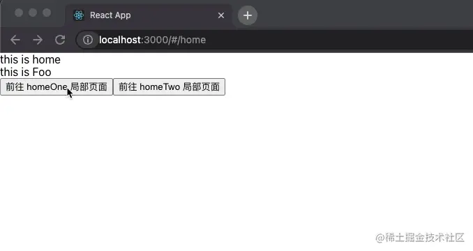

# React-Router 路由

## React-Router 是什么
许多现代网站实际上是由一个页面组成的。它们看起来就像是多个页面，因为它们包含呈现为单独页面的组件。这些通常被称为 SPA——单页应用程序。

从根本上说，React Router 的作用是根据 URL 中使用的路由有条件地显示某些组件（`/` 表示主页，`/about` 表示关于页面等）。

## 安装

要使用 React Router，首先必须使用 NPM 安装它：
```bash
npm install react-router-dom
```

## Route

`Route` 的使用变得更加简洁，可读性更高。

```jsx
import { BrowserRouter as Router, Route, Routes } from "react-router-dom";

<Router>
  <Routes>
    <Route path="/" element={<Index />} />
    <Route path="/home" element={<Home />} />
    <Route path="/user:userId" element={<User />} />
  </Routes>
</Router>;


```

## 页面跳转

### `link`跳转
```jsx
import { Link } from "react-router-dom";

export default Page = () => {
  return (
    <>
      <div>
        <Link to="home">to home page</Link>
      </div>
      // 跳转页面进行替换路由
      <div>
        <Link replace to="home">
          to home page
        </Link>
      </div>
      // 用户可以在这里自定义 userId
      <div>
        <Link to="user:123">to user page</Link>
      </div>
    </>
  );
};
```

### 方法跳转
这里介绍用户常用的跳转方式，第二个入参可选的配置参数。
```jsx
import { useNavigate } from "react-router-dom";

export default Page = () => {
  let navigate = useNavigate();
  return (
    <>
      <button onClick={() => navigate("/home")}>跳转到 home 页面</button>
      <button onClick={() => navigate("/home", { replace: true, state: {} })}>替换到 home 页面</button>
    </>
  );
};

```
* `replace`: 用户配置是否是替换路由，而非创建路由。
* `state`: 用户参数传递，但是这些参数并不会在 url 上体现。而是存在了 `state` 里，这就要保证用户必须是从某个页面跳转过来，并且 `state` 有配置参数。如果用户是直接访问该链接，那么就无法拿到 `state` 里的数据。

如果需要回退页面的话，使用 `navigate(-1)` 即可。


## 嵌套路由



这就是需求实现的效果。

要实现局部路由的效果，首先 `<Route>` 需要实现嵌套。
```jsx
<Routes>
  <Route path="/" element={<Index />} />
  <Route path="/home" element={<Home />}>
    <Route path="/home/one" element={<HomeOne />} />
    <Route path="/home/two" element={<HomeTwo />} />
  </Route>
  <Route path="/user:userId" element={<User />} />
</Routes>

```

嵌套的路由通过 `<Outlet />` 展示。

所以在 /home 文件下用 `<Outlet />` 代替 `<HomeOne />`、`<HomeTwo />` 的展示。

```jsx
import React from "react";
import { useLocation, Outlet, useNavigate } from "react-router-dom";

const HomePage = (props) => {
  let location = useLocation();
  let navigate = useNavigate();
  let urlParams = new URLSearchParams(location.search);
  const obj = {} as any;
  urlParams.forEach((value, key) => (obj[key] = value));

  return (
    <div>
      this is home
      <button onClick={() => navigate("/home/one")}>前往 homeOne 局部页面</button>
      <button onClick={() => navigate("/home/two")}>前往 homeTwo 局部页面</button>
      <Outlet />
    </div>
  );
};

export default HomePage;
```

转载于[React-Router v6 教学(附demo)](https://juejin.cn/post/7088663952225206279)