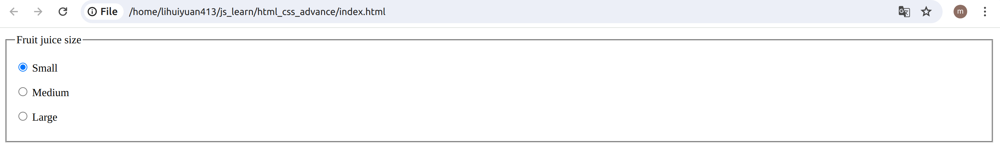
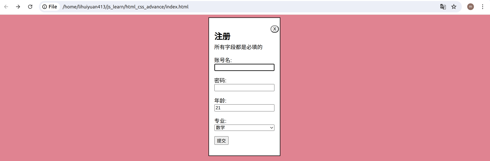

# HTML 表单
新建一个 `html_css_advance_form`的文件夹，然后新建 `html_css_advance_form/index.html`和 `html_css_advance_form/style.css`两个文件。
```html title="index.html"
<!DOCTYPE html>
<html>
  <head>
    <meta charset="utf-8">
    <meta name="viewport" content="width=device-width, initial-scale=1.0">
    <title> Form </title>
  </head>

  <body>
    <form>
    </form>
  </body>
<html>
```
## form 元素
form 元素按照一定的格式定义了表单和确定表单行为的属性。当你想要创建一个 HTML 表单时，都必须从这个元素开始，然后把所有内容都放在里面。许多辅助技术或浏览器插件可以发现form元素并实现特殊的钩子，使它们更易于使用。
:::tip
备注： 严格禁止在一个表单内嵌套另一个表单。嵌套会使表单的行为不可预知，而这取决于正在使用的浏览器。
:::

## fieldset 和 legend 元素
fieldset元素是一种方便的用于创建具有相同目的的小部件组的方式，出于样式和语义目的。你可以在fieldset开口标签后加上一个legend元素来给fieldset标上标签。

许多辅助技术将使用legend 元素，就好像它是相应的 fieldset 元素里每个部件的标签的一部分。
```html title="index.html"
<!DOCTYPE html>
<html>
  <head>
    <meta charset="utf-8">
    <meta name="viewport" content="width=device-width, initial-scale=1.0">
    <title> Form </title>
  </head>

  <body>
    <form>
      <fieldset>
        <legend>Fruit juice size</legend>
        <p>
          <input type="radio" name="size" id="size_1" value="small" />
          <label for="size_1">Small</label>
        </p>
        <p>
          <input type="radio" name="size" id="size_2" value="medium" />
          <label for="size_2">Medium</label>
        </p>
        <p>
          <input type="radio" name="size" id="size_3" value="large" />
          <label for="size_3">Large</label>
        </p>
      </fieldset>
    </form>
  </body>
<html>
```
在网页浏览器中显示如下:

当然这个不算一个正常意义上的表单，只有一个单选框，太单调了。

## 一个例子
```html title="index.html"
<!DOCTYPE html>
<html>
  <head>
    <meta charset="utf-8">
    <meta name="viewport" content="width=device-width, initial-scale=1.0">
    <link rel="stylesheet" href="style.css">
    <title> Form </title>
  </head>

  <body>
    <dialog open aria-labelledby="dialogid">
    <form action="thankyou.php">
        <button type="submit" aria-label="close" formmethod="dialog" formnovalidate>X</button>
        <h2 id="dialogid">注册</h2>
        <p>所有字段都是必填的</p>
        <p>
        <label>账号名: 
            <input type="text" name="name" required />
        </label>
        </p>
        <p>
        <label>密码: 
            <input type="text" name="password" required />
        </label>
        </p>
        <p>
        <label>年龄: 
            <input type="number" min="0" max="131" name="age" required />
        </label>
        </p>
        <p>
        <label>专业:
            <select name="major">
            <option>数学</option>
            <option>化学</option>
            <option>计算机科学</option>
            <option>生物学</option>
            <option>物理学</option>
            <option>历史学</option>
            <option>文学</option>
            <option>心理学</option>
            <option>经济学</option>
            <option>建筑学</option>
            <option>工程学</option>
            <option>法律</option>
            <option>医学</option>
            <option>教育学</option>
            <option>会计学</option>
            <option>艺术</option>
            <option>音乐学</option>
            <option>社会学</option>
            </select>
        </label>
        </p>
        <p>
        <button type="submit" formmethod="post">提交</button>
        </p>
    </form>
    </dialog>
  </body>
<html>
```
用 VS Code 在`html_css_advance_form/style.css`文件添加如下代码：
```css title="style.css"
body {
    background:rgb(249, 166, 179);
    font-family: sans-serif;
  }
  [aria-label="close"] {
    float: right;
    appearance: none;
    border-radius: 5rem;
    margin: -1em;
  }
  p {
    margin-top: 1em;
  }
  h2 + p {
    margin-top: -1em;
  }
  label {
    display: flex;
    flex-direction: column;
  }
```
在网页浏览器中显示如下:

此示例在 dialog 中有一个表单，其中包含一个嵌套的 form，其中包含三个表单控件和两个提交按钮，以及明确的标签和说明。

第一个提交按钮会关闭对话框。使用 formmethod="dialog" 替换表单的默认方法，并关闭 dialog 而不提交或清除数据。您还必须添加 formnovalidate，否则浏览器将尝试验证所有必填字段是否都有值。用户可能想要关闭对话框和表单，但不输入任何数据；验证会阻止这种情况。添加 aria-label="close"，因为“X”是已知的视觉提示，但不是描述性标签。

最后的提交按钮将表单方法设置为 POST。点击后，系统会检查每个值的有效性。如果所有值均有效，系统会提交表单数据并关闭对话框，并且页面可能会重定向到 thankyou.php，即操作网址。如果缺少任何值，或者数值对应的步骤不匹配或超出范围，系统将显示相关浏览器定义的错误消息，表单无法提交，对话框也不会关闭。您可以使用