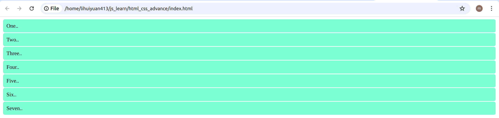

# Grid 布局
网格布局（Grid）是最强大的 CSS 布局方案。

它将网页划分成一个个网格，可以任意组合不同的网格，做出各种各样的布局。以前，只能通过复杂的 CSS 框架达到的效果，现在浏览器内置了。


Grid 布局与 Flex 布局有一定的相似性，都可以指定容器内部多个项目的位置。但是，它们也存在重大区别：

1、方向性：
- Flex 布局（弹性布局）：主要用于单维度布局，即沿着一个轴（通常是水平或垂直）排列项目，可以看作是一维布局
- Grid 布局：允许在两个维度上（行和列）布局项目，因此更适合于复杂的多维度布局需求，可以看作是二维布局

2、项目排列：
- Flex 布局：通过 flex-direction 属性控制项目的排列方向，可以是水平排列（默认），也可以是垂直排列。
- Grid 布局：使用行和列的概念，可以更精ss确地控制项目在网格中的位置，通过 grid-template-rows 和 grid-template-columns 等属性来定义行和列的大小和数量。

3、对齐方式：
- Flex 布局：通过 justify-content 和 align-items 等属性控制项目在主轴和交叉轴上的对齐方式。
- Grid 布局：同样可以通过类似的属性（如 justify-items 和 align-items）控制项目在网格容器中的对齐方式，但它们是针对网格中的每个项目的，默认情况下，Grid 布局中的项目会填充整个网格区域。

4、适用场景：
- Flex 布局：适合于构建单维度的布局，比如导航菜单、工具栏、侧边栏等。
- Grid 布局：适用于需要更复杂、多维度布局的情况，比如网格系统、整体页面布局等。


## Grid 属性

新建一个 `html_css_advance_grid`的文件夹，然后新建 `html_css_advance_grid/index.html`和 `html_css_advance_grid/style.css`两个文件。
用 VS Code 在`html_css_advance_grid/index.html`文件添加如下代码：

```html title="index.html"
<!DOCTYPE html>
<html>
  <head>
    <meta charset="utf-8">
    <meta name="viewport" content="width=device-width, initial-scale=1.0">
    <link rel="stylesheet" href="style.css">
    <title>grid</title>
  </head>

  <body>
    <div class="grid-container">
      <div class="box box1">  One..</div>
      <div class="box box2">  Two..</div>
      <div class="box box3">  Three..</div>
      <div class="box box4">  Four..</div>
      <div class="box box5">  Five..</div>
      <div class="box box6">  Six..</div>
      <div class="box box7">  Seven..</div>
    </div>
  </body>
<html>
```

用 VS Code 在`html_css_advance_grid/style.css`文件添加如下代码：

```css title="style.css"
.box{
    background-color: aquamarine;
    border-radius: 5px;
    margin: 2px;
    padding: 10px;
}
```

在网页浏览器中显示如下:


HTML 文件中有七个 div 容器。

相应的 CSS 文件包含了所有七个具有 box 类的 div 标记的规则。请注意，每个标记都有两个类名，一个是所有类中通用的，另一个是独立的。该样式将应用于所有容器。

现在，让我们将 grid 容器转换为 grid，为其添加属性。

`display:grid`;
用 VS Code 在`html_css_advance_grid/style.css`将代码修改成如下：
```css title="style.css"
.grid-container{
    display: grid;
}

.box{
    background-color: aquamarine;
    border-radius: 5px;
    margin: 2px;
    padding: 10px;
}
```

现在输出的是七个从左上角开始从左到右排列的 grid 容器。

在网页浏览器中显示如下:


## 对齐属性

让我们检查一下 grid 中的一些对齐属性。有四个主要属性用于对齐 grid 容器及其中的项目： 

1、对齐网格项内部：
- `justify-self`：用于水平对齐单个网格项内部的内容，可以设置为 start、end、center、stretch 等。
- `align-self`：用于垂直对齐单个网格项内部的内容，可以设置为 start、end、center、stretch 等。

2、对齐整个网格容器：
- `justify-items`：用于水平对齐网格容器内的所有网格项，可以设置为 start、end、center、stretch 等。
- `align-items`：用于垂直对齐网格容器内的所有网格项，可以设置为 start、end、center、stretch 等。
- `justify-content`：用于水平对齐整个网格容器内的网格线（列），可以设置为 start、end、center、stretch 等。
- `align-content`：用于垂直对齐整个网格容器内的网格线（行），可以设置为 start、end、center、stretch 等。

### `justify-self`
用 VS Code 在`html_css_advance_grid/style.css`将代码修改成如下：
```css title="style.css"
.grid-container{
  display: grid;
}

.box{
  background-color: aquamarine;
  border-radius: 5px;
  margin: 2px;
  padding: 10px;
  justify-self: center;
}
```
每个 .box 元素内部的内容都将水平居中对齐。

在网页浏览器中显示如下:


### `align-self`
用 VS Code 在`html_css_advance_grid/style.css`将代码修改成如下：
```css title="style.css"
.grid-container{
  display: grid;
}

.box {
  background-color: aquamarine;
  border-radius: 5px;
  margin: 2px;
  padding: 10px;
  align-self: center; /* 垂直居中对齐 */
}
```
.box 元素都会在垂直方向上居中对齐，而不受网格容器的布局影响。
在网页浏览器中显示如下:


### `justify-items`
用 VS Code 在`html_css_advance_grid/style.css`将代码修改成如下：
```css title="style.css"
.grid-container {
  display: grid;
  justify-items: center; /* 水平居中对齐 */
}

.box {
  background-color: aquamarine;
  border-radius: 5px;
  margin: 2px;
  padding: 10px;
}
```
.box 元素都会在垂直方向上居中对齐，而不受网格容器的布局影响。
在网页浏览器中显示如下:


