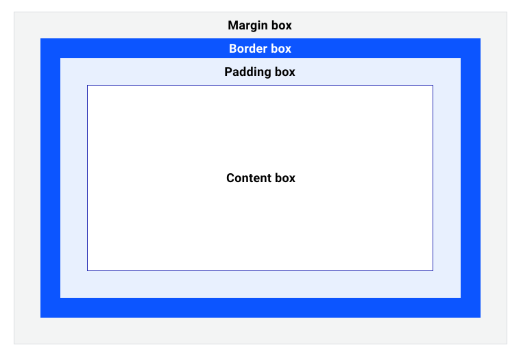

# CSS盒模型

<iframe src="//player.bilibili.com/player.html?bvid=BV1As4y1m7hw&page=1&autoplay=0" width="100%" height="600" scrolling="no" border="0" frameborder="no" framespacing="0" allowfullscreen="true"> </iframe>

所有HTML元素可以看作盒子，在CSS中，"box model"这一术语是用来设计和布局时使用。

CSS盒模型本质上是一个盒子，封装周围的HTML元素，它包括：边距，边框，填充，和实际内容。

盒模型允许我们在其它元素和周围元素边框之间的空间放置元素。




不同部分的说明：

- Content(内容) - 盒子的内容，显示文本和图像， `width` 和 `height` 属性可以发挥作用
- Padding(内边距) - 环绕在内容框周围，并且是由 `padding` 属性创建的空间。由于内边距是在框内部，因此框的背景将在其创建的空间中可见。
- Border(边框) - 环绕在内边距框周围，其空间由 `border` 值占用。 边框框是框的边界，边框边缘是您可以看到的边界的边界。border 属性用于直观地呈现元素。
- Margin(外边距) - 是框周围的空间，由框上的 `margin` 规则定义

盒装模型理解起来比较复杂，因此我们以类比的方式总结一下所学的内容。


在此图中，有三个相框安装在墙上，彼此相邻。该图中的标签用于将帧的元素与框模型相关联。

打个比方：

- 内容框就是艺术作品。
- 内边距框是指位于框架和艺术作品之间的白色安装板。
- 边框框是一个框架，为图片提供字面边框。
- 外边距框是各个帧之间的间距。
- 阴影与外边距框占据的空间相同。


## 案例

用 VS Code 在`html_css_basic/index.html`文件中的代码更改如下：

```html title="index.html"
<!DOCTYPE html>
<html>
  <head>
    <meta charset="utf-8">
    <meta name="viewport" content="width=device-width, initial-scale=1.0">
    <link rel="stylesheet" href="style.css">
    <title>Flexbox</title>
  </head>

  <body>
    <div id="box"> </div>
  </body>
<html>
```

用 VS Code 在`html_css_basic/style.css`文件添加如下代码：

```css title="style.css"
#box {
  width: 350px;
  height: 150px;
  margin: 10px;
  padding: 25px;
  border: 5px solid black;
}
```

在网页浏览器中显示如下:


上述案例中整个盒子实际占用的空间宽为 410px（350 + 25 + 25 + 5 + 5），高为 210px（150 + 25 + 25 + 5 + 5）。


:::note

外边距不计入盒子的实际大小——当然，它影响盒子在页面上所占的总空间，但只影响盒子外的空间。盒子的面积止于边框，不会延伸到外边距中。

:::


## 调试盒模型

用 VS Code 在`html_css_basic/debug.html`文件中的代码更改如下：

```html title="debug.html"
<!DOCTYPE html>
<html>
  <head>
    <meta charset="utf-8">
    <meta name="viewport" content="width=device-width, initial-scale=1.0">
    <link rel="stylesheet" href="debug.css">
    <title>调试</title>
  </head>

  <body>
    <main>
      <div class="wrapper">
        <article class="flow">
          <h1>Outline effect on the box model</h1>
          <figure class="callout">
            <p>Even if we have an outline of 50px like this example, it has no effect on the size of the box.</p>
          </figure>
        </article>
        <div class="box">I am the same size regardless of outline width.<div>
          </div>
    </main>
  </body>
<html>
```

用 VS Code 在`html_css_basic/debug.css`文件添加如下代码：

```css title="debug.css"
.box {
  outline: 50px solid var(--color-primary-dark);
}

article + * {
  margin-top: 100px;
}
```


浏览器开发者工具可以直观呈现选定框的框模型计算结果，这有助于您了解框模型的工作原理，重要的是，它对您正在访问的网站有何影响。

接下来，在您自己的浏览器中尝试此操作：

1. 打开开发者工具
2. 选择一个元素
3. 显示 Box 模型调试程序


## 边框

`border` 具有以下属性的值：
- 宽度：`border-width`
- 风格：`border-style`
- 颜色：`border-color`

用 VS Code 在`html_css_basic/index.html`文件中的代码更改如下：

```html title="index.html"
<!DOCTYPE html>
<html>
  <head>
    <meta charset="utf-8">
    <meta name="viewport" content="width=device-width, initial-scale=1.0">
    <link rel="stylesheet" href="style.css">
    <title>Flexbox</title>
  </head>

  <body>
    <p class="none">无边框。</p>
    <p class="dotted">虚线边框。</p>
    <p class="dashed">虚线边框。</p>
    <p class="solid">实线边框。</p>
    <p class="double">双边框。</p>
    <p class="groove"> 凹槽边框。</p>
    <p class="ridge">垄状边框。</p>
    <p class="inset">嵌入边框。</p>
    <p class="outset">外凸边框。</p>
    <p class="hidden">隐藏边框。</p>
    <p class="mix">混合边框</p>
  </body>
<html>
```

用 VS Code 在`html_css_basic/style.css`文件添加如下代码：

```css title="style.css"
p.none {border-style:none;}
p.dotted {border-style:dotted;}
p.dashed {border-style:dashed;}
p.solid {border-style:solid;}
p.double {border-style:double;}
p.groove {border-style:groove;}
p.ridge {border-style:ridge;}
p.inset {border-style:inset;}
p.outset {border-style:outset;}
p.hidden {border-style:hidden;}
p.mix {border-style: dotted dashed solid double;}
```

在网页浏览器中显示如下:


用 VS Code 在`html_css_basic/index.html`文件中的代码更改如下：

```html title="index.html"
<!DOCTYPE html>
<html>
  <head>
    <meta charset="utf-8">
    <meta name="viewport" content="width=device-width, initial-scale=1.0">
    <link rel="stylesheet" href="style.css">
    <title>Flexbox</title>
  </head>

  <body>
    <p class="one">一些文本。</p>
    <p class="two">一些文本。</p>
    <p class="three">一些文本。</p>
    <p><b>注意:</b> "border-width" 属性 如果单独使用则不起作用。要先使用 "border-style" 属性来设置边框。</p>
  </body>
<html>
```

用 VS Code 在`html_css_basic/style.css`文件添加如下代码：

```css title="style.css"
p.one 
{
	border-style: solid;
	border-width: 5px;
  border-color: blue;
}
p.two 
{
	border-style: solid;
	border-width: 3px;
  border-color: red;
}
p.three
{
	border-style: solid;
	border-width: 1px;
  border-color: orange;
}
```

在网页浏览器中显示如下:

## padding 和 margin


### margin

margin 清除周围的（外边框）元素区域。margin 没有背景颜色，是完全透明的。

margin 可以单独改变元素的上，下，左，右边距，也可以一次改变所有的属性。

用 VS Code 在`html_css_basic/index.html`文件中的代码更改如下：

```html title="index.html"
<!DOCTYPE html>
<html>
  <head>
    <meta charset="utf-8">
    <meta name="viewport" content="width=device-width, initial-scale=1.0">
    <link rel="stylesheet" href="style.css">
    <title>Flexbox</title>
  </head>

  <body>
    <p>这是一个没有指定边距大小的段落。</p>
    <p class="margin">这是一个指定边距大小的段落。</p>
  </body>
<html>
```

用 VS Code 在`html_css_basic/style.css`文件添加如下代码：

```css title="style.css"
p
{
	background-color:yellow;
}
p.margin
{
	margin-top:100px;
	margin-bottom:100px;
	margin-right:50px;
	margin-left:50px;
}
```

在网页浏览器中显示如下:


为了缩短代码，有可能使用一个属性中`margin`指定的所有边距属性，这就是所谓的简写属性。

以下是简写案例：

1. margin:25px 50px 75px 100px;
  - 上边距为25px
  - 右边距为50px
  - 下边距为75px
  - 左边距为100px

2. margin:25px 50px 75px;
  - 上边距为25px
  - 左右边距为50px
  - 下边距为75px

3. margin:25px 50px;
  - 上下边距为25px
  - 左右边距为50px

4. margin:25px;
  - 所有的4个边距都是25px


### padding 

用 VS Code 在`html_css_basic/index.html`文件中的代码更改如下：

```html title="index.html"
<!DOCTYPE html>
<html>
  <head>
    <meta charset="utf-8">
    <meta name="viewport" content="width=device-width, initial-scale=1.0">
    <link rel="stylesheet" href="style.css">
    <title>Padding</title>
  </head>

  <body>
    <p>这是一个没有指定填充边距的段落。</p>
    <p class="padding">这是一个指定填充边距的段落。</p>
  </body>
<html>
```

用 VS Code 在`html_css_basic/style.css`文件添加如下代码：

```css title="style.css"
p
{
	background-color:yellow;
}
p.padding
{
	padding-top:25px;
	padding-bottom:25px;
	padding-right:50px;
	padding-left:50px;
}
```

在网页浏览器中显示如下:


为了缩短代码，`padding`也具有简写属性。
