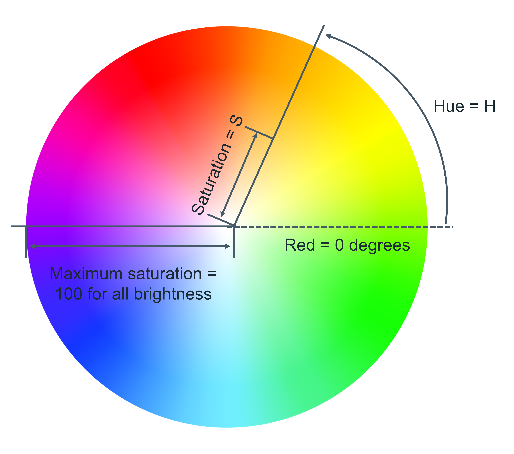
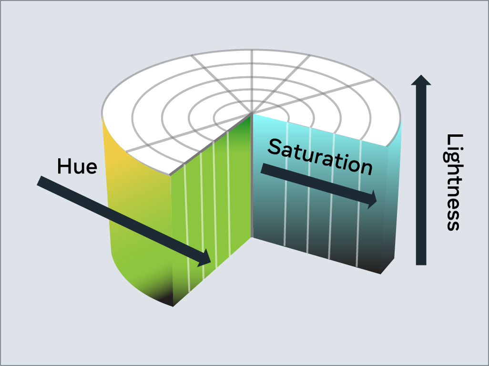

# CSS文本

在设计网站的过程中，你会经常使用颜色和文字。有许多不同的方法来显示文本，同样也有许多方法来定义颜色。

本文将介绍 CSS 中文字和颜色的工作原理。

## 颜色
例如，许多 CSS 属性中都会用到颜色：

```css
p { 
  color: blue; 
}
```

从 CSS 第 3 版开始，有五种主要的颜色引用方式。

- RGB 值
- RGBA 值
- HSL 值
- 十六进制值
- 预定义颜色名称。

### RGB值

RGB 是一种色彩模型，它将红色 (R)、绿色 (G) 和蓝色 (B) 相加来产生色彩。这是基于人眼观察颜色的方式。

每个值被定义为介于**0** 和**255** 之间的数字，代表该颜色的强度。

例如，红色的 RGB 值为`255,0,0` ，因为红色的强度为 100%，而蓝色和绿色的强度为 0%。

黑色的 RGB 值为`0,0,0` ，白色的 RGB 值为`255,255,255` 。

在 CSS 中使用 RGB 值时，可以使用`rgb` 关键字来定义：

```css
p { 
  color: rgb(255, 0, 0); 
}
```
### RGBA 值

RGBA 是 RGB 的扩展，增加了一个 alpha (A) 通道。Alpha 通道表示颜色的不透明度或透明度。

与 RGB 相似，在 CSS 中使用`rgba` 关键字来指定：


```css
p { 
  color: rgba(255, 0, 0, 0.8); 
}
```

### HSL 值

HSL 是一种较新的颜色模型，定义为色相 (H)、饱和度 (S) 和亮度 (L)。该模型的目的是简化数值所代表颜色的视觉效果。

将彩虹想象成一个圆圈。这代表色相。色相值是这个圆上的度数，从 0 度到 360 度。0 代表红色，120 代表绿色，240 代表蓝色。



饱和度是圆心到圆边的距离。饱和度值以 0% 到 100% 的百分比表示，其中 0% 为圆心，100% 为圆边。
例如，0% 表示颜色更灰暗，100% 表示颜色更饱满。

明度是该色彩模型的第三个元素。把它想象成把圆变成一个三维圆柱体，圆柱体的底部更黑，顶部更白。
因此，明度就是圆柱体底部到顶部的距离。
同样，亮度用 0% 到 100% 的百分比表示，其中 0% 是圆柱体的底部，100% 是顶部。
换句话说，0% 表示颜色更黑，100% 表示颜色更白。



在 CSS 中，您可以使用`hsl` 关键字来使用 HSL 定义颜色。

```css
p { 
  color: hsl(0, 100%, 50%);
}
```

### 十六进制值

可以使用十六进制值来指定颜色。如果您不熟悉十六进制，可以将其视为不同的数字集。

十进制是您日常使用的数字。在使用十位和百位之前，数字范围从0 到9 。

十六进制与之类似，但它有 16 位数。这被算作0, 1, 2, 3, 4, 5, 6, 7, 8, 9, A, B, C, D, E, F 。

事实上，您可以在十进制和十六进制之间进行转换。十进制10 等于十六进制A 。十六进制F 等于十进制15 。

十六进制也可以转换成十进制和百进制。例如，十进制16 等于十六进制10 ，而10 是F 之后的下一个数字。

一开始可能会有点困惑，不过不用担心，如果你遇到困难，有很多转换器可以使用。

使用十六进制指定的颜色前缀是# 符号，后面是十六进制格式的 RGB 值。

例如，RGB 值为255,0,0 的红色将被写成十六进制的#FF0000 。

如果遇到问题也不用担心，有很多转换器可以解决这个问题！

### 预定义颜色名称

现代网络浏览器支持 140 种预定义颜色名称。这些颜色名称是为了方便起见，可以映射为等效的十六进制/RGB/HSL 值。

下面列出了一些常用的颜色名称。

1. black
2. silver
3. gray
4. white
5. maroon
6. red
7. purple
8. fuchsia
9. green
10. lime
11. olive
12. yellow
13. navy
14. blue
15. teal
16. aqua

## 文本


使用 CSS，有很多方法可以改变文本的显示方式。在本节中，你将学习到最常用的文本操作 CSS 属性。

### 文本颜色

color 属性用于设置文本的颜色。下面的 CSS 将所有段落元素的文本颜色设置为红色。


### 文本字体和大小

在电脑上显示文字有多种不同的字体。简单来说，字体是以特定样式和大小书写的文本字符的集合。

如果你以前使用过文字处理器，你可能对 Times New Roman 和 Calibri 字体比较熟悉。

要在 CSS 中设置文本使用的字体，可以使用`font-family` 属性。

由于电脑安装的字体各不相同，建议在使用`font-family` 属性时包含几种字体。
这些字体是以回退顺序指定的，也就是说，如果第一种字体不可用，就会检查第二种字体。
如果第二种字体不可用，则将检查第三种字体，依此类推。
如果所有字体都不可用，就会使用浏览器的默认字体。

要设置字体大小，需要使用`font-size` 属性。

### 文本转换

如果要确保文本内容的大小写正确，文本转换就非常有用。在下面的示例中，
CSS 规则将使用`text-transform` 属性将段落元素中的所有文本改为大写：


`text-transform` 属性最常用的值：`uppercase`、`lowercase` 、`capitalize` 和`none` 。
使用的默认值是`none`, ，这意味着文本将按照 HTML 文档中的写法显示。


### 文本装饰

`text-decoration` 属性用于对文本进行额外装饰，如下划线和穿行（删除线）。


还可以设置装饰的颜色、粗细和样式。在下面的示例中，下划线将是一条 5 像素粗的红色实线。


如果您对此感到困惑，请不要担心。
可以使用`text-decoration-line` 、
`text-decoration-color` 、
`text-decoration-style` 和
`text-decoration-thickness` 属性单独设置这些属性。
让我们再次使用相同的示例，并使用各个属性进行定义：


最常用的`text-decoration-line` 值是：`underline`,`overline`,`line-through` 和`none` 。无是默认值，表示不使用文本装饰。

`text-decoration-style` 属性有多种样式：`solid`,`double`,`dotted`,`dashed` 和`wavy` 。
`text-decoration-style` 属性要求定义装饰行。如果未指定装饰样式，则将使用`solid` 。