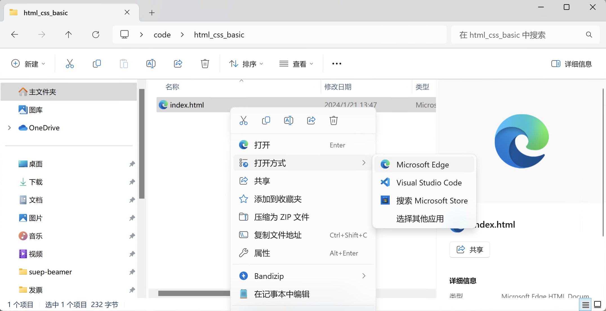
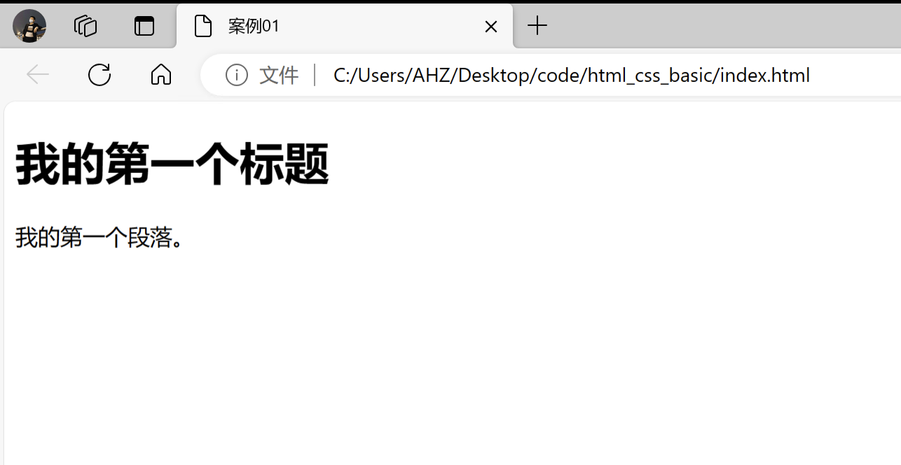

# 一个HTML5的案例

:::tip

本课程网站内容请仔细阅读后再进行实操。因未仔细阅读内容，出现任何错误后果自负（逃～～～逃～～～逃


**所有的代码请不要复制粘贴，请手敲每一行代码。复制粘贴不会让你动脑子，而手敲每一个行代码会让你自然而然地去动脑子会想每一行代码的含义和原理**

:::

新建一个名为`html_css_basic`的文件夹，用 VSCode 打开该文件夹。
然后新建一个名为 `index.html` 的 HTML 文件，输入如下代码。

```html title="index.html"
<!DOCTYPE html>
<html>
  <head>
    <meta charset="utf-8">
    <meta name="viewport" content="width=device-width, initial-scale=1.0">
    <title> 案例01 </title>
  </head>

  <body>
  <!-- 这是注释 -->
  <h1>我的第一个标题</h1>
  
  <p>我的第一个段落。</p>
  </body>
<html>
```

请有文件管理器打开 `html_css_basic` 文件夹，右击 `index.html` 文件，选择打开方式为 **Microsoft Edge**。



于是你便可以在  **Microsoft Edge** 中看到你亲自写的第一个HTML页面。



接下来我们解释一下上述HTML代码的意思：

- `<!DOCTYPE html>` 声明为 HTML5 文档
- `<html>` 元素是 HTML 页面的根元素
- `<head>` 元素包含了文档的元（meta）数据，如 `<meta charset="utf-8">` 定义网页编码格式为 utf-8。
- `width=device-width`部分设置页面的宽度以遵循设备的屏幕宽度。
- `initial-scale=1.0` 部分设置浏览器首次加载页面时的初始缩放级别。
- `<title>` 元素描述了文档的标题
- `<body>` 元素包含了可见的页面内容
- `<h1>` 元素定义一个大标题
- `<p>` 元素定义一个段落