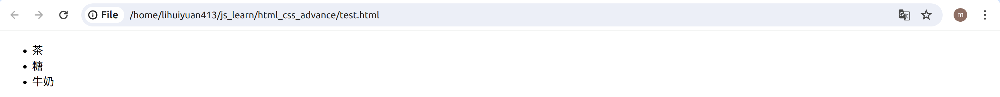
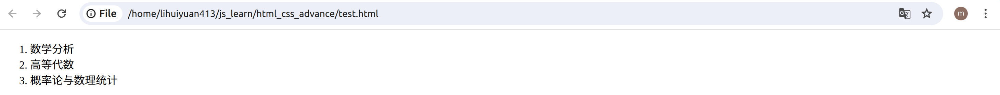

# HTML列表

您可以在网页中添加列表。HTML 中有两种类型的列表。

使用`<ul>`标签，列表可以是无序的。例如，可使用`<li>`标签指定列表项：


```html title="index.html"
<!DOCTYPE html>
<html>
  <head>
    <meta charset="utf-8">
    <meta name="viewport" content="width=device-width, initial-scale=1.0">
    <title> 案例01 </title>
  </head>

  <body>
    <ul>
      <li>茶</li>
      <li>糖</li>
      <li>牛奶</li>
    </ul>
  </body>
<html>
```

在网页浏览器中显示为



也可以使用`<ol>` 标签对列表进行排序。同样，可以使用`<li>` 标签指定列表项。


```html title="index.html"
<!DOCTYPE html>
<html>
  <head>
    <meta charset="utf-8">
    <meta name="viewport" content="width=device-width, initial-scale=1.0">
    <title> 案例01 </title>
  </head>

  <body>
    <ol>
      <li>数学分析</li>
      <li>高等代数</li>
      <li>概率论与数理统计</li>
    </ol>
  </body>
<html>
```
在网页浏览器中显示如下。

