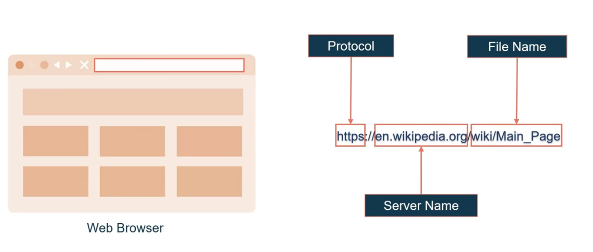
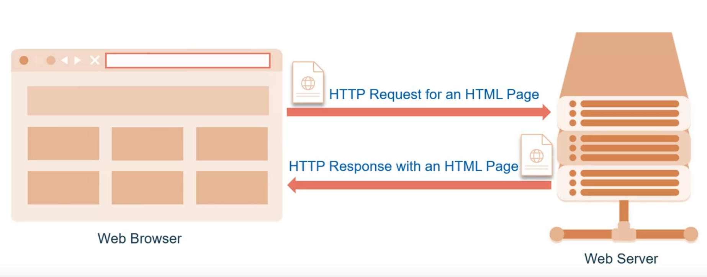
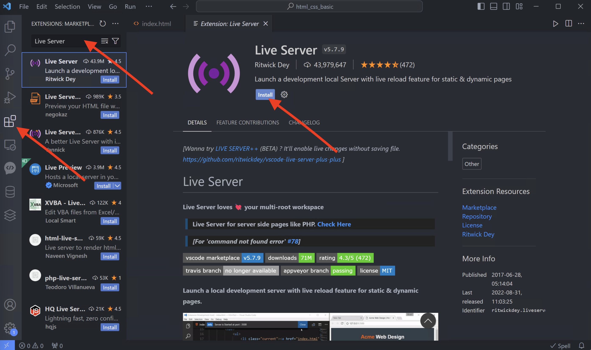
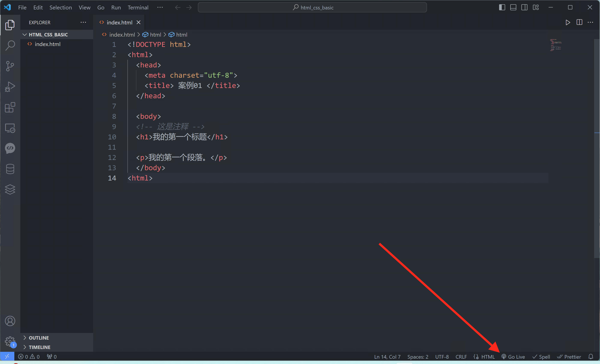
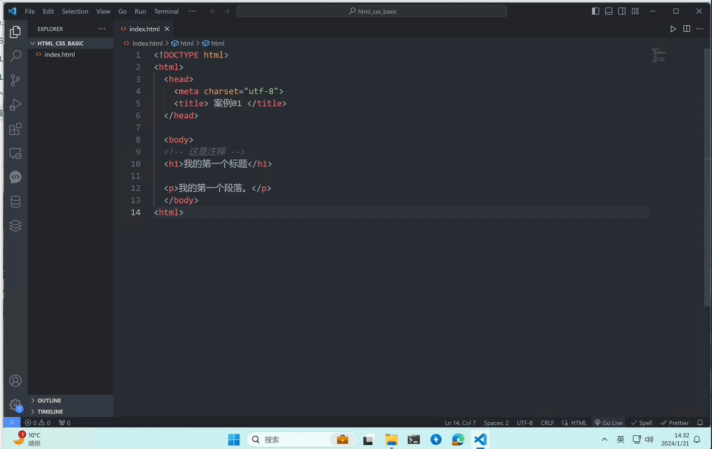

# 安装 HTTP服务器以传送网页

:::tip

本课程网站内容请仔细阅读后再进行实操。因未仔细阅读内容，出现任何错误后果自负（逃～～～逃～～～逃

**所有的代码请不要复制粘贴，请手敲每一行代码。复制粘贴不会让你动脑子，而手敲每一个行代码会让你自然而然地去动脑子会想每一行代码的含义和原理**

:::

当您在 Web 浏览器中输入网址或 URL 时，
Web 浏览器会将该网址分为三个部分。 
协议、服务器名 和服务器名后面的文件名。 

为了让 Web 浏览器连接到 Web 服务器并检索所请求的信息，
它会与相应的 Web 服务器通信，将服务器名称转换为 IP 地址。
Web 浏览器 使用超文本传输协议或 HTTP 连接到 Web 服务器后，
服务器将返回 HTTP 响应，
客户端 Web 浏览器随后解释超文本标记语言或 HTML 脚本并呈现页面。 

于是我们就有这样一个令我们头痛的事情，当你对代码进行更改时，
需要手动刷新页面才能看到更改。 
对于每一个细微的改变，如果代码改动变多了，
那刷新浏览器是一项重要且重复的任务。

在这里我们推荐是用使用 VS Code 扩展 —— Live Server，
它可以在每次更改文件内容后自动重新加载页面，
从而使开发变得更加轻松快捷。
点击 VS code 左侧的 **扩展** 按钮，
然后在搜索栏中搜索 Live Server，点击**安装**按钮。 

安装好 Live Server 拓展后，回到我们的 `index.html` 文件，
点击右下角的 `Go Live`按钮，
便可使用 Live Server 拓展提供的Web Server功能。

效果如下：

这样我们对文件内容的每一次更改自动重新加载页面，
您可以通过单击同一个按钮随时启动和停止 Live Server 。

:::info

Live Server 拓展只在 HTML、CSS和JavaScript的学习中使用，当进入Vue.js 的学习时不需要用到 Live Server，因为现代Web前端工程化提供了很好的修改代码自动重新加载页面的工具。

:::
