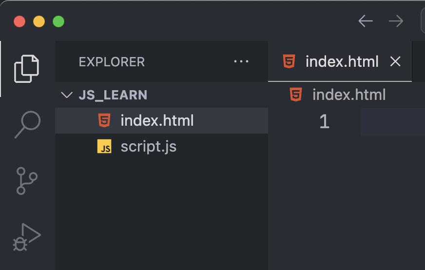
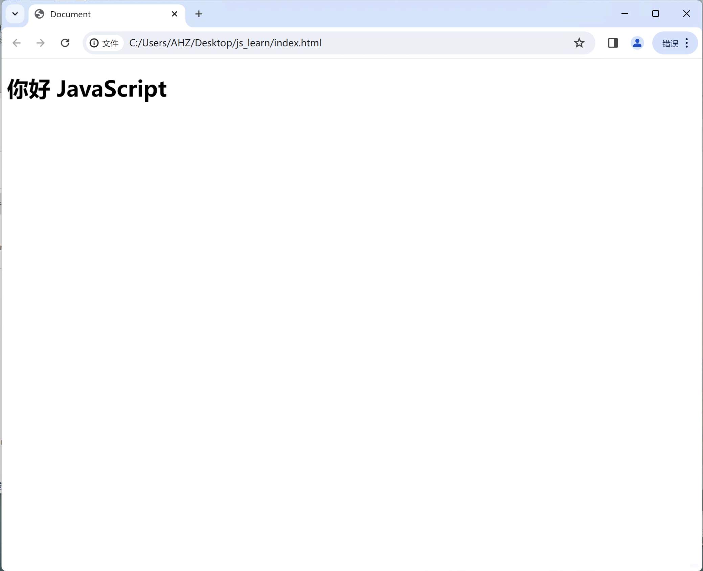
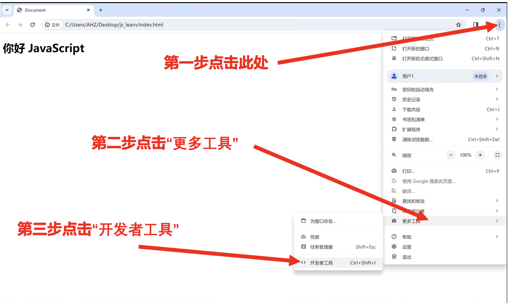
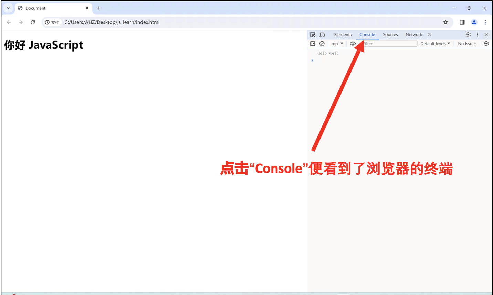
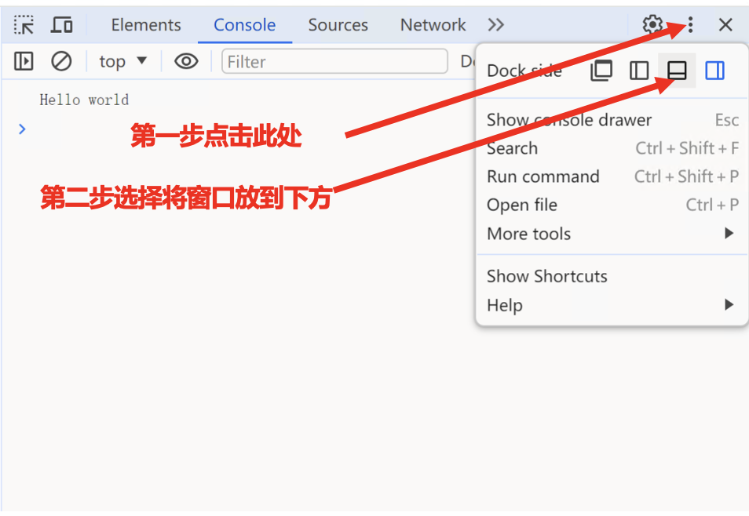
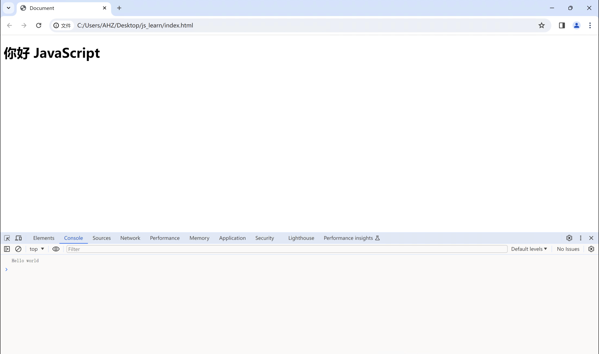
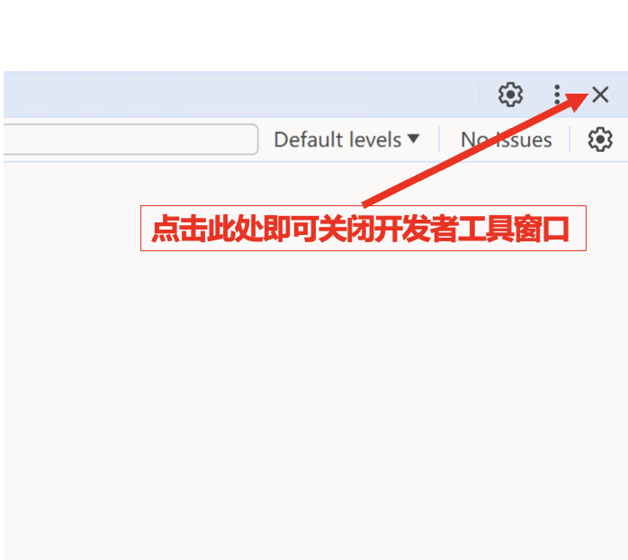

# 你的第一行JavaScript代码

新建 `js_learn` 目录，请用 VS Code 打开 `js_learn` 目录，
然后在`js_learn` 目录中新建`index.html`和`script.js`两个文件，如下图所示。



请在`index.html`中输入如下代码

```html title="index.html"
<!DOCTYPE html>
<html lang="en">
<head>
  <meta charset="UTF-8">
  <meta name="viewport" content="width=device-width, initial-scale=1.0">
  <title>Document</title>
</head>
<body>
  <h1>你好 JavaScript</h1>
  <script src="script.js"></script>
</body>
</html>
```
`<script src="script.js"></script>` 这行代码是HTML中的一个`<script>`标签，它用于在网页中引入外部JavaScript文件。具体来说，它告诉浏览器加载名为`script.js`的JavaScript文件。这样做的目的是将JavaScript代码从HTML文件中分离出来，使代码更加模块化和易于管理。

请在`script.js`中输入如下代码。
```js title="script.js"
// 终端中打印 "Hello world"
console.log("Hello world")
```

请用Chrome浏览器打开 `index.html`，便可看到如下页面。



此时你心中肯定有疑问，JavaScript的代码不是在终端打印 `Hello world`，但目前只在网页中看到 `你好 JavaScript`，终端在哪呢？请接下来根据图片操作打开浏览器的开发者工具，进入浏览器的终端。




此时你就进入了开发者工具窗口，点击开发者工具窗口的 `Console` 便可进入浏览器的终端，然后你就可以看到JavaScript代码在终端输出的 `Hello world`。



如果你觉得开发者工具在整个页面的右边，不习惯，那么你可以将开发者工具切换到不同的位置。操作方式如下所示：



于是你就看到开发者工具窗口转移到了下方，如下所示：



那么如何关闭开发者工具窗口，可以按照如下操作：



