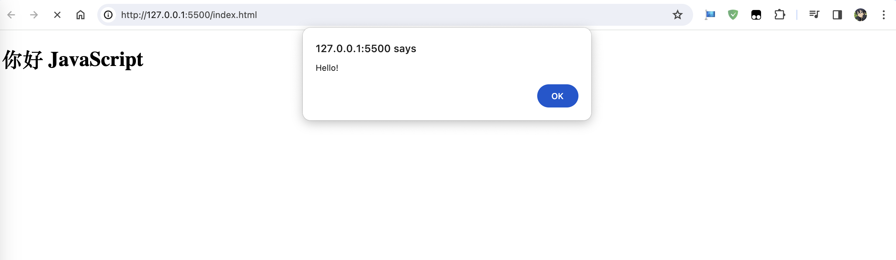
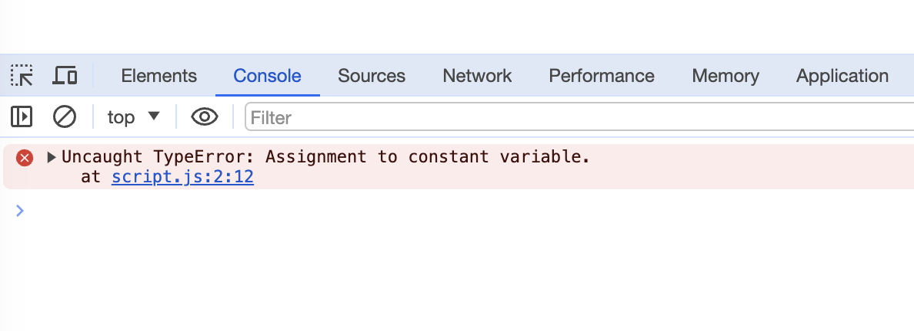

# 变量与数据类型

## 变量

变量是数据的“命名存储”。我们可以使用变量来保存任何你想保存的数据。

在 JavaScript 中创建一个变量，我们需要用到 `let` 关键字。

请将`script.js`中代码修改为：

```js showLineNumbers title="script.js"
let message = 'Hello!'; // 定义变量，并且赋值
alert(message); // 窗口弹出 Hello! 字符
```
用浏览器打开`index.html`，便可看到如下页面:



上述代码创建（也可以称为`声明`或者`定义`）了一个名称为 `message` 的变量，赋值运算符 `=` 为变量添加一些数据。


:::tip `var` 而不是 `let`

在较老的脚本中，你也可能发现另一个关键字 `var`，而不是 `let`：

```js
var message = 'Hello';
```

`var` 关键字与 `let` 大体 相同，也用来声明变量，但稍微有些不同，也有点“老派”。
`let` 和 `var` 之间有些微妙的差别，但目前对于我们来说并不重要。

:::

## 常量

声明一个常数（不变）变量，可以使用 `const` 而非 `let`。使用 `const` 声明的变量称为“常量”。它们不能被修改，如果你尝试修改就会发现报错。

请将`script.js`中代码修改为：

```js showLineNumbers title="script.js"
const myBirthday = '18.04.1982';
myBirthday = '01.01.2001'; // 错误，不能对常量重新赋值
```

用浏览器打开`index.html`，便可在终端中看到如下页面:



## 数据类型

### Number 类型
number 类型代表整数和浮点数。

数字可以有很多操作，比如，乘法 *、除法 /、加法 +、减法 - 等等。

```js showLineNumbers title="script.js"
let n = 123;
n = 12.345;

let x = 20;

console.log(n + x);
```

### String 类型

JavaScript 中的字符串必须被括在引号里。

在 JavaScript 中，有三种包含字符串的方式。

- 双引号：`"Hello"`.
- 单引号：`'Hello'`.
- 反引号：\`hello`.

双引号和单引号都是“简单”引用，在 JavaScript 中两者几乎没有什么差别。

反引号是功能扩展引号。它们允许我们通过将变量和表达式包装在 `${…}` 中，来将它们嵌入到字符串中。

```js showLineNumbers title="script.js"
let str = "Hello";
let str2 = 'Single quotes are ok too';
let phrase = `can embed another ${str}`;

let name = "John";

// 嵌入一个变量
console.log( `Hello, ${name}!` ); // Hello, John!

// 嵌入一个表达式
console.log( `the result is ${1 + 2}` ); // the result is 3

console.log( "the result is ${1 + 2}" ); // the result is ${1 + 2}（使用双引号则不会计算 ${…} 中的内容）
```

### Boolean 类型

boolean 类型仅包含两个值：`true` 和 `false`。这种类型通常用于存储表示 `yes` 或 `no` 的值

```js showLineNumbers title="script.js"
let nameFieldChecked = true; // yes, name field is checked
let ageFieldChecked = false; // no, age field is not checked

let isGreater = 4 > 1;

console.log(isGreater); // true
```

### null 值

特殊的 `null` 值不属于上述任何一种类型。
它构成了一个独立的类型，只包含 `null` 值。
JavaScript 中的 `null` 仅仅是一个代表“无”、“空”或“值未知”的特殊值。

```js showLineNumbers title="script.js"
let age = null;

console.log(age);
```

### undefined 值

特殊值 `undefined` 和 `null` 一样自成类型。`undefined` 的含义是未被赋值。

如果一个变量已被声明，但未被赋值，那么它的值就是 `undefined`：

```js showLineNumbers title="script.js"
let age;

console.log(age); // "undefined"
```