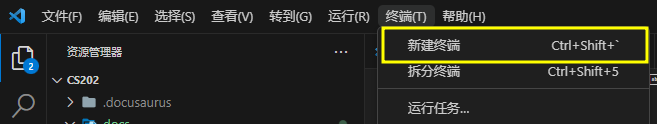

# 配置环境

## 克隆仓库

1. 用`vscode`打开想放置`TodoListApplication`的文件夹
2. 打开终端 
   


输入

```bash
git clone https://github.com/SUEPaper/TodoListApplication.git
```

## 后端配置
1. 用`vscode`打开`TodoListApplication`文件夹
2. 打开终端
3. 新建数据库
   输入
   ```bash
   mysql -u root -p
   ```
   输入你的mysql密码（默认为password）
   进入mysql后输入
   ```mysql
   create database todoapp;
   quit
   ```
4. 迁移数据库
   输入 
   ```bash
    cd .\backend\db\migrations\
    pip install alembic
    alembic upgrade head
   ```

5. 安装依赖
   输入
   ```bash
   cd ../..
   pip install -r .\requirements.txt
   ```
6. 运行后端服务器
   输入
   ```bash
   python .\main.py 
   ```
   
## 前端配置
1. 用`vscode`打开`TodoListApplication`文件夹
2. 打开终端
3. 安装依赖
   ```bash
   npm install
   ```
4. 启动前端服务器
   ```bash
   npm run dev
   ```