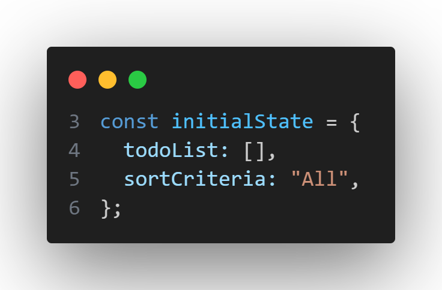
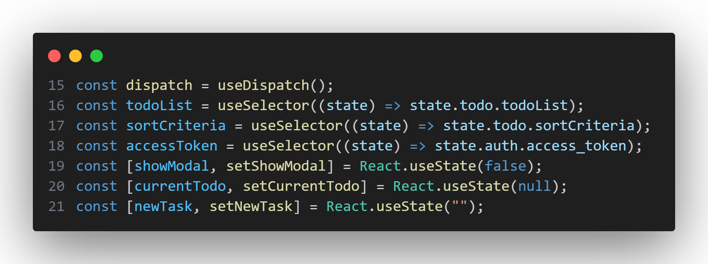
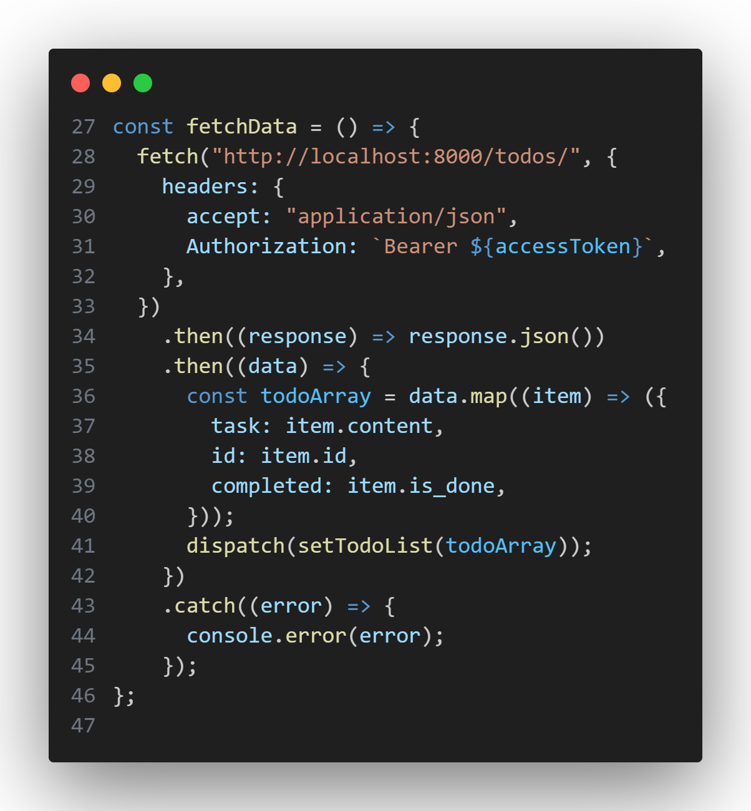
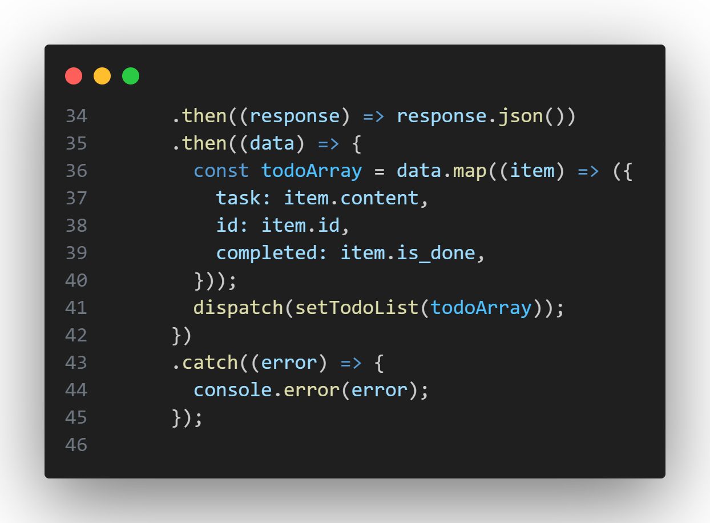
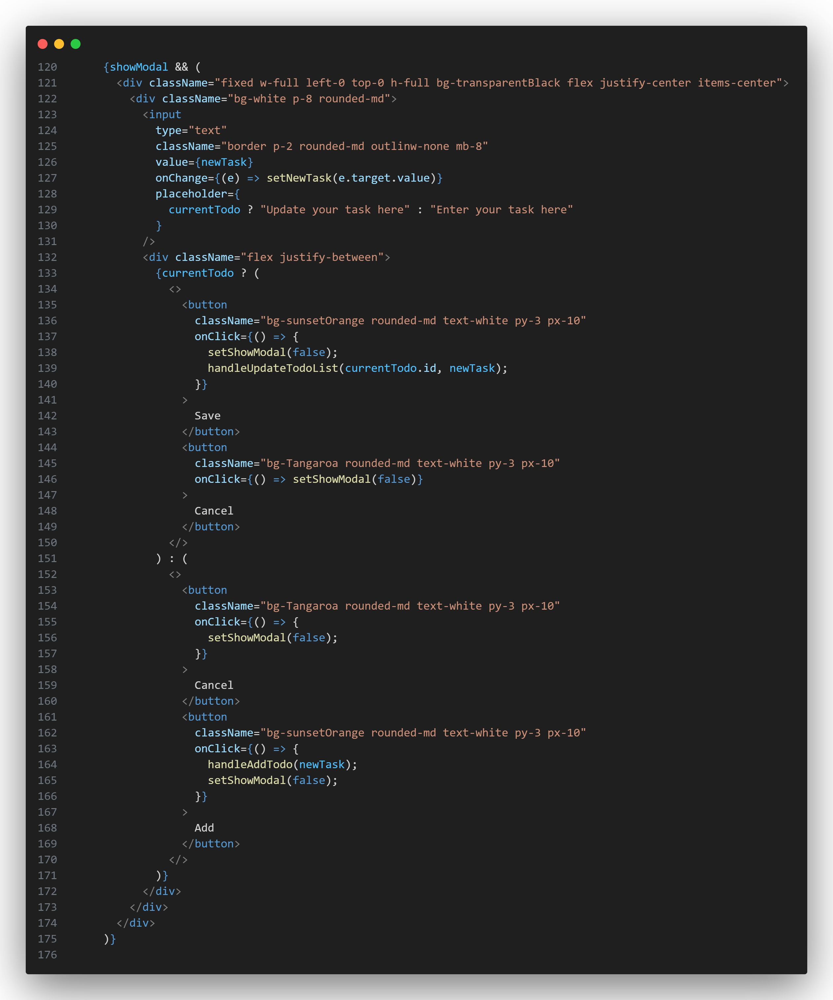
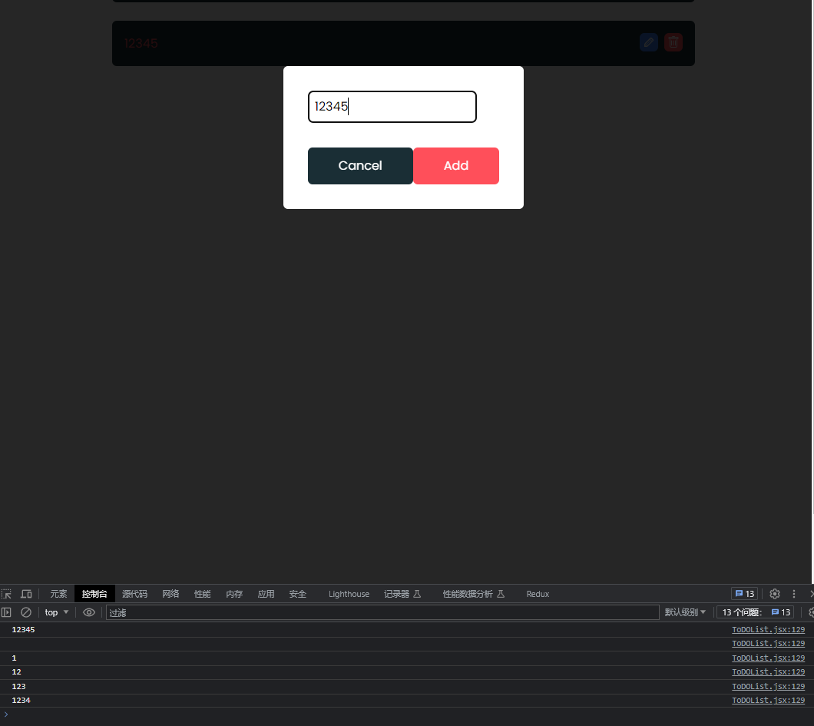
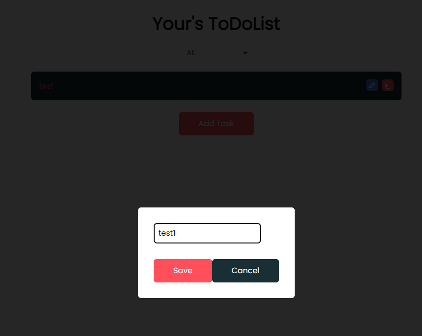
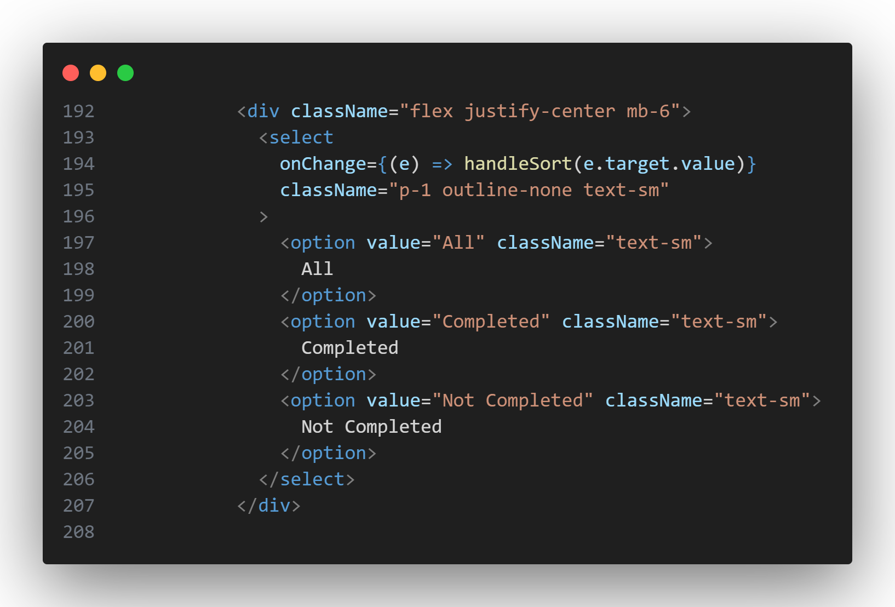

# todolist 的逻辑设计

在上一篇中讲了`React`的UI设计，这一篇讲用`Redux` 与 `React` 进行状态管理以及逻辑处理。

:::tip
在写这个的时候发现了些bug，并修复，这导致了下面的行号可能不是很准确
:::

## Redux

Redux是一个用于JavaScript应用程序的状态管理库。它提供了一种可预测的状态管理机制，帮助开发者更好地管理和共享应用程序的状态数据。

Redux的核心概念包括：
1. Store（存储）：应用程序的状态数据存储在一个单一的全局状态树中，称为Store。它是一个JavaScript对象，包含了应用程序的所有状态。
2. Action（动作）：Action是一个描述状态变化的普通JavaScript对象，它包含了一个type字段来描述动作类型，以及可选的payload字段来携带数据。
3. Reducer（归约器）：Reducer是一个纯函数，它接收当前的状态和一个动作作为参数，并返回一个新的状态。它定义了如何根据动作类型来更新状态。
4. Dispatch（派发）：派发是通过调用store.dispatch(action)来触发状态变化的过程。它将动作发送给Reducer，从而更新状态。
5. Subscribe（订阅）：通过订阅store.subscribe(listener)方法，可以注册一个监听器，监听状态的变化。每当状态发生变化时，监听器会被调用。

通过这些机制，Redux实现了单向数据流的状态管理模式。当用户与应用程序交互时，触发动作来更新状态，状态的变化通过归约器进行处理，然后通知订阅者进行界面的更新。

Redux的状态管理模式可以帮助开发者更好地组织和管理应用程序的状态，提供了可预测性和可维护性。

### 全局的状态树

```jsx
ReactDOM.createRoot(document.getElementById("root")).render(
  <Provider store={store}>
    <Router>
      <Navbar />
      <Routes>
        <Route path="/" element={<LoginPage />} />
        <Route path="/register" element={<RegisterPage />} />
        <Route path="/test" element={<Test />} />
        <Route path="/todo" element={<App_WithAuth />} />
        <Route path="/edit-profile" element={<EditProfilePage_WithAuth />} />
      </Routes>
    </Router>
  </Provider>
);
```
在我们的路由中，存在`<Provider store={store}>``</Provider>`,这是让所有的路由都能使用`Redux`的状态树

其中`store={store}`的第二个store，是一个组件
```jsx
import { configureStore } from "@reduxjs/toolkit";
import TodoReducer from "../ToDoSlice";
import AuthReducer from "../UserSlice"; // Assuming you have an AuthSlice

const store = configureStore({
  reducer: {
    todo: TodoReducer,
    auth: AuthReducer,
  },
});

export default store;
```
这段代码将`TodoReducer`和`AuthReducer`合并为一个根`Reducer`，并创建了一个包含这两部分状态的`Redux Store`。

## TodoSlice.jsx

`frontend\src\components\ToDOList.jsx`

这段代码使用了Redux Toolkit中的`createSlice`函数来创建一个`Slice`，即一个包含了状态和相关操作的模块。



首先，在第3~6行，定义了一个名为`initialState`的对象，它包含了`todoList`和`sortCriteria`两个状态字段，并设置了初始值。

```jsx
const ToDoSlice = createSlice({
  name: "todo",
  initialState,
  reducers: {},
});
```
接下来，使用`createSlice`函数创建了一个Slice对象，并传入了一个配置对象作为参数。配置对象包括了Slice的名称(`name`)和各个操作(`reducers`)。

:::tip
在Redux中，Slice是一个包含了相关状态和操作的模块单元。它是Redux中的一种组织方式，用于将相关的状态和操作组织在一起，以便更好地管理应用的状态。

一个Slice通常包含以下内容：

1. 状态（State）：Slice中定义了特定的状态属性，用于存储数据。
2. 操作（Actions）：Slice中定义了操作函数，用于更新和处理状态。
3. Reducer：Slice中包含了一个自动生成的reducer函数，用于根据操作更新状态。
4. Action Creators：Slice中也会自动生成相应的action creators，用于创建操作的action对象。

Slice的好处是它将相关的状态和操作组织在一起，使得状态的管理更加模块化和可维护。它提供了一种清晰的方式来定义和处理特定领域的状态，使得代码更易于理解和扩展。

Redux Toolkit中的`createSlice`函数提供了简化Slice创建的工具，它自动生成了reducer函数和action creators，使得创建和管理Slice变得更加简单和高效。
:::

:::tip
`createSlice`是Redux Toolkit中的一个函数，用于创建一个包含了状态和相关操作的Slice。

通过调用`createSlice`函数，我们可以定义一个包含了状态和操作的模块，它包含了自动生成的reducer函数以及与每个操作相关联的action creators。

`createSlice`函数接收一个配置对象作为参数，配置对象包括以下属性：

- `name`: Slice的名称，用于标识该Slice。
- `initialState`: 初始状态对象，包含了Slice的初始值。
- `reducers`: 一个对象，包含了各个操作函数，用于更新Slice的状态。

在调用`createSlice`函数后，它会自动生成一个包含reducer函数和action creators的对象，我们可以将其导出，并使用它们来更新和访问Slice的状态。

使用`createSlice`函数可以简化Redux中的状态管理，不需要手动编写reducer函数和action creators，减少了样板代码的编写，并提供了更简洁和易于维护的方式来定义和处理状态。
:::
在`reducers`中，定义了多个操作函数，每个函数对应一个特定的操作。这些操作函数接收两个参数：`state`和`action`。在每个操作函数中，我们可以直接修改`state`对象来更新相应的状态。

- `setTodoList`: 设置`todoList`状态为传入的`action.payload`值。
- `addTodo`: 向`todoList`中添加一个新的todo项，其中`action.payload`包含了任务的具体信息。
- `sortTodo`: 设置`sortCriteria`状态为传入的`action.payload`值，用于排序todo列表。
- `updateTodo`: 更新指定id的todo项的任务内容为传入的`action.payload.task`值。
- `toggleCompleted`: 切换指定id的todo项的`completed`状态。

最后，通过`ToDoSlice.actions`导出了每个操作函数，可以在其他地方使用它们来触发对应的操作。同时，通过`export default ToDoSlice.reducer`导出了Slice的reducer函数，用于将Slice与Redux Store关联起来。

这样，其他组件可以通过调用这些操作函数来更新和访问与todo相关的状态。

## ToDOList.jsx
现在回到上一章讲的ToDOList，

在第15行到第21行


这段代码主要是使用React Hooks来获取和管理Redux中的状态。

- `useDispatch()`函数返回一个dispatch函数，用于触发Redux中的action。
- `useSelector()`函数接收一个函数作为参数，用于从Redux的store中选择需要的状态。
  - `state.todo.todoList`表示选择Redux中`todo`模块下的`todoList`状态，即上面提到的TodoSlice.jsx。
  - `state.todo.sortCriteria`表示选择Redux中`todo`模块下的`sortCriteria`状态。
  - `state.auth.access_token`表示选择Redux中`auth`模块下的`access_token`状态，即`frontend\src\components\withAuth.jsx`文件中的slice。
- `React.useState(false)`创建一个名为`showModal`的state变量，初始值为`false`，并提供了一个函数`setShowModal`用于更新该状态。
- `React.useState(null)`创建一个名为`currentTodo`的state变量，初始值为`null`，并提供了一个函数`setCurrentTodo`用于更新该状态。
- `React.useState("")`创建一个名为`newTask`的state变量，初始值为空字符串，提供了一个函数`setNewTask`用于更新该状态。

获取并管理Redux中的状态，并通过React的state和setState来管理一些组件级的状态变量。
:::tip
`useState`是React中的一个Hook，用于在函数组件中声明和管理状态。

`useState`函数接受一个初始值作为参数，并返回一个包含两个元素的数组：当前状态的值和更新状态的函数。函数组件可以调用这个更新状态的函数来更新状态的值，并且组件会在状态发生改变时重新渲染。

使用`useState`的语法如下：
```jsx
const [state, setState] = useState(initialValue);
```

其中，`state`是当前的状态值，`setState`是更新状态的函数，`initialValue`是初始值。

这段代码中，通过`useState`声明了多个状态变量，例如`showModal`、`currentTodo`和`newTask`。这些状态变量可以在组件中使用，并且在需要更新它们的时候，可以调用对应的更新函数来修改它们的值。

在React中，使用setState函数来更新状态是为了确保组件的重新渲染和状态的同步更新。

当我们直接修改状态变量的值时，React无法检测到状态的改变，从而无法触发组件的重新渲染。这可能导致状态变化后，组件界面没有及时更新。

而使用setState函数来更新状态，React会自动检测状态的改变，并触发组件的重新渲染。这样可以确保界面与状态的同步更新。

此外，setState函数还可以接受一个回调函数作为参数，用于在状态更新完成后执行一些额外的操作。这可以确保我们在状态更新完毕后执行一些逻辑，例如更新其他相关的状态、调用API等。(这里并没有使用)

:::

### fetch函数
#### fetchData函数
在第27 ~ 46行




```jsx
      headers: {
        accept: "application/json",//这个表示接受JSON格式的响应数据
        Authorization: `Bearer ${accessToken}`, //这个是登陆令牌，下面的章节会讲
      },
```
这段代码是一个用于获取todo列表数据的函数`fetchData`。它使用`fetch`函数向指定的URL（"http://localhost:8000/todos/"）发送GET请求。

:::tip
`fetch` 是 JavaScript 中用于进行网络请求的内置函数,用于发送 HTTP 请求并处理响应。

通过 `fetch` 函数，我们可以向指定的 URL 发送请求，并获取响应数据。它支持各种 HTTP 方法（GET、POST、PUT、DELETE 等）和请求头的设置，以及处理响应的方式。

使用 `fetch` 函数发送请求的基本语法如下：

```javascript
fetch(url, options)
  .then((response) => {
    // 处理响应
  })
  .catch((error) => {
    // 处理错误
  });
```

其中，`url` 是请求的目标 URL，`options` 是一个可选的配置对象，用于设置请求的参数，如请求方法、请求头、请求体等。

`fetch` 函数返回一个 Promise，通过 `then` 方法可以获取到响应对象 `response`，然后我们可以根据需要对响应进行处理，如解析响应数据、判断请求是否成功等。如果发生错误，可以通过 `catch` 方法捕获并处理错误。
:::

在请求中，设置了请求头




在获取到响应后，通过`response.json()`将响应数据解析为JSON格式。然后使用`map`函数遍历返回的数据数组，将每个todo项转换为包含`task`、`id`和`completed`属性的对象，并将结果存储在`todoArray`中。

接下来，使用`dispatch`函数调用`setTodoList` action，并将`todoArray`作为payload传递给reducer，从而更新Redux store中的todo列表。

如果请求过程中出现错误，通过`catch`方法捕获并打印错误信息到控制台。

:::tip
`.then` 是一个 Promise 对象的方法，用于处理异步操作成功的情况。在这段代码中，`.then` 方法被用于在 `fetch` 请求成功并返回响应后执行后续操作。

具体来说，`.then` 方法接受一个回调函数作为参数，该回调函数将在异步操作成功后执行。在这段代码中，第一个 `.then` 方法用于处理 `fetch` 请求成功并返回的响应对象。

在这个 `.then` 方法的回调函数中，使用 `response.json()` 方法将响应数据解析为 JSON 格式。这个方法返回一个 Promise 对象，可以通过 `.then` 方法链式调用来处理解析后的数据。

在第二个 `.then` 方法中，可以访问到解析后的数据，即 JSON 格式的数据。在这段代码中，使用 `data.map` 方法对数据进行遍历和转换，将每个项转换为包含特定属性的对象。

通过使用 `.catch` 方法来捕获并处理异常，可以在请求过程中发生错误时执行相应的操作。
:::

总的来说，这段代码用于从服务器获取todo列表数据，并通过Redux的`dispatch`函数将数据更新到Redux store中的状态。

:::tip
`dispatch` 是 Redux 中的一个函数，用于触发一个 action 来改变应用的状态。它是 Redux store 的一个方法。

在 Redux 中，通过定义不同的 action 来描述状态的变化，然后通过调用 `dispatch` 函数来分发（dispatch）这些 action，从而触发相应的 reducer 进行状态更新。通过 dispatch 函数，我们可以将 action 发送到 Redux store，然后 Redux store 会根据 action 的类型来执行相应的 reducer，并更新应用的状态。
:::

#### 其余的fetch函数
```jsx
  const addData = (props) => {
    fetch("http://localhost:8000/todos/", {
      method: "POST",
      headers: {
        accept: "application/json",
        Authorization: `Bearer ${accessToken}`,
        "Content-Type": "application/json",
      },
      body: JSON.stringify(props),
    })
      .then((response) => response.json())
      .then(() => {
        fetchData();//请求成功后重新获取数据
      });
  };
```
```jsx
  const deleteData = (id) => {
    fetch(`http://localhost:8000/todos/${id}/`, {
      method: "DELETE",
      headers: {
        accept: "application/json",
        Authorization: `Bearer ${accessToken}`,
        "Content-Type": "application/json",
      },
    })
      .then(() => {
        fetchData();
      })
      .catch((error) => {
        console.error(error);
      });
  };
```
通过fetch api可以将后端传过来的数据储存在状态中。

### 修改todo的内容

接下来将如何修改todo的内容



```jsx
onChange={(e) => setNewTask(e.target.value)}
```

在第127行中，是一个事件处理函数，用于处理输入框的变化事件。它使用了箭头函数的形式，并将事件对象 `e` 作为参数传入。

在函数体内部，通过 `e.target.value` 可以获取到输入框的当前值。然后，调用 `setNewTask` 函数并将输入框的值作为参数传递给它。这样做的目的是更新组件的状态，将输入框的值存储在名为 `newTask` 的状态变量中。

通过这种方式，每当输入框的值发生变化时，都会触发这个事件处理函数，并更新 `newTask` 的值。这样，你可以在其他地方读取和使用 `newTask` 的最新值。

```jsx
onChange={(e) => {
  setNewTask(e.target.value);
  console.log(newTask);
}}
```
若将第127行添加`console.log(newTask)`,则可以在控制台中看到`newTask`值


在208到244行中，第228行，当点击图标为`<TiPencil />`的按钮时，触发函数
```jsx
setShowModal(true);//更新状态ShowModal为真,即上一章“添加/修改 task”部分可见。
setCurrentTodo(todo);//更新状态CurrentTodo为todo
setNewTask(todo.task);//更新状态NewTask为todo.task
```
当`ShowModal`为`true`时“添加/修改 task”可见，


当点击cancel时，代码第146~149行
```jsx
onClick={() => {
    setShowModal(false);//“添加/修改 task”部分不可见
    setNewTask("");//更新状态NewTask为""
}}
```
可以试试将`setNewTask("")`注释掉会发生什么事情

当点击save时，代码第137~139行
```jsx
onClick={() => {
    setShowModal(false);//“添加/修改 task”部分不可见
    handleUpdateTodoList(currentTodo.id, newTask);
}}
```

调用了`handleUpdateTodoList`函数，
```jsx
const handleUpdateTodoList = (id, task) => {
if (task.trim().length === 0) {
    alert("please enter a task");
} else {
    dispatch(updateTodo({ task: task, id: id }));
    setShowModal(false);
}
};
```
上述代码是一个用于更新待办事项列表的处理函数 `handleUpdateTodoList`。它执行以下操作：

- 首先，它检查任务内容是否为空。如果为空，弹出一个警告提示框，提醒用户输入任务内容。
- 否则，它调用 `dispatch` 函数，将更新待办事项的动作 `updateTodo` 分发到 Redux store。这个动作包含了新的任务内容和对应的任务 ID。
- 最后，它将 `showModal` 状态设置为 `false`，关闭弹出窗口。

### todo的删除

第236~241行
```jsx
<button
    className="bg-sunsetOrange text-white p-1 rounded-md ml-2"
    onClick={() => handleDeleteToDo(todo.id)}
>
    <BsTrash />
</button>
```
当点击按钮时触发`handleDeleteToDo`函数
```jsx
  const handleDeleteToDo = (id) => {
    deleteData(id);
  };
   const deleteData = (id) => {
    fetch(`http://localhost:8000/todos/${id}/`, {
      method: "DELETE",
      headers: {
        accept: "application/json",
        Authorization: `Bearer ${accessToken}`,
        "Content-Type": "application/json",
      },
    })
      .then(() => {
        fetchData();
      })
      .catch((error) => {
        console.error(error);
      });
  };
```
`handleDeleteToDo`函数调用`deleteData`函数，`deleteData`中使用上面讲的fetch api，来删除该todo，并使用`fetchData();`重新渲染页面。

### todo的增加

代码第249~254行
```jsx
<button
    className="bg-sunsetOrange text-center text-white py-3 px-10 rounded-md"
    onClick={() => setShowModal(true)}
>
    Add Task
</button>
```
当点击按钮时，触发函数`setShowModal(true)`,此时`ShowModal`为真,`currentTodo`为空
:::tip
只有点击 `<TiPencil />`，即修改按钮
```jsx
onClick={() => {
    setShowModal(true);
    setCurrentTodo(todo);
    setNewTask(todo.task);
}}
```
`currentTodo`的状态才为真，且此时`ShowModal`的状态为真，无论点击Save 按钮还是cancel按钮，都会设置`setCurrentTodo(null);`
```jsx
<button
className="bg-sunsetOrange rounded-md text-white py-3 px-10"
onClick={() => {
    setShowModal(false);
    handleUpdateTodoList(currentTodo.id, newTask);
    setCurrentTodo(null);
}}
>
Save
</button>
<button
className="bg-Tangaroa rounded-md text-white py-3 px-10"
onClick={() => {
    setShowModal(false);
    setNewTask("");
    setCurrentTodo(null);
}}
>
Cancel
</button>
```
:::
此时会渲染一下代码，有Cancel与Add的按钮
```jsx
<>
    <button
    className="bg-sunsetOrange rounded-md text-white py-3 px-10"
    onClick={() => {
        handleAddTodo(newTask);
        setShowModal(false);
    }}
    >
    Add
    </button>
    <button
    className=" bg-Tangaroa rounded-md text-white py-3 px-10"
    onClick={() => {
        setShowModal(false);
    }}
    >
    Cancel
    </button>
</>
```
当点击Cancel按钮时，`ShowModal`为false，不渲染

当点击Add按钮是，触发函数`handleAddTodo`
```jsx
  const handleAddTodo = (task) => {
    if (task.trim().length === 0) {
      alert("please enter a task");
    } else {
      addData({
        content: task,
        is_done: false,
      });

      setNewTask("");
    }
  };
  const addData = (props) => {
    fetch("http://localhost:8000/todos/", {
      method: "POST",
      headers: {
        accept: "application/json",
        Authorization: `Bearer ${accessToken}`,
        "Content-Type": "application/json",
      },
      body: JSON.stringify(props),
    })
      .then((response) => response.json())
      .then(() => {
        fetchData();
      });
  };  
```
该函数是一个用于添加待办事项的处理函数 `handleAddTodo`。

它执行以下操作：

- 首先，它检查任务内容是否为空。如果为空，弹出一个警告提示框，提醒用户输入任务内容。
- 否则，它调用 `addData` 函数，将新的待办事项的内容和状态信息作为参数传递给该函数。`addData` 函数负责将新的待办事项发送到后端进行存储。
- 接下来，它将 `newTask` 状态设置为空字符串，清空输入框中的内容。


### 查找是否完成
在代码第192~207行

这是一个用于渲染排序选项的部分。它包含一个 `<select>` 元素，用于选择待办事项的排序方式。

- 在 `<select>` 元素中，使用 `onChange` 属性来监听选择的变化，并调用 `handleSort` 函数进行处理。`e.target.value` 表示选择的值，它作为参数传递给 `handleSort` 函数。
- `<option>` 元素用于定义不同的排序选项。每个 `<option>` 元素都有一个 `value` 属性，表示选项的值。当选择不同的选项时，`handleSort` 函数将根据选项的值进行相应的处理。

```jsx
  const handleSort = (sortCriteria) => {
    dispatch(sortTodo(sortCriteria));
  };
```

`handleSort` 函数用于处理排序选项的变化，并通过 Redux 的 `dispatch` 函数触发 `sortTodo` action 来更新状态中的排序标准。

- `handleSort` 函数接收 `sortCriteria` 参数，表示选择的排序标准。
- 在函数体内部，通过调用 `dispatch(sortTodo(sortCriteria))`，将 `sortTodo` action 分发到 Redux store 中。
- `sortTodo` action 会被传递到 reducer 中的 `sortTodo` case，该 case 根据传入的 `action.payload`（即排序标准）更新状态中的 `sortCriteria` 字段。

通过这种方式，当用户选择不同的排序选项时，调用 `handleSort` 函数可以更新应用程序的状态，从而重新渲染待办事项列表并按照新的排序标准进行排序。

第209行
`sortTodoList`是一个数组
```jsx
  const sortTodoList = todoList.filter((todo) => {
    if (sortCriteria === "All") return true;
    if (sortCriteria === "Completed" && todo.completed) return true;
    if (sortCriteria === "Not Completed" && !todo.completed) return true;
    return false;
  });
```
`sortTodoList`根据选择的排序标准对待办事项列表进行过滤的部分。

首先，使用 `filter` 函数遍历 `todoList` 数组，并根据条件对每个待办事项进行筛选。

- 如果 `sortCriteria` 的值为 "All"，则返回所有待办事项，即 `true`。
- 如果 `sortCriteria` 的值为 "Completed"，则只返回已完成的待办事项，即 `todo.completed` 为 `true`。
- 如果 `sortCriteria` 的值为 "Not Completed"，则只返回未完成的待办事项，即 `todo.completed` 为 `false`。
- 如果不满足以上条件，则返回 `false`。

我们可以根据选择的排序标准对待办事项列表进行过滤，只显示符合条件的待办事项。这样可以实现按照完成状态进行筛选和展示。

第209~225行
```jsx
{sortTodoList.map((todo) => (
<div
    key={todo.id}
    className="flex items-center justify-between mb-6 bg-Tangaroa mx-auto w-full md:w-[75%] rounded-md p-4"
>
    <div
    className={`${
        todo.completed
        ? "line-through text-greenTeal"
        : "text-sunsetOrange"
    }`}
    onClick={() => {
        handleToggleCompleted(todo.id);
    }}
    >
    {todo.task}
    </div>
```
上述代码是一个待办事项列表的渲染部分，使用了 `map` 函数遍历 `sortTodoList` 数组，生成每个待办事项的 JSX 元素。

- 对于每个待办事项，都会生成一个 `<div>` 元素作为容器，并设置 `key` 属性为 `todo.id` 以确保元素的唯一性。
- 容器内部包含一个 `<div>` 元素，用于显示待办事项的内容。根据 `todo.completed` 字段的值，通过动态添加 CSS 类名来控制文字的样式，使用三元运算符实现条件渲染。
- 通过添加 `onClick` 事件处理程序，当用户点击待办事项时，会调用 `handleToggleCompleted` 函数，并传递待办事项的 `id` 作为参数。

通过上述代码，待办事项列表会根据 `sortTodoList` 中的数据进行动态渲染，每个待办事项的内容、样式以及点击事件都会根据数据进行相应的处理。