# `<todolist/>`的UI设计

**本章只讲UI设计**

**本章只讲UI设计**

**本章只讲UI设计**


## 路由
在路由中可以看到
```jsx
import App from "./components/App.jsx";
const App_WithAuth = withAuth(App);
<Route path="/todo" element={<App_WithAuth />} />
```

这样的一个路由，`App_WithAuth`，它由
```jsx
const App_WithAuth = withAuth(App);
```
转换而来（一个关系不大的函数），`App`从`"./components/App.jsx"`导入

## App组件构成

```jsx
import Heading from "./Heading";
import ToDoList from "./ToDoList";

function App() {
  return (
    <div className="App font-Poppins container py-16 px-6 min-h-screen mx-auto">
      <Heading />
      <ToDoList />
    </div>
  );
}

export default App;
```
这是组件`App`的构成，函数`App()`返回一个`JSX`语句，一个`<div>`中包含了两个组件，`<Heading />`,`<ToDoList />`

:::tip
`React` 中的`UI`是由组件`return` 的 `JSX`构建，渲染
:::
## Heading 组件构成

```jsx
// <Heading />
import React from "react";

const Heading = () => {
  return <div className="text-center text-4xl font-bold"> Your's ToDoList</div>;
};

export default Heading;

```
这个组件返回一个`JSX`语句，包含了一个盒子，写着Your's ToDoList，
对应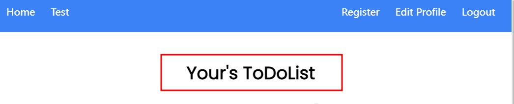

另一个组件`<ToDoList />`包含内容较多，先重点关注`return`的内容

## ToDoList 组件构成

在文件`frontend\src\components\ToDOList.jsx`中可以看到函数`ToDoList`return了很长的`JSX`代码，


主要分为三大部分
1. 没有task时

2. 添加/修改 task时
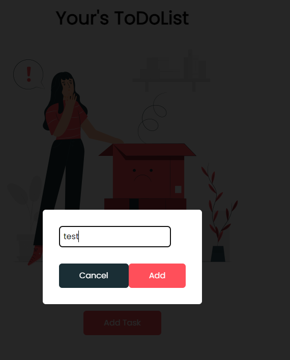

3. 正常的显示 task，包括all/Completed/Not Completed
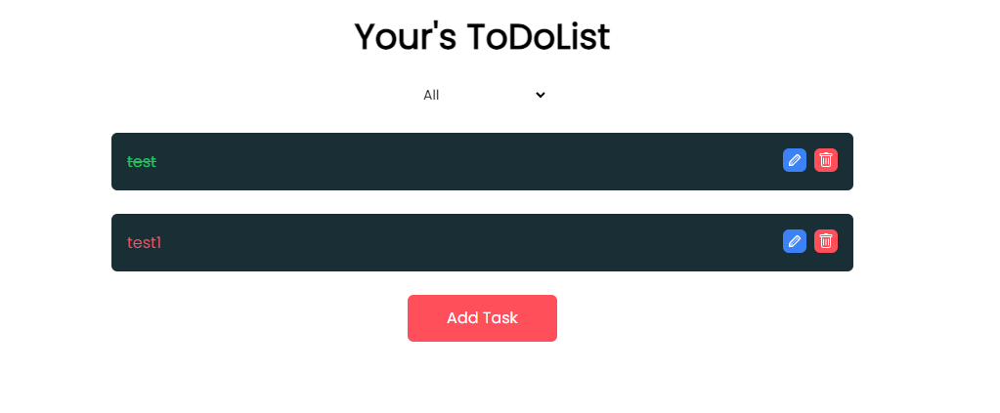
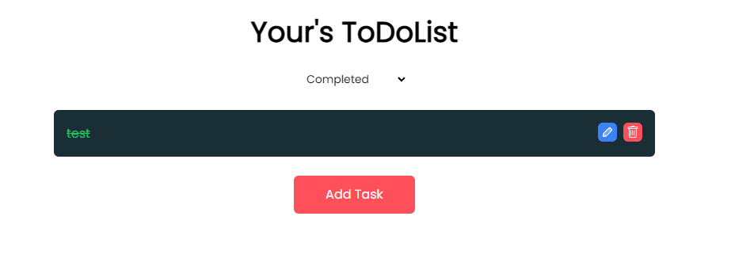
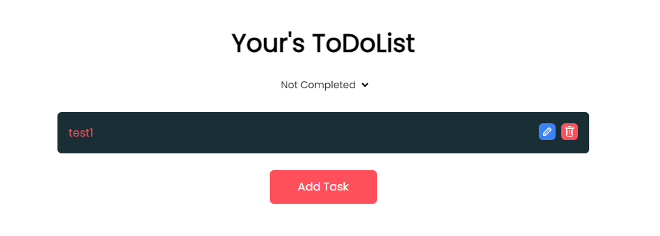

### 没有task时
在代码的第178行，
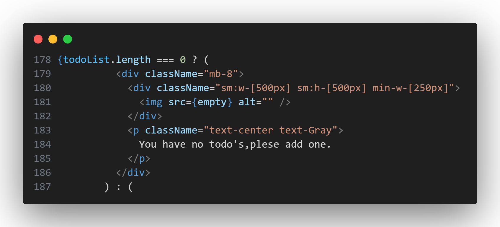
```jsx
{todoList.length === 0 ? (< />):(< />)}
```
这段代码使用了条件渲染
:::tip
条件渲染是一种根据特定条件来决定在页面中渲染不同内容的技术。在React中，可以使用条件语句或三元运算符等方式进行条件渲染。

通过条件渲染，可以根据应用程序的状态或用户的交互来显示不同的组件、元素或内容。例如，根据用户是否已登录，可以显示不同的欢迎信息或导航菜单；根据数据是否加载完成，可以显示加载动画或数据列表；根据用户的权限，可以显示不同的操作按钮等。

条件渲染通常使用JavaScript的逻辑运算符（如`if`语句、三元运算符）或逻辑表达式来判断条件，并根据条件的结果来决定是否渲染特定的组件或元素。这样可以根据应用程序的状态动态地更新用户界面，提供更灵活和交互性的体验。

在React中，可以使用条件渲染来处理各种场景，如根据用户权限显示不同的功能、根据表单输入验证结果显示错误提示、根据数据的存在与否渲染列表等。这种灵活的条件渲染机制使得React在构建交互性强、动态变化的应用程序时非常有用。
:::

当没有`todoList`时，即`todoList.length === 0`时，页面会渲染
```jsx
<div className="mb-8">
  <div className="sm:w-[500px] sm:h-[500px] min-w-[250px]">
    
  </div>
  <p className="text-center text-Gray">You have no todo's,plese add one.</p>
</div>;
```

### 添加/修改 task时
在代码的第121行到176行,实现了该UI，根据`showModal`来判断是否渲染。

再根据133行到176行的`currentTodo`来判断渲染哪一个，是修改还是添加.

若`currentTodo`不为空(135~151),则渲染修改
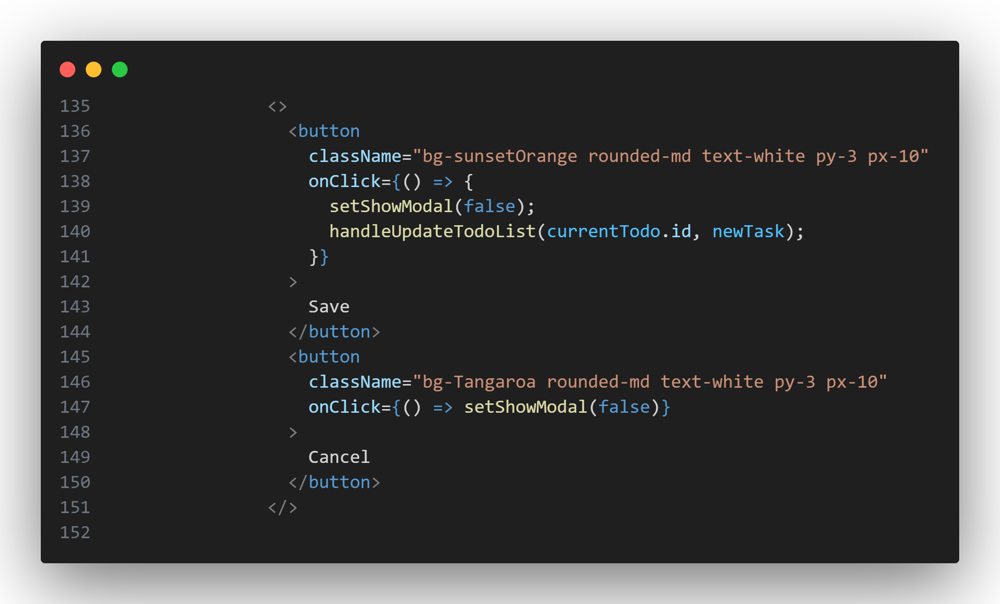

若`currentTodo`为空(153~171),则渲染增加
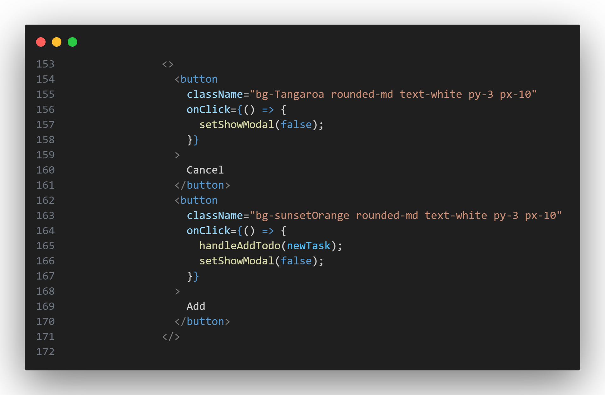

### 正常的显示 task，包括all/Completed/Not Completed
在代码的第188行到204行,即如果`todoList`不为空时

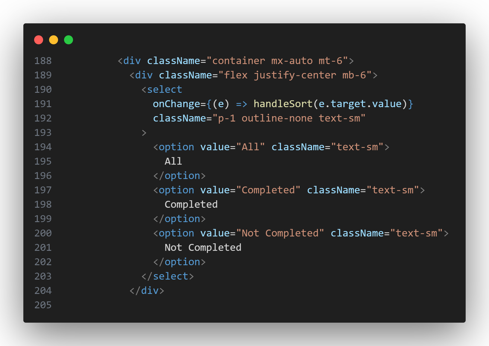

这一段代码渲染了一个下拉框，有三个选项

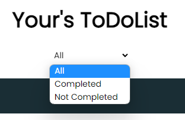

在205到240行

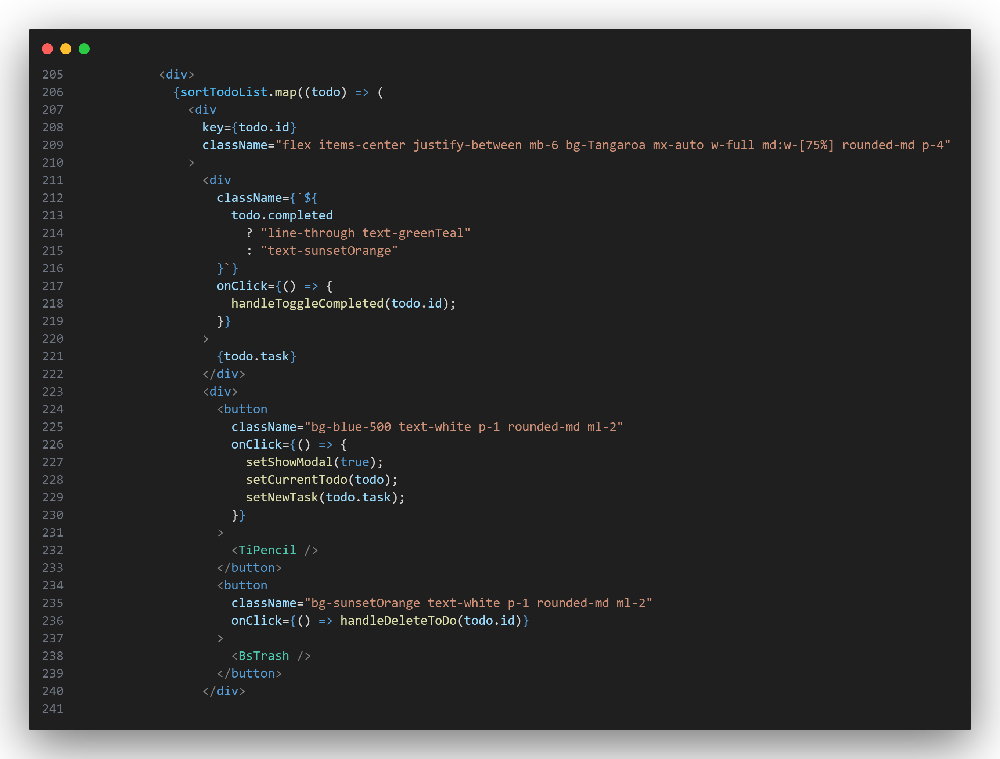

使用了一个函数`sortTodoList.map((todo) => ())`
:::tip
`map()` 是 JavaScript 中的数组方法，用于对数组中的每个元素执行相同的操作，并返回由操作结果组成的新数组。

在给定的代码中，`sortTodoList` 是一个数组，通过 `map()` 方法对其进行遍历，对每个 `todo` 元素执行相应的操作。

`map()` 方法接受一个回调函数作为参数，该回调函数将在数组的每个元素上被调用，并且可以访问当前元素的值、索引和原始数组。
:::

这个函数对`sortTodoList`这个数组的每一个元素进行操作

第211~222行
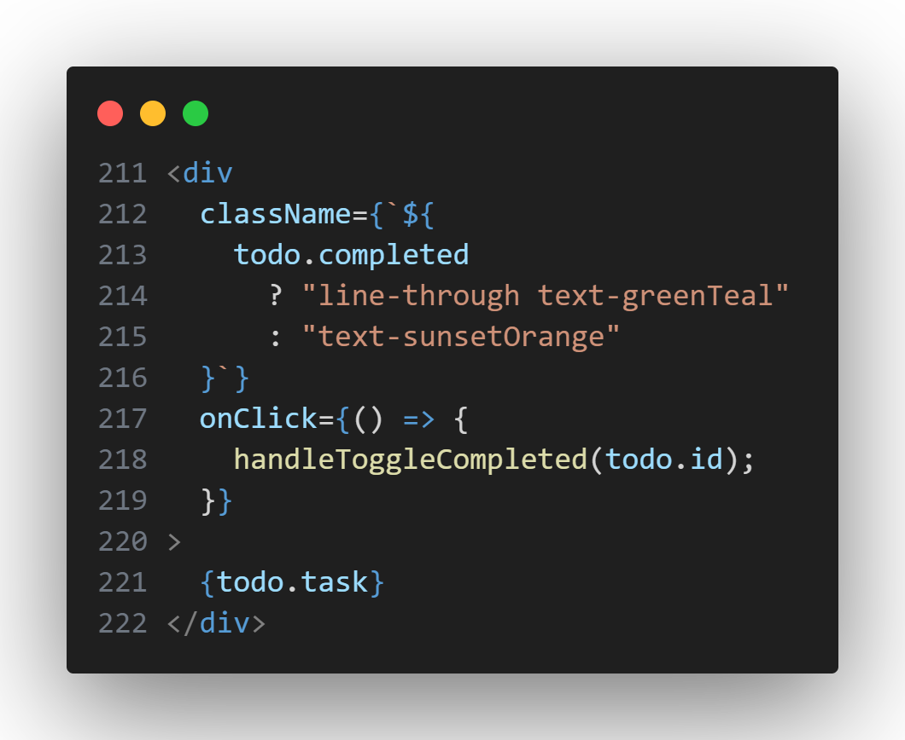
这个盒子中，渲染了`{todo.task}`也就是数组中每一个元素的`task`属性，也就是task的具体内容

第218行：当被点击时，改变这个`todo`的`completed`状态

第213~215行：通过条件渲染来改变其css样式，若`todo`的`completed`状态为真则显示绿色，删除线，若为假则为红色。

第223~240行：添加两个按钮，按钮图标分别为`<TiPencil />`,`<BsTrash />`

:::tip
`react-icons` 库是一个常用的 React 图标库，它提供了一系列常见的图标组件，可以直接在 React 项目中使用。

`react-icons` 库提供了多个图标集，包括但不限于 Font Awesome、Material Icons、Ionicons、Feather 等。每个图标集都有对应的导入方式。

`import { TiPencil } from "react-icons/ti";` 是导入 `react-icons/ti` 图标集中的 `TiPencil` 组件。`TiPencil` 表示 `Ti` 图标集中的铅笔图标。
:::

当图标被点击时分别触发不同的函数。