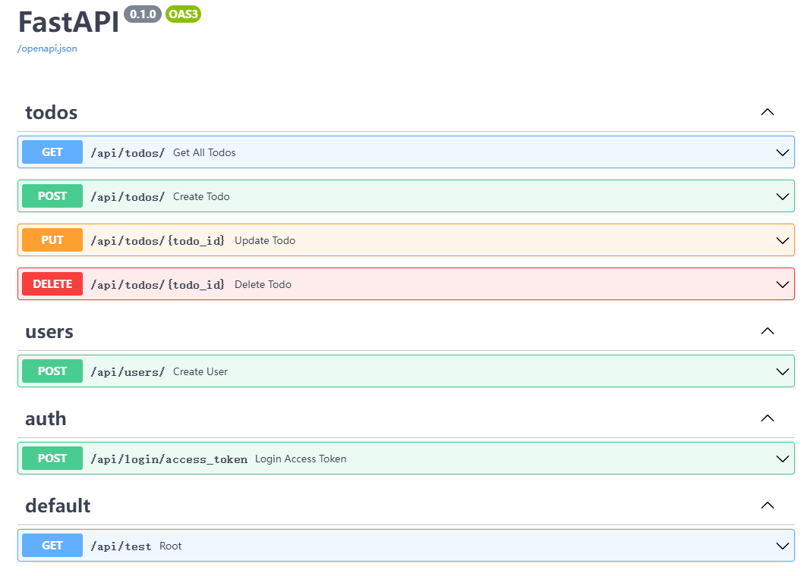
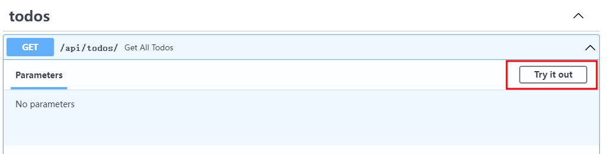
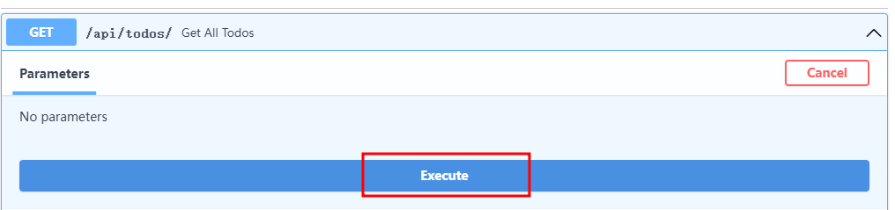
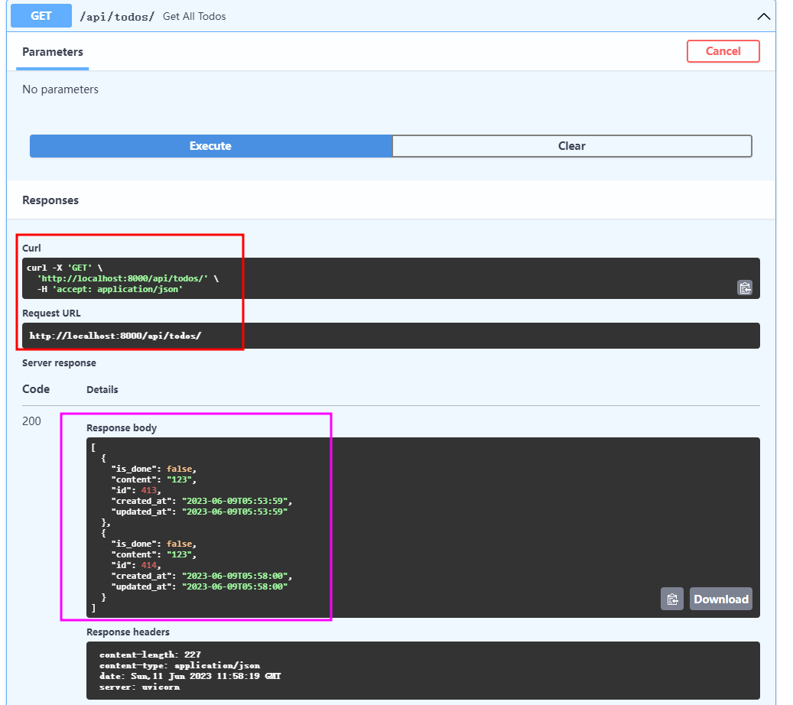

# 1

目前我们已经做完纯前端的todolist，现在需要将后端链接起来，从后端得到数据，这就需要`fetch`

## fetch是什么

`fetch` 是一种现代的 JavaScript 函数，用于发送网络请求并获取数据。它是浏览器内置的 API，也可以在 Node.js 环境中使用。

通过 `fetch` 函数，您可以向指定的 URL 发起 HTTP 请求，例如获取数据、提交表单或执行其他与网络通信相关的操作。它支持不同的请求方法（GET、POST、PUT、DELETE 等）和请求头配置，可以发送 JSON 数据、表单数据或其他类型的数据。

`fetch` 函数返回一个 Promise，可以使用 `.then()` 和 `.catch()` 方法处理异步操作的结果。在 `.then()` 中可以获取响应对象，并使用 `.json()`、`.text()` 或其他方法解析响应数据。

:::tip
`Promise` 是 JavaScript 中的一种异步编程模型，用于处理可能尚未完成的操作，例如网络请求、文件读取、定时器等。它是一种表示异步操作最终完成或失败的对象。

Promise 有三种状态：`pending`（进行中）、`fulfilled`（已完成）和 `rejected`（已失败）。当 Promise 被创建时，它处于 `pending` 状态，随后可能会转变为 `fulfilled` 或 `rejected` 状态，表示操作的最终结果。

Promise 对象具有两个主要的方法：`.then()` 和 `.catch()`。`.then()` 方法用于处理 Promise 完成时的结果，接受一个回调函数作为参数。`.catch()` 方法用于处理 Promise 失败时的结果，也接受一个回调函数作为参数。

通过 `.then()` 和 `.catch()` 方法，可以将多个 Promise 链接在一起，形成连续的异步操作序列。这种方式称为 Promise 链式调用。

Promise 的优点在于它提供了一种更简洁、可读性更高的方式来处理异步操作，避免了回调地狱（callback hell）的问题。它使异步代码更易于编写、维护和理解，并提供了一种标准的异步编程模型。

:::

以下是一个简单的示例，使用 `fetch` 函数发送 GET 请求并获取 JSON 数据：

```javascript
fetch('https://api.example.com/data')
  .then(response => response.json())
  .then(data => {
    // 处理返回的数据
    console.log(data);
  })
  .catch(error => {
    // 处理错误
    console.error(error);
  });
```

需要注意的是，`fetch` 函数默认不会捕获网络错误（如网络连接失败）。如果需要处理网络错误，可以使用 `catch` 方法捕获异常。

`fetch` 是一种强大且灵活的网络请求工具，常用于前端开发中获取数据和与服务器进行交互。

## 查看后端的api文档

在vscode中启动后端服务器，浏览器中输入[localhost:8000/docs](http://localhost:8000/docs)，即可看到我们的api文档。



点开`GET`,点击Try it out



点击`Execute`



可以看到其`Responses`



红色的部分是我们发出的api请求

紫色的部分是我们收到的回应

```bash
curl -X 'GET' \
  'http://localhost:8000/api/todos/' \
  -H 'accept: application/json'
```


