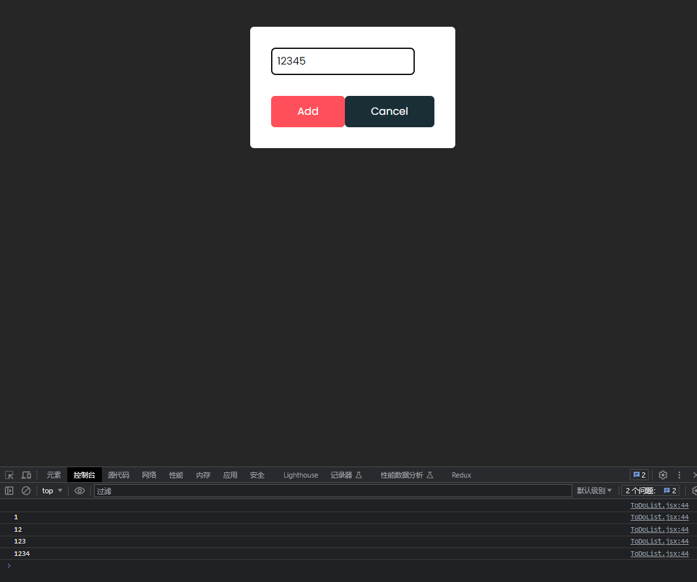
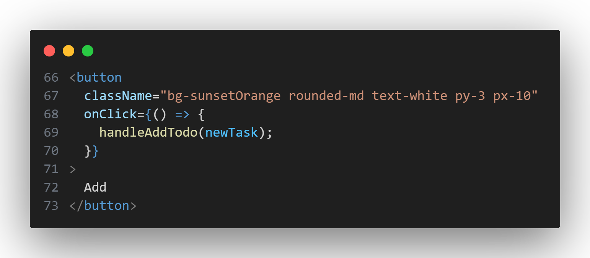

# 增加逻辑，并储存

## add

### 新增一个状态

```jsx
    const [newTask, setNewTask] = React.useState("");
```
这是为了储存"要添加的todolist"

在`<input>`中添加

```jsx
onChange={(e) => setNewTask(e.target.value)}
value={newTask}
```

在上述代码中，`onChange={(e) => setNewTask(e.target.value)}` 是一个事件处理函数，用于响应输入框的变化事件。当输入框的值发生变化时，React会调用这个函数，并将事件对象 `e` 作为参数传递进来。通过 `e.target.value`，我们可以获取输入框当前的值。

而 `value={newTask}` 是将 `newTask` 变量的值绑定到输入框的值上。通过将 `newTask` 变量作为输入框的值，可以实现输入框的双向绑定。当 `newTask` 的值发生变化时，输入框的值也会相应地更新；反过来，当用户在输入框中输入内容时，`newTask` 的值也会随之更新。

通过 `onChange` 和 `value` 的配合使用，可以实现输入框的双向数据绑定，使得输入框的值与 `newTask` 变量保持同步。

如果不理解上面的解释，可以添加
```jsx
onChange={(e) => {
    setNewTask(e.target.value);
    console.log(newTask);
}}
```
这是将`newTask`的值在命令台输出

在网页中的输入框中输入12345



### 接下来为add按钮添加逻辑

```jsx
  const handleAddTodo = (task) => {
    if (task.trim().length === 0) {
      alert("please enter a task");
    } else {
      dispatch(
        addTodo({
          task: task,
          id: Date.now(),
        })
      );
      setNewTask("");
      setShowModel(false);
    }
  };
```


`handleAddTodo` 函数用于添加新的待办事项。在函数内部，它首先检查任务是否为空，如果为空则显示警告弹窗。否则，它使用 `dispatch` 函数来触发 `addTodo` action，将新任务的信息传递给 reducer 进行状态更新。

`task` 参数代表要添加的任务。你可以在调用 `handleAddTodo` 函数时，作为参数传递进去

这样，当点击 "Add Task" 按钮时，将会调用 `handleAddTodo` 函数，并传递当前输入框中的 `newTask` 值作为参数。然后，`handleAddTodo` 函数会将任务添加到状态中，并清空输入框中的内容。同时，它还会设置 `showModal` 的值为 `true`，以显示输入框。


### 为Add按钮添加被点击的逻辑

```jsx
onClick={() => {
    handleAddTodo(newTask);
}}
```


可以在网页中测试逻辑是否成功

### 设置储存todolist

首先导入`{ useEffect }`
```jsx
import React, { useEffect } from "react";
```
:::tip
`useEffect` 是 React 提供的一个钩子函数，用于处理组件中的副作用操作。副作用是指在组件渲染过程中，与渲染结果无关的操作，例如数据获取、订阅事件、操作 DOM 等。

`useEffect` 接受两个参数：一个回调函数和一个依赖项数组。回调函数定义了副作用的具体操作，依赖项数组用于指定在哪些依赖项发生变化时触发副作用。

```jsx
useEffect(() => {
  // 副作用操作
}, [依赖项]);
```

当组件初次渲染时，会执行 `useEffect` 中的回调函数。之后，只有在依赖项发生变化时，才会重新执行回调函数。如果依赖项为空数组 `[]`，则表示副作用只在组件初次渲染时执行一次。

`useEffect` 可以用于处理各种副作用操作，例如：

- 数据获取：通过网络请求获取数据，并更新组件状态或进行其他操作。
- 订阅事件：订阅外部事件，如键盘事件、鼠标事件，以便在事件触发时执行相应的操作。
- 操作 DOM：对 DOM 进行操作，例如添加或删除元素、改变元素样式等。
- 清理操作：在组件卸载时执行清理操作，如取消订阅、清除定时器等。

通过使用 `useEffect`，我们可以在 React 组件中方便地处理副作用，确保在适当的时机执行相应的操作，同时遵循 React 的生命周期和数据流管理规则。
:::

```jsx
useEffect(() => {
if (todoList.length > 0)
    localStorage.setItem("todoList", JSON.stringify(todoList));
}, [todoList]);

useEffect(() => {
const localTodoList = JSON.parse(localStorage.getItem("todoList"));
if (localTodoList) {
    dispatch(setTodoList(localTodoList));
}
}, []);
```


这段代码使用了 React 的 `useEffect` 钩子函数来处理副作用。它在组件渲染时执行，并根据指定的依赖项进行触发。

第一个 `useEffect` 函数用于在 `todoList` 发生变化时将其存储到本地存储中。它通过使用 `localStorage.setItem` 将 `todoList` 转换为 JSON 字符串，并存储在本地存储的 `"todoList"` 键下。这样可以确保在页面刷新或重新加载后，之前的待办事项列表仍然可用。在依赖项数组 `[todoList]` 中，指定了当 `todoList` 发生变化时触发副作用。

第二个 `useEffect` 函数用于在组件初次渲染时从本地存储中获取之前保存的待办事项列表，并将其设置为初始的 `todoList`。它通过使用 `localStorage.getItem` 获取存储在本地存储的 `"todoList"` 键下的值，并使用 `JSON.parse` 解析为 JavaScript 对象。然后，使用 `dispatch` 函数触发 `setTodoList` action 将其设置为初始的 `todoList`。由于该副作用只需要在组件初次渲染时执行一次，因此依赖项数组 `[]` 是空数组，表示不依赖于任何值进行触发。

这两个 `useEffect` 函数的目的是将待办事项列表存储到本地存储，并在组件初始化时从本地存储中获取之前保存的列表，以实现数据的持久化和恢复。

此时在浏览器中当我们添加todolist后，可以看到


这说明已经将数据保存在了浏览器中

## 总结
通过
```jsx
onChange={(e) => setNewTask(e.target.value)}
value={newTask}
```
将输入框的内容储存到`newTask`中

```jsx
onClick={() => {
    handleAddTodo(newTask);
}}
```

通过点击add按钮触发`handleAddTodo(newTask)`

`handleAddTodo`中使用`dispatch` 函数来触发 `addTodo` action

这使得`todoList`这个全局状态增加了

```jsx
  useEffect(() => {
    if (todoList.length > 0)
      localStorage.setItem("todoList", JSON.stringify(todoList));
  }, [todoList]);
```

使用`useEffect`，当`todoList`变化时，若其长度大于0，则将其数据储存到本地浏览器中

```jsx
  useEffect(() => {
    const localTodoList = JSON.parse(localStorage.getItem("todoList"));
    if (localTodoList) {
      dispatch(setTodoList(localTodoList));
    }
  }, []);
 ``` 

 再通过这个`useEffect`，读取本地`localStorage`中的`todoList`，将其赋值给`localTodoList`,若它不为空，则使用`dispatch` 函数来触发 `setTodoList` action，更新全局状态`todoList`，这保证了当页面刷新时，数据还在
