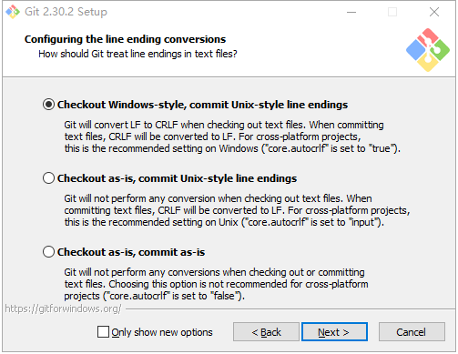

# Windows 安装

:::caution

_非常重要，请仔细阅读完本文以后再进行相关操作。（因未仔细阅读完本文，出现任何错误后果自负， 逃～～～逃～～～逃_

:::

## 下载 Git

打开[Git 官网下载地址](https://git-scm.com/downloads/win)

根据自己的电脑版本选择 32 位或 64 位，基本版和便携版均可

下载后点击即可进行安装，下面是具体安装步骤：

## 安装步骤

### 许可申请

点击 “Next” 即可。

### 选择安装路径

根据自己需要修改安装位置。

### 选择安装组件

默认勾选的选项，建议不要动。默认安装了一些组件 Git Bash ,Git GUI 以及 Git LFS 还有桌面快捷方式以及配置文件默认的文本编辑，使用 sh 脚本启动 git bash.

红色框框决定在所有控制台窗口中使用 TrueType 字体和是否每天检查 Git 是否有 Windows 更新，按需勾选。

注：Git LFS 用于实现 Git 对大文件的支持 ，LFS 策略可以节省存储空间和提高性能，比如游戏开发中设计资源文件占用很大。

### 选择开始菜单目录

默认 git 即可 直接 next。

### 选择 Git 文件默认的编辑器

很少用到，所以默认 Vim 即可，直接点“Next”。

### 选择 Git 初始化分支的名称

git 默认的初始化分支名称为”master”。

根据自己项目业务重新命名 如：main,trunk 或者自己填写。

注：已经存在的项目不受影响。

### 选择使用 Git 的方式

1. 第一个选项, 只从 Git Bash 命令行工具 使用 Git，也是最谨慎的默认的选择。

2. 第二个选项, 从命令行或者第三方软件 使用 Git。

3. 第三个选项，在命令提示符中使用 Git 和可选的 Unix 工具。

我们选取第一个选项

### 选择 https 传输后端

第一个选项，使用 OpenSSL 库，服务器 cer 证书将使用 ca 包中.crtw 文件进行验证通过，默认选这个。

第二个选项，使用本机 Windows 安全通道库，服务器证书将在 Windows 证书存储中进行验证。这个选项还允许您通过 Active Directory 域服务使用您的公司内部根 CA 证书。

我们选取第一个选项。

### 配置结束行转换方式

第一个选项，下拉是转换 Windows 风格，提交转换为 iunix 风格，在 windows 这是推荐默认的设置。

第二个选项，下拉时不改变，提交转换为 iunix 风格。对于跨平台项目，这是 Unix 上的推荐设置。

最后一个选项，下拉和提交都不进行任何转换，对于跨平台项目(“核心项目”)，不推荐选择此选项。

选择第一个选项。

### 配置终端模拟器为使用 Git Bash

第一个选项，Git Biash 将使用 MinTTY 作为终端模拟器，它拥有一个可调整大小的窗口，非矩形的选择和 Unicode 字体。Windows 控制台程序(如交互式 Python)必须通过 winpty’启动才能在 MinTTY 中工作，默认选择这个更灵活。

第二个选项，使用 Windows 的默认控制台（cmd.exe）,它可以在 Win32 控制台程序中工作，如交互式 Python 或 node。is，但有一个非常有限的默认滚动回滚，需要配置为使用 Unicode 字体，以便正确显示非 ascil 字符，在 Windows 10 之前，它的窗口不能自由调整大小，它只允许矩形文本选择

选择第一个选项。

### 选择 git 下拉默认行为

第一个选项，默认(快进或合并)。这是“git pull”的标准行为:尽可能快进当前分支到一个被捕获的分支，否则创建合并提交。

第二个选项，将当前分支改为获取的分支。如果没有要重基的本地提交，这相当于快进。

第三个选项，仅仅快进， 快进到获取的分支。如果不可能，就失败。

选择第一个选项

### 选择 git 凭证小助手

Credential helper 是帮我们保存凭证（用户密码）他有很多存储模式如：cache，store，manager 和 osxkeychain，默认 wincred，这里根据自己需要选择。

### 配置额外特性选项

第一个选项，启用文件系统缓存,文件系统数据将被大量读取，并缓存到内存中以用于某些操作(“core。fscache”设置为”true”)。这提供了显著的性能提升。

第二个选项，支持符号链接，启用符号链接(需要 SeCreateSymboliclink 权限)。请注意，现有存储库不受此设置的影响。

推荐选择第一个选项。

### 启用实验配置选项

启用对伪控制台的实验性支持,(新)这允许在 Git Bash 窗口中运行原生控制台程序，如 Node 或 Python，而不使用 winpty，但它仍然有已知的 bug,一般用不到 可不勾选

点击 Install 即可安装完毕。
