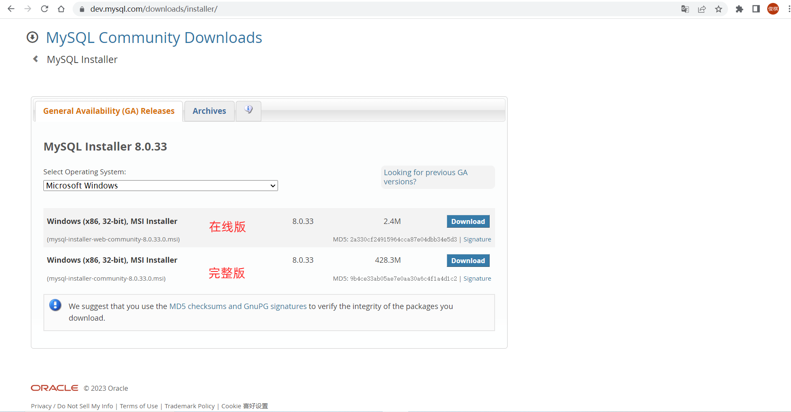
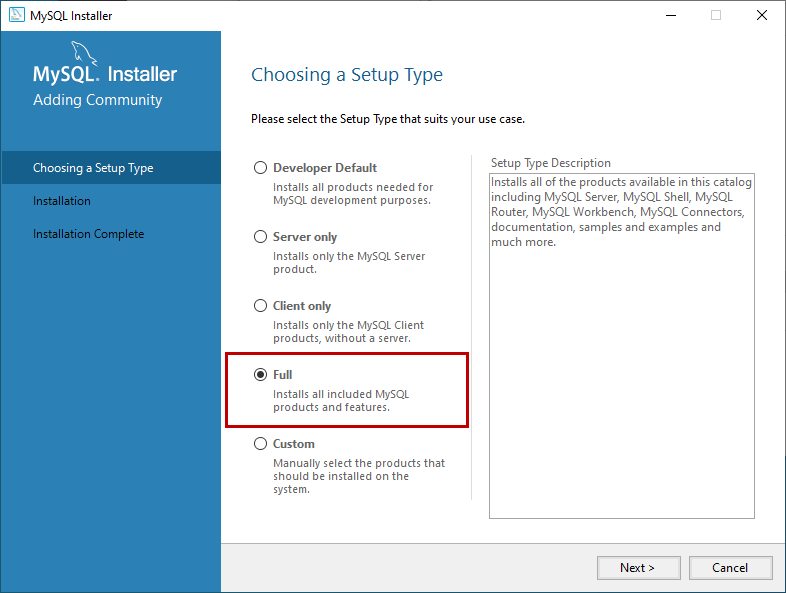
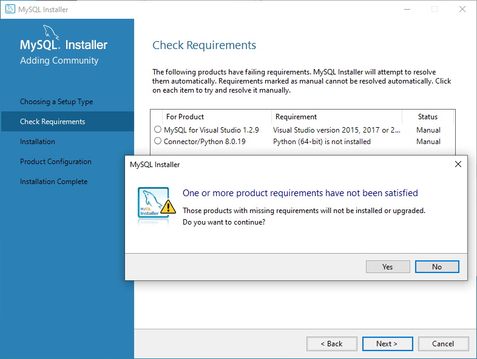
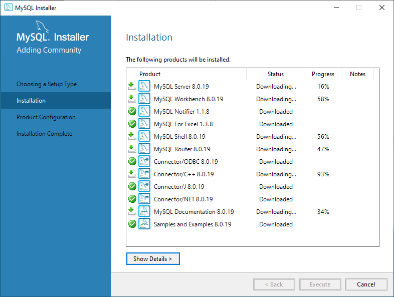
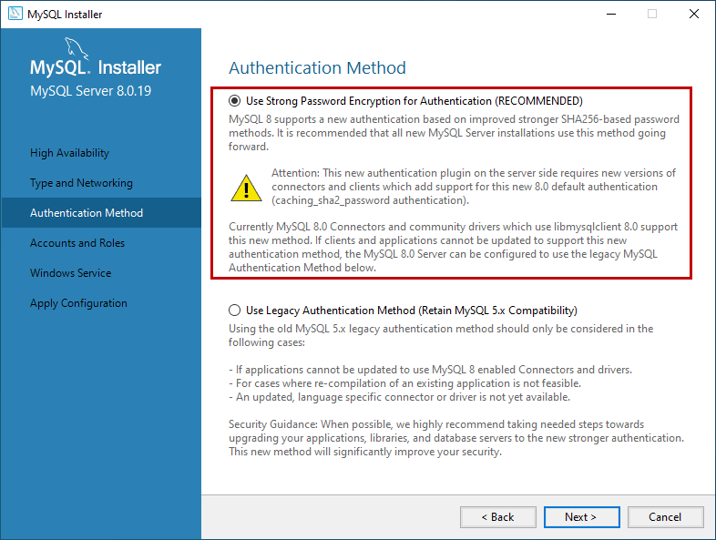
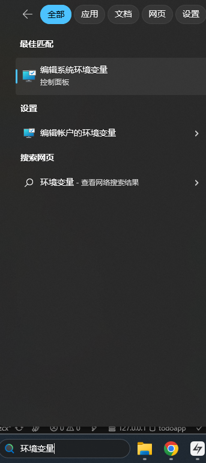
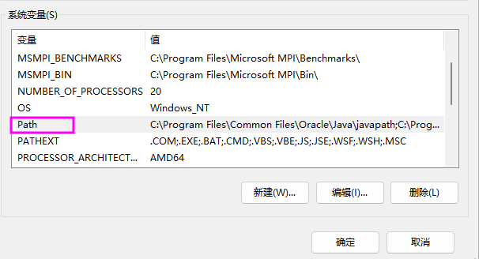
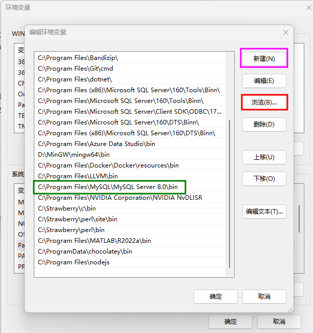

# Windows 安装

:::caution

_非常重要，请仔细阅读完本文以后再进行相关操作。（因未仔细阅读完本文，出现任何错误后果自负， 逃～～～逃～～～逃_

:::

## 下载 MySQL 安装程序

[MySQl 官方下载页面](https://dev.mysql.com/downloads/installer/)

同学们可以根据自己的需求选择下载在线版或完整版

## 安装 MySQL 数据库

下载安装程序后，双击安装文件开始安装过程。

在选择安装类型页面上，同学们可以看到五个安装选项:

我们安装 MySQL 服务器以及所有组件的，选择 “Full” 并单击 “Next”

### 检查所需组件

在安装开始之前，安装程序会检查安装所需的先决条件。界面上会显示产品名称、所需组件/软件及其状态。可以看到，安装 MySQL for visual studio ，必须安装 visual studio 2015 或以上版本。同样，要安装 Connector/Python 8.0.19，我们必须先安装 python。

如果本页有 “Execute“ 按钮，则先点击 “Execute“ 按钮，然后单击 “Next”。

如果没有 “Execute“ 按钮，则直接单击 “Next”。

安装程序向我们发出警告。我们继续安装，单击 “Yes“。

### 安装所选产品组件

在安装界面上，我们可以看到将要安装的 MySQL 产品/软件的列表。查看列表并单击 “Execute“。

安装程序会自动下载所有产品/软件，然后，它会自动安装所有产品。

等待几分钟。安装过程完成后，我们就可以配置 MySQL 数据库服务器和其他组件了。单击 “Next” 进入配置界面。

### 产品配置

在产品配置界面上，我们可以看到需要配置的产品列表。单击“Next”。

### 配置高可用性

在高可用性界面上，我们选择 “Standalone MySql Server / Classic MySQL Replication”。这是选择我们服务器作为独立服务器或者经典的 MySQL 复制服务器。

### 配置服务器类型和网络

在类型和网络界面上，我们可以配置以下内容：

Config Type: 配置类型

- Development Computer: 开发计算机，占用最少的资源。

- Server Computer: 服务器计算机，可以和其他服务器软件一同安装，比如 web 服务器等。中等资源占用。

- Dedicated Computer: 专用计算机，可最大限度的占用资源。

Connectivity：可以控制客户端如何连接到 MySQL 数据库

### 配置认证方法

在 MySQL 8.0 版本中，我们可以使用基于 SHA256 的强密码。在 Authentication Method 界面上，选择使用传统身份验证方法或强密码进行身份验证的选项。注意：如果使用强密码加密进行身份验证，请确保所有客户端或者连接器必须更新到最新版本。我们使用强密码加密进行身份验证。

### 配置账户和角色

在 Accounts and Roles 界面上，您可以指定 MySQL 的 root 帐户密码。MySQL root 帐户是默认的 sysadmin 帐户，为了安全，一般要禁用它。

:::danger MySQL 密码设置推荐

**建议同学们把自己的 root 密码设置为：`password`**

_使用其他密码的出现问题我们概不负责_

:::

### 配置 Windows 服务

在 Windows 服务界面上，可以将 MySQL 服务器配置为作为 Windows 服务运行。我们可以自定义服务器的名称以及是否随机自启动服务。

### 将配置生效

在 “Apply Configuration” 界面上，我们可以看到保存配置的步骤。检查所有配置设置后，单击 “Execute”。

等待配置保存成功后，单击 “Finish” 关闭安装程序。

## 配置环境变量

搜索环境变量

双击`Path`

依次点击新建，浏览，找到绿框中的内容，点确定

