# Windows 安装

:::caution

_非常重要，请仔细阅读完本文以后再进行相关操作。（因未仔细阅读完本文，出现任何错误后果自负， 逃～～～逃～～～逃_

:::


## 下载

[下载地址](https://nodejs.org/en)

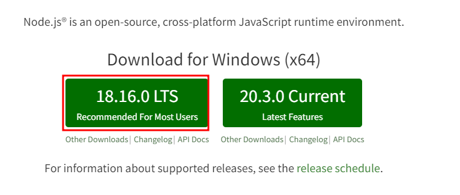

下载第一个

## 安装

打开下载好的文件`node-v18.16.0-x64.msi`（或其他版本）

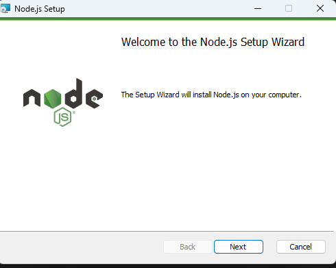

点击`next`

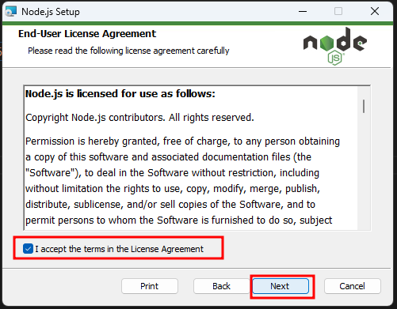

勾选后，点击`next`

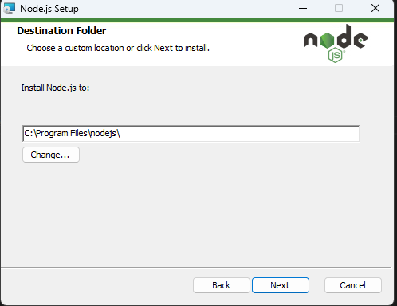

点击`next`

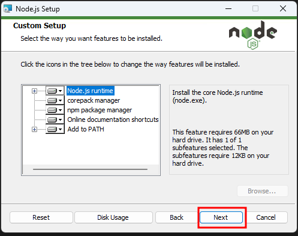

点击`next`

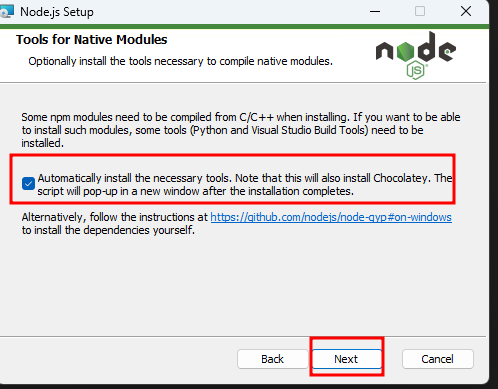

勾选后，点击`next`

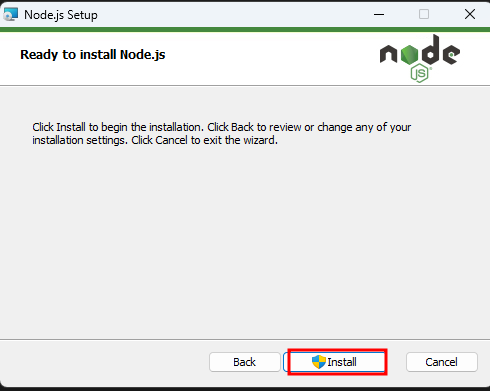

点击`Install`

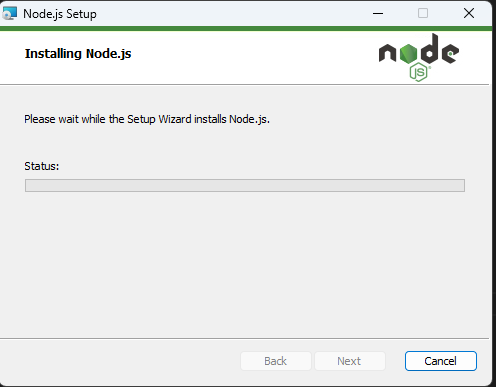

等待

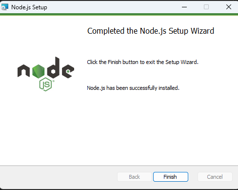

点击`finish`

## 环境变量设置

搜索环境变量并打开

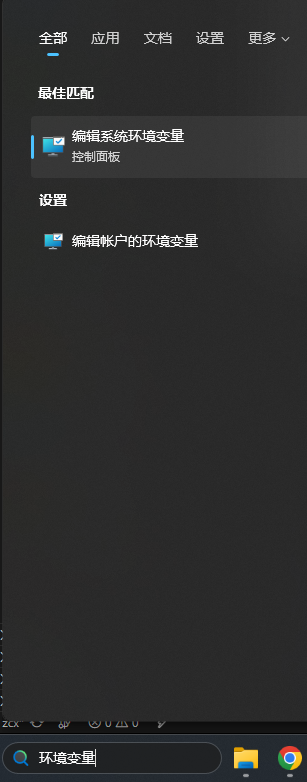

点击环境变量

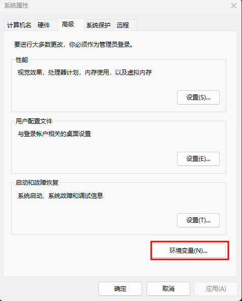

双击`Path`

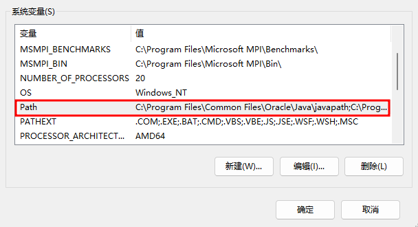

点击`新建`

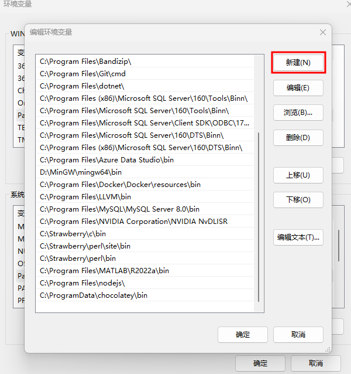

点击`浏览`

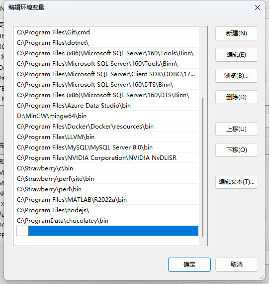

选中所安装的文件夹路径，然后点击`确定`

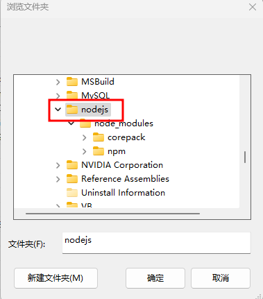

点击`确定`

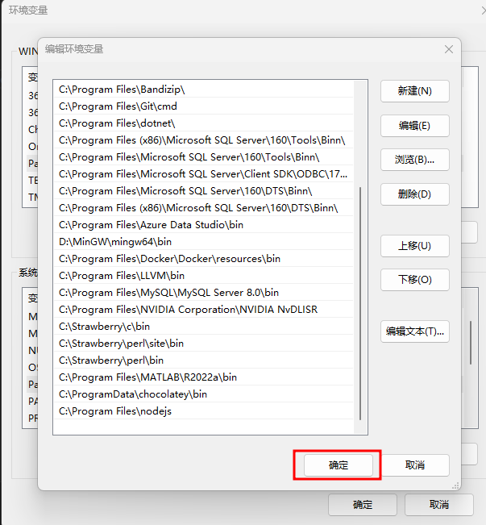

点击`确定`

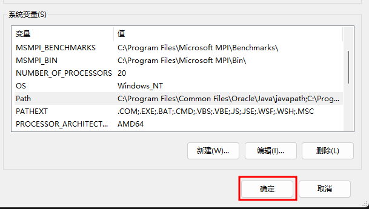

点击`确定`

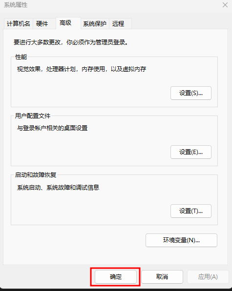


## npm 国内镜像加速
由于众所周知的原因，在中国大陆使用 npm 过程中经常会遇到无法下载包的问题。

```bash
npm config set registry https://registry.npmmirror.com/
```

