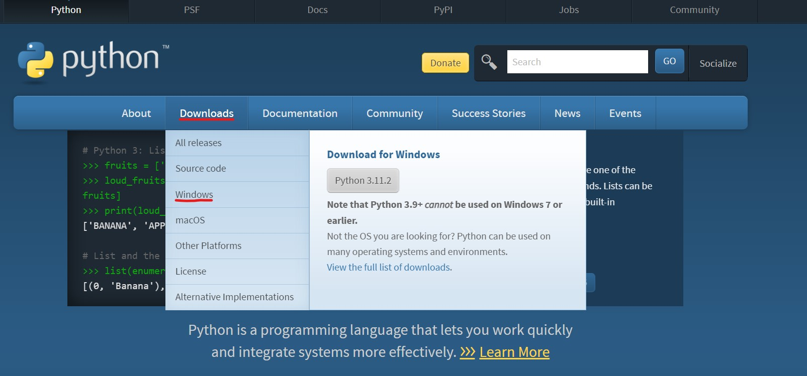

# Windows 安装

:::caution

_非常重要，请仔细阅读完本文以后再进行相关操作。（因未仔细阅读完本文，出现任何错误后果自负， 逃～～～逃～～～逃_

:::

## 下载安装包

Python 官网地址为:https://www.python.org/

1.进入首页点击"Downloads"，然后点击"windows"

2.选择"Python 3.10.9"这一版本进行下载

:::danger
本课程 Windows 上的 Python 版本为 3.10.9，请不要下错版本。
:::

## 安装

1.找到刚才下载好的 Python 安装程序，双击进行安装

2.勾选`Add python.exe to PATH`，然后点击"Install Now"进行默认安装

**一定要勾选 `Add python.exe to PATH`**

**重要的事情说三遍！！！请勾选`Add python.exe to PATH`**

3.当出现"Setup was successful"时则安装结束

## 验证是否安装成功

1."windows+R"打开运行页面，输入"cmd"进入 Windows 命令行终端。

2.输入`python`命令出现如下类似信息，则说明安装成功。

运行`python`命令出现的这个东西叫做 Python 交互式解释器(REPL)

:::tip

“读取-求值-输出”循环（英语：Read-Eval-Print Loop，简称 REPL），也被称做交互式顶层构件（英语：interactive toplevel），是一个简单的，交互式的编程环境。这个词常常用于指代一个 Lisp 的交互式开发环境，也能指代命令行的模式。———[维基百科](https://zh.m.wikipedia.org/zh-hans/%E8%AF%BB%E5%8F%96%EF%B9%A3%E6%B1%82%E5%80%BC%EF%B9%A3%E8%BE%93%E5%87%BA%E5%BE%AA%E7%8E%AF)

:::
