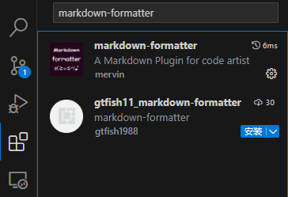
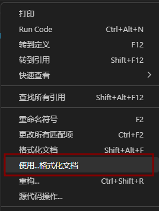
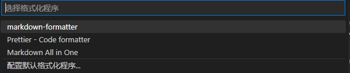
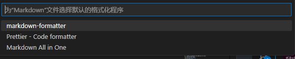
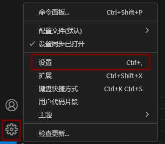
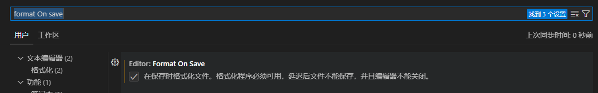

# 自动格式化

## vscode 扩展
搜索markdown-formatter

## 设置默认format
选择默认format，右键

点击使用...格式化文档

配置默认格式化程序

选择想要的format
## 保存时自动格式化
打开设置，vscode左下角,并搜索Format On Save

勾选 **Format On Save**

## 其它语言
扩展中搜索对应语言的format,进行如上设置