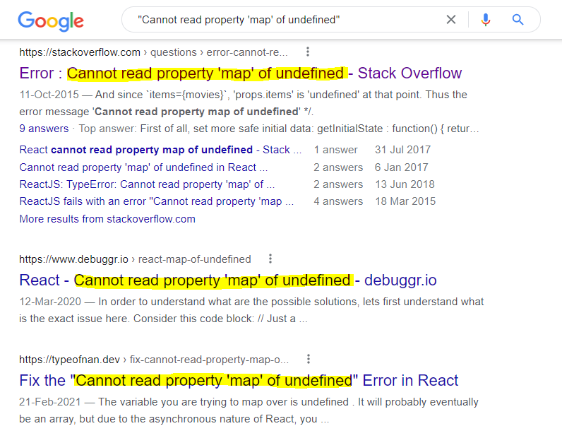
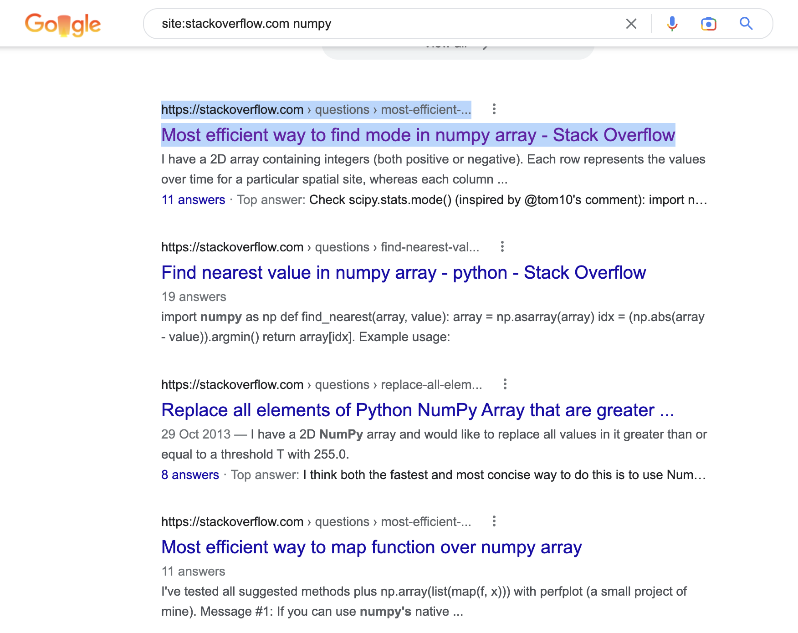
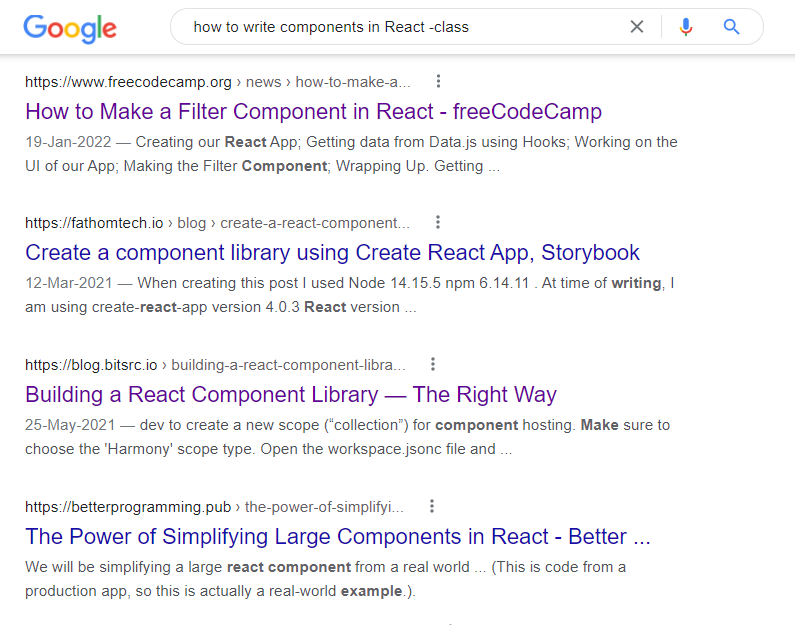
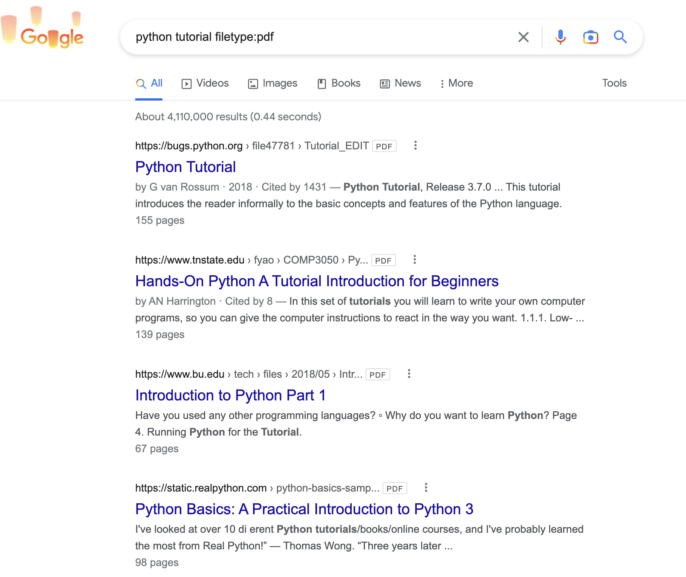
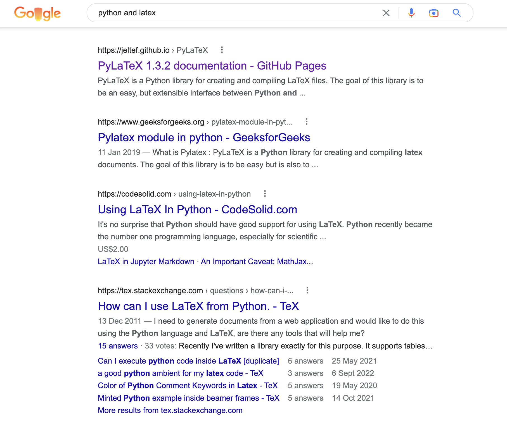
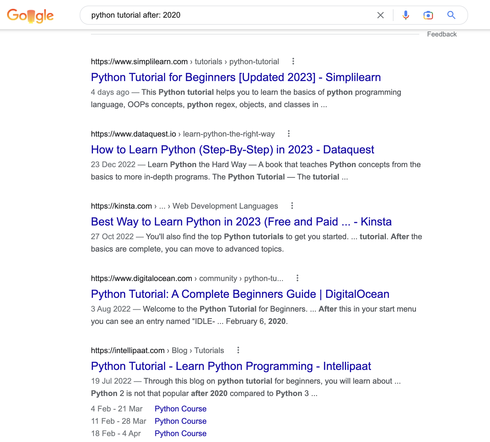
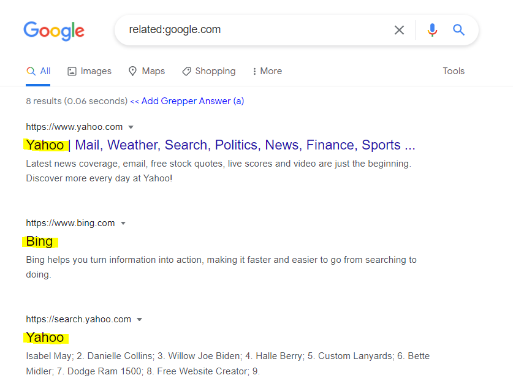

# 如何高效地使用 Google 搜索

本文参考

- [How to Google like a Pro – 10 Tips for More Effective Googling](https://www.freecodecamp.org/news/how-to-google-like-a-pro-10-tips-for-effective-googling/)

:::info

根据我们多年的经验，珍爱生命远离百度。同时 AIGC 时代，我们首推 ChatGPT 来解决问题，其次是 Google。但是强烈不推荐直接让 ChatGPT 来帮你写代码。至于如何使用 ChatGPT 和 Google，由于某种原因，我们不提供解决方案，请自行研究。

:::

你几乎可以在互联网上搜索到任何内容，而 Google 是大多数人选择搜索信息的主要途径之一。

尽管频繁地使用 Google，但是大部分互联网用户都不知道如何快速和高效地使用 Google 搜索。

可以说使用 Google 是一门艺术。

想要获得正确的答案，你需要提出正确的问题。想要快速地获得正确的答案，你必须知道 如何 提正确的问题。

每一个人都应该学学这个实操（how） 部分，这也是一篇教程教学目的所在。 以下是一些提示和技巧，帮助你快速、高效地寻找到问题的正确答案。

## 1. 使用引号来获得“完全一致”的匹配搜获

当我们按照惯常的习惯在 Google 上搜索的时候，实际上我们使用的是浅搜索。 这样得到的搜索结果可能会包括你的搜索查询里没有的词。

但如果你将自己的查询请求或者问题（词汇或者短语）用引号打包，像这样 —— "你的问题"，Google 就会进入深度搜索模式。这样的搜索结果会包含所有在引号内你的搜索问题里的词汇。

当你需要在搜索结果中呈现出某个特定的词汇或者短语的时候，这个方法就十分有用。

## 2. 使用 site: 在特定网站搜索

如果你希望 Google 返回的搜索结果是来自某个特定的网站，仅需要在你的搜索问题前添加 site: 。

当你想要在某个没有内置搜索选项的网站，或者内置搜索不太好用的网站进行搜索的时候，这个方法可以派上用场。

假设，你的搜索问题是 site:stackoverflow.com numpy， 返回的搜索结果仅会是来自[stackoverflow.com](https://stackoverflow.com/) 关于 NumPy 的话题。

## 3. 使用-在搜索结果中排除某个词汇

如果你不希望自己的搜索结果中出现某个词汇或者短语，可以在那个单词前添加 - 。

假设你的搜索内容是 => how to write components in React -class，返回的搜索结果会不包含“class”。所以， (如果你了解一点 React)，你会发现搜索结果只包含函数式组件。

## 4. 使用 imagesize:搜索特定大小的图片

如果你想搜索特定大小的图片，可以在你的搜索查询中使用 imagesize:标签，并且标注好以 pixels（像素） 为单位的宽和高。

尺寸仅以 pixels 为单位 – 例如：imagesize:500x500 的搜索结果是尺寸为 500px x 500px 的图片。 所以如果搜索查询是 => "cute dog images imagesize:500x600"的搜索结果是尺寸为 500px x 600px 的可爱小狗的图片。

## 5. 使用 filetype:搜索特定文件类型

如果你希望搜索的结果包含了某个特定的文件类型，如：PDF 或者 PPT，就可以添加 filetype: 扩展名（不需要尖括号）。 如，python tutorial filetype:pdf 的搜索结果是 PDF 格式的，如图：

## 6. 在搜索中使用通配符\*

如果你不确定搜索查询/问题或者忘记了其中的词汇，你可以在搜索中使用通配符\*，Google 会用相关的词汇来替换通配符。

例如，如果你搜索 => the \* of money，会产生如下结果。 Google 会返回一系列搜索页面，包括 "the exchange of money"、 "the use of money"、 "the role of money"、 "the psychology of money"等。

## 7. 使用 OR（或）、 AND（且）逻辑合并搜索

如果你希望搜索结果包含两个词汇，可以在其中使用 AND 关键字。例如，你搜索=> Python and LaTeX， Google 会返回即包含 Python，又包含 LaTeX 的结果。

同样的，如果你希望搜索结果包含两个词汇中的任意一个， 可以在其中使用 OR 关键字。 例如，你搜索 => Python OR LaTeX，Google 会返回包含 Python 或者 LaTeX 的结果，甚至包含两者的结果。

## 8. 在两个数字间使用 AFTER:（在……之后）、 BEFORE:（在……之前） 或 .. 来筛选结果

如果你希望 Google 的搜索结果是发布在特定年份之后的，你可以使用 AFTER:标签。例如，你搜索 => Python tutorials AFTER:2020 会返回迟于 2020 年发布的结果。

同样的，如果添加 BEFORE: 标签，会返回早于某个特定年份的结果。

你也可以搜索发布在某个年份范围内的结果，或者介于两个数字之间的任意事物。仅在两个数字之间添加 ..即可，如果有计算单位，也可以添加计算单位。

## 9. 使用 related:查询相关网站

如果你想知道和某个特定网站相关的其他网站，可以使用 related:标签。

例如，你搜索 related:google.com 就会得到所有和 Google 类似的网站，如：Bing、Yahoo、DuckDuckGo 等。

## 10. 使用 cache:查看 Google 对某个网站的缓存版本

Google 提供网站的缓存版本以提高搜索速度。想要知道 Google 是否缓存了某个网站，可以在网站 URL 前面添加 cache:。

这一招对于 web 开发来说非常管用，可以检查现在浏览的到底是 Google 缓存的网站，还是提交了一些修改之后的最近版本的网站。 例如，在写这篇教程的时候（2023 年 2 月 5 日）搜索 => cache:www.baidu.com ，得到的结果如下：

你可以看到，即便我是在 2023 年 2 月 6 日搜索这个网站，我得到的搜索结果是 Google 缓存的 2023 年 2 月 5 日的版本。

正如 Google 自己描述的一样，我们必须知道“不是所有的搜索运算都会穷举所有结果。”

但我仍相信以上的方法可以帮助你提高使用 Google 搜索的效率。我希望我的解释足够清晰，并且在日后你能够将这些方法运用在日常的 Google 搜索中
