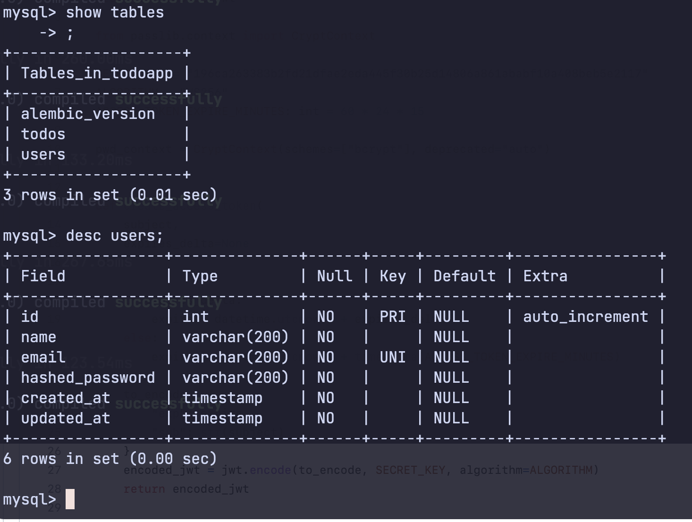
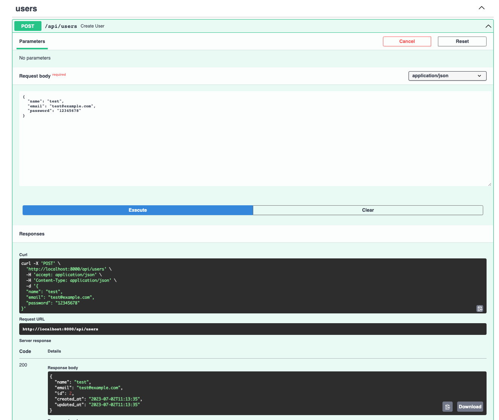
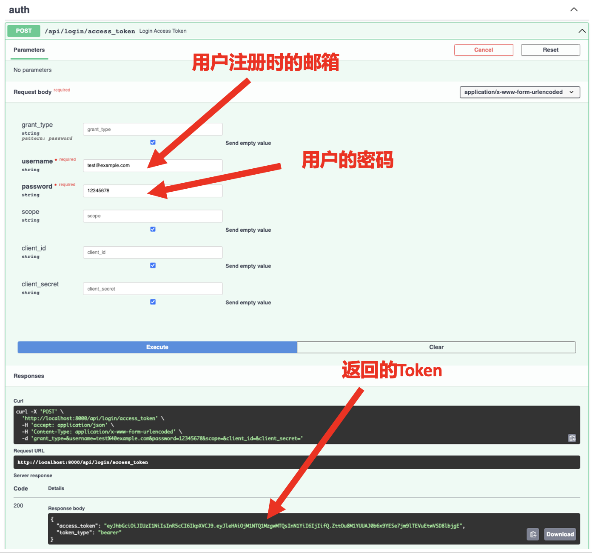

# 用户登陆

:::tip

本课程网站内容请仔细阅读后再进行实操。因未仔细阅读内容，出现任何错误后果自负（逃～～～逃～～～逃

请切换到 `backend_user_start` 分支，开始此教程代码的编写。

**所有的代码请不要复制粘贴，请手敲每一行代码。复制粘贴不会让你动脑子，而手敲每一个行代码会让你自然而然地去动脑子会想每一行代码的含义和原理**
:::

请回忆一下常用的淘宝网、京东、抖音等网站或者App，最开始是不是需要大家注册一个用户，有了用户需要登陆以后才能使用更多的功能。那为什么需要登陆以后才可以用呢？请大家设想一个问题，如果没有登陆这个操作，哪我们的Web应用程序怎么才能知道这购物车里面的物品是你的而不是别人的。如果下单了以后了，那怎么知道是你购买了商品而不是别人购买了商品。因此对于一个Web应用来说，最最最重要的便是用户系统，它是几乎是所有Web应用的基础功能。接下来我将带着大家实现一个基本的注册、登陆功能的用户系统。


## 新建一张`users`表

为了将用户信息可以持久存储在磁盘上，我们需要在数据库里新建一张 `users` 表来存储用户信息。还记得我们是怎么在数据库里新建一张`todos`表了吗？请回忆一下我们在[数据库迁移](./datamigration.md)章节所学的内容。

打开终端，并且进入 `db/` 文件夹，输入如下命令。

```bash
alembic revision -m "create_users_table"
```
我们可以看到在 `db/migrations/versions` 文件夹下新增了一个`a61389cd92a0_create_users_table.py`。(**也许在你的电脑里面文件名不是`a61389cd92a0_`开头的，这个取决于你的电脑随机生成的数字和字母的组合， 本教程用`xxx_create_users_table.py`指代你本地对应的文件**)

```bash
E:
db
├── __init__.py
├── alembic.ini
├── config.py
└── migrations
    ├── README
    ├── env.py
    ├── script.py.mako
    └── versions
        ├── 0f54f99f8360_create_todos_table.py
        └── a61389cd92a0_create_users_table.py
```

请用 VS Code 打开 `xxx_create_users_table.py`，将代码文件中的`upgrade`、`downgrade` 函数替换成如下代码：

```python showLineNumbers
def upgrade() -> None:
    op.create_table(
        "users",
        sa.Column("id", sa.Integer, primary_key=True, index=True),
        sa.Column("name", sa.String(200), nullable=False),
        sa.Column("email", sa.String(200), unique=True,
                  index=True, nullable=False),
        sa.Column("hashed_password", sa.String(200), nullable=False),
        sa.Column("created_at", sa.TIMESTAMP, nullable=False),
        sa.Column("updated_at", sa.TIMESTAMP, nullable=False)
    )

def downgrade() -> None:
    op.drop_table("users")
```

我们可以看到对于 `users` 这张表包含了 `id`,`name`,`email`,`hashed_password`,`created_at`,`updated_at`六个字段。其中 `id` 是主键，采用MySQL自增的方式自动生成。`name`和`email`是最常见的两个属性。 **`email`字段中使用了 `unique=True`，意思是用户的邮箱是全局唯一的，不能用同一个邮箱注册两个账户**

那么`hashed_password`是啥呢？为啥不叫 `password` 呢？不知道大家有没有听说过，XXX网站的用户密码被泄漏了，大多数人的很多网站密码都是相同的，这导致了一旦密码泄露了，有心人便可用同样的密码登陆到其他网站，然后。。。。。。因此我们需要一种方法来保证存在数据库里面的密码不是你真实输入的密码，这种方法就是对密码“加盐（哈希）”。比如说密码是：*12345678*，加盐后的密码就变成了：*7890c543cd0a9f79d2f14167e0e14d40a8f113154a1cd369ef997d98d95129ed*。这样的方法，即使黑客拿到了数据库中的所有数据，也得不到真正的密码。我们一直推荐写代码一定要见名知义，因此原本是 `password`的字段名，我们改成了`hashed_password`。


打开终端，并且进入 `db/` 文件夹，输入如下命令

```bash
alembic upgrade head
```

进入数据库便可看到新建的 `users` 表。



### 新建ORM的Model

在 `models/`文件夹下新建 `user.py` 文件，用 VS Code 打开，输入如下代码：

```python showLineNumbers

from datetime import datetime
from sqlalchemy import TIMESTAMP, Column, Integer, String
from db.config import Base


class User(Base):
    __tablename__ = "users"

    id = Column(Integer, primary_key=True, index=True)
    name = Column(String(200), nullable=False)
    email = Column(String(200), unique=True, index=True, nullable=False)
    hashed_password = Column(String(200), nullable=False)
    created_at = Column(TIMESTAMP(timezone=True),
                        nullable=False, default=datetime.utcnow)
    updated_at = Column(TIMESTAMP(timezone=True), nullable=False,
                        onupdate=datetime.utcnow, default=datetime.utcnow)

```

用 VS Code 打开 `models/__init__.py`，将代码改成如下：

```python showLineNumbers
from models.todo import Todo
from models.user import User
```

### 实现密码加盐辅助函数

在终端中输入如下命令，安装用户密码加盐的 PassLib 包。

```bash
pip install passlib[bcrypt]
pip install python-jose[cryptography]
```

在 `core/`文件夹下新建 `security.py` 文件，用 VS Code 打开，输入如下代码：

```python showLineNumbers

from passlib.context import CryptContext

SECRET_KEY = "196ca263383b2fd21dfae2eda445f30b25d14806a861ababf10a408beb5e2117"
ALGORITHM = "HS256"

pwd_context = CryptContext(schemes=["bcrypt"], deprecated="auto")

def verify_password(plain_password, hashed_password):
    return pwd_context.verify(plain_password, hashed_password)

def get_password_hash(password):
    return pwd_context.hash(password)

```

- `SECRET_KEY = "..."`：加盐的密钥，用于进行密码哈希和验证的安全操作。
- `ALGORITHM = "HS256"`：用于生成和验证令牌的加密算法是HS256算法。
- `pwd_context = CryptContext(schemes=["bcrypt"], deprecated="auto")`：创建了一个CryptContext对象，用于处理密码的哈希和验证。
- `get_password_hash`函数：输入一个明文的密码，返回一个通过哈希算法加盐后的密码。

- `verify_password`函数：用于验证明文密码和哈希密码是否匹配，如果匹配则返回 `True`，否则返回 `False`。


### 新建`users`表的增删改查

在 `crud/`文件夹下新建 `user.py` 文件，用 VS Code 打开，输入如下代码：

```python showLineNumbers
from sqlalchemy.orm import Session
from crud.base import CRUDBase
from models import User as ModelsUser
from core.security import get_password_hash, verify_password

class CRUDUser(CRUDBase):

    def get_by_email(self, db: Session, email: str):
        return db.query(self.model).filter(self.model.email == email).first()

    def create(self, db: Session, user_params):
        user = ModelsUser(
            name=user_params.name,
            email=user_params.email,
            hashed_password=get_password_hash(user_params.password)
        )
        db.add(user)
        db.commit()
        db.refresh(user)
        return user

    def authenticate(self, db: Session, email, password):
        user = self.get_by_email(db, email=email)
        if not user:
            return None
        if not verify_password(password, user.hashed_password):
            return None
        return user
    
    def update_name(self, db: Session, id, user_params):
        user = self.get_by_id(db=db, id=id)
        user.name = user_params.name    
        db.commit()
        db.refresh(user)
        return user
    
    def update_password(self, db: Session, id, user_params):
        user = self.get_by_id(db=db, id=id)
        user.hashed_password = get_password_hash(user_params.password)   
        db.commit()
        db.refresh(user)
        return user

crud_user = CRUDUser(ModelsUser)
```

VS Code 打开 `crud/__init__.py`文件，将代码改成如下：

```python showLineNumbers
from crud.todo import crud_todo
from crud.user import crud_user
```

## 实现用户注册 API

在 `schemas/`文件夹下新建 `user.py` 文件，用 VS Code 打开，输入如下代码：

```python showLineNumbers
from datetime import datetime
from pydantic import BaseModel, EmailStr

class UserBase(BaseModel):
    name: str
    email: EmailStr

class UserCreate(UserBase):
    password: str

class UserUpdateName(BaseModel):
    name: str

class UserUpdatePassword(BaseModel):
    password: str

class UserInDB(UserBase):
    id: int
    created_at: datetime
    updated_at: datetime

    class Config:
        orm_mode = True
```

我们在 `UserBase` 类中定义了 `email` 属性为 Pydantic 包提供的 `EmailStr` 类型，该类型需要额外安装一个包：`email-validator`，在命令行输入如下命令，安装此包。

```bash
pip install email-validator
```

在 `api/`文件夹下新建 `users.py` 文件，用 VS Code 打开，输入如下代码：

```python showLineNumbers
from fastapi import APIRouter, Depends, HTTPException
from sqlalchemy.orm import Session
from api import deps
from crud import crud_user
from schemas import user as schemas_user

router = APIRouter()

@router.post("/users", response_model=schemas_user.UserInDB)
def create_user(
    user_params: schemas_user.UserCreate,
    db: Session = Depends(deps.get_db)
):
    user = crud_user.get_by_email(db=db, email=user_params.email)
    if user:
        raise HTTPException(
            status_code=400,
            detail="The user with this email already exists in the system."
        )
    user = crud_user.create(db=db, user_params=user_params)
    return user
```

VS Code 打开 `api/api.py`文件，将代码改成如下：

```python showLineNumbers
from fastapi import APIRouter
from api.todos import router as todos_router
from api.users import router as users_router

api_router = APIRouter()
api_router.include_router(todos_router, tags=["todos"])
api_router.include_router(users_router, tags=["users"])

@api_router.get("/")
def hello_world():
    return {"message": "Hello world"}
```

接下来是测试阶段，请用浏览器打开 http://localhost:8000/docs(打开 URL 前请确保我们的FastAPI 应用是运行起来的)测试用户注册的API。



## 实现用户登陆API

我们所说的身份验证是什么意思：**身份验证与授权**

当人们谈论“身份验证”时，他们谈论的是：

- 身份验证：确定用户是否是他们声称的身份
- 授权：确定用户可以访问和不能访问的内容
  
简而言之，对资源的访问受到身份验证和授权的保护。如果您无法证明自己的身份，您将不被允许进入资源。即使你可以证明您的身份，如果您未获得该资源的授权，您仍将被拒绝访问。

由于HTTP协议因各种因素，在是标准制定时将其设计成无状态协议。HTTP无状态协议指的是服务器不会在不同的请求之间保存任何状态信息。每个请求都是独立的，服务器并不知道该请求是与之前的请求相关联的。这意味着服务器不能直接识别特定的客户端（浏览器打开的页面、IOS/Android的App等）或跟踪客户端的状态，并且很难对相关资源进行授权。

那么我们就需要一种方法，在客户端实现登陆以后，让每次客户端发送请求服务器端就能识别出具体的客户端用户状态以及相关的鉴权和授权的管理等。为了解决这个问题通常有两种解决方案，一种是Session/Cookie和Token两种方式。

:::info
Session/Cookie和Token是两种常见的身份验证和状态管理机制，它们在实现方式和用途上有一些区别。

1. 实现方式：
- Session/Cookie：基于服务器端的状态管理机制。当用户进行身份验证时，服务器会为其创建一个唯一的会话标识（Session ID），并将该标识存储在一个名为Cookie的小型文件中，发送给客户端的浏览器。浏览器在后续的请求中将该Cookie自动包含在请求头中，从而服务器可以根据Session ID识别用户并管理其状态。
- Token：基于令牌的身份验证机制。在用户进行身份验证后，服务器会生成一个加密的令牌（Token），并将其发送给客户端。客户端在后续的请求中将令牌包含在请求头中。服务器通过验证令牌的有效性来识别用户身份和管理状态。

1. 存储位置：
- Session/Cookie：会话信息存储在服务器端，并通过Cookie在客户端和服务器之间传递。
- Token：令牌信息存储在客户端，并在每个请求中直接发送给服务器。

1. 无状态性：
- Session/Cookie：需要在服务器端存储会话信息，使服务器保持状态，因此不符合HTTP的无状态特性。
- Token：不需要在服务器端存储令牌信息，因此可以实现无状态的身份验证。

1. 扩展性和分布式环境：
- Session/Cookie：在分布式环境下，需要共享会话信息，要求服务器之间共享会话状态，这可能带来一些挑战。
- Token：由于令牌信息存储在客户端，可以轻松在多个服务器之间共享和验证令牌，适用于分布式环境和微服务架构。

1. 安全性：
- Session/Cookie：Cookie可能受到跨站点脚本攻击（XSS）和跨站请求伪造（CSRF）等安全漏洞的影响。需要适当的安全措施来防止攻击。
- Token：使用令牌时，可以通过使用安全的加密算法和签名来保证其安全性，并采取其他安全措施来保护令牌的传输和使用。
:::

本教程采用的是Token方式中最流行的实现方案 **JSON Web Token (JWT)** （更多关乎JWT的资料，请查阅文档：https://jwt.io/）


```bash
pip install python-multipart
```

用 VS Code 打开 `core/security.py`，将代码改成如下：

```python showLineNumbers
from passlib.context import CryptContext
from datetime import datetime, timedelta
from jose import jwt

SECRET_KEY = "196ca263383b2fd21dfae2eda445f30b25d14806a861ababf10a408beb5e2117"
ALGORITHM = "HS256"
ACCESS_TOKEN_EXPIRE_MINUTES: int = 60 * 24 * 15

pwd_context = CryptContext(schemes=["bcrypt"], deprecated="auto")

def verify_password(plain_password, hashed_password):
    return pwd_context.verify(plain_password, hashed_password)

def get_password_hash(password):
    return pwd_context.hash(password)

def create_access_token(
    subject,
    expires_delta=None
):
    if expires_delta:
        expire = datetime.utcnow() + expires_delta
    else:
        expire = datetime.utcnow() + timedelta(ACCESS_TOKEN_EXPIRE_MINUTES)

    to_encode = {
        "exp": expire,
        "sub": str(subject)
    }
    encoded_jwt = jwt.encode(to_encode, SECRET_KEY, algorithm=ALGORITHM)
    return encoded_jwt
```

- `ACCESS_TOKEN_EXPIRE_MINUTES: int = 60 * 24 * 15`：用于设置JWT的过期时间，超过15天该Token就失效了。
- `to_encode=...`： 设置JWT编码的信息。
- `encoded_jwt = jwt.encode(to_encode, SECRET_KEY, algorithm=ALGORITHM)`：使用 `jose` 包提供的JWT编码函数，得到token。

在 `schemas/`文件夹下新建 `token.py` 文件，用 VS Code 打开，输入如下代码：

```python showLineNumbers
from typing import Optional
from pydantic import BaseModel

class Token(BaseModel):
    access_token: str
    token_type: str

class TokenPayload(BaseModel):
    sub: Optional[int] = None
```

在 `api/`文件夹下新建 `auth.py` 文件，用 VS Code 打开，输入如下代码：

```python showLineNumbers
from fastapi import APIRouter, Depends, HTTPException
from fastapi.security import OAuth2PasswordRequestForm
from sqlalchemy.orm import Session
from api import deps
from crud import crud_user
from schemas import token as schemas_token
from core import security

router = APIRouter()

@router.post("/login/access_token", response_model=schemas_token.Token)
def login_access_token(
    db: Session = Depends(deps.get_db), 
    form_data: OAuth2PasswordRequestForm = Depends()
):
    user = crud_user.authenticate(
        db, email=form_data.username, password=form_data.password
    )

    if not user:
        raise HTTPException(
            status_code=400,
            detail="Incorrect email or password"
        )
    access_token = security.create_access_token(user.id)
    return {
        "access_token": access_token,
        "token_type": "bearer"
    }
```

`form_data: OAuth2PasswordRequestForm = Depends()`: 这也是一个依赖注入的参数，用于获取OAuth2密码请求的表单数据。它通过`Depends`装饰器来自动解析并注入表单数据。`OAuth2PasswordRequestForm`是FastAPI提供的一个模型，用于表示OAuth2密码请求的表单数据，包括`username`和`password`字段。但是我们在`users`表设计中，使用 `email` 作为约定全局唯一的属性而不是`name`，而此处我们又想使用FastAPI提供的 `OAuth2PasswordRequestForm`模型，因此我们可以约定该模型中的 `username` 输入的是用户的邮箱。

用 VS Code 打开 `api/api.py`，将代码改成如下：

```python showLineNumbers
from fastapi import APIRouter
from api.todos import router as todos_router
from api.users import router as users_router
from api.auth import router as auth_router

api_router = APIRouter()
api_router.include_router(todos_router, tags=["todos"])
api_router.include_router(users_router, tags=["users"])
api_router.include_router(auth_router, tags=["auth"])

@api_router.get("/")
def hello_world():
    return {"message": "Hello world"}
```

接下来是测试阶段，请用浏览器打开 http://localhost:8000/docs(打开 URL 前请确保我们的FastAPI 应用是运行起来的)测试用户登陆的API。



:::tip

可以切换 `backend_user_finished` 分支，查看最终正确实现的代码。

:::