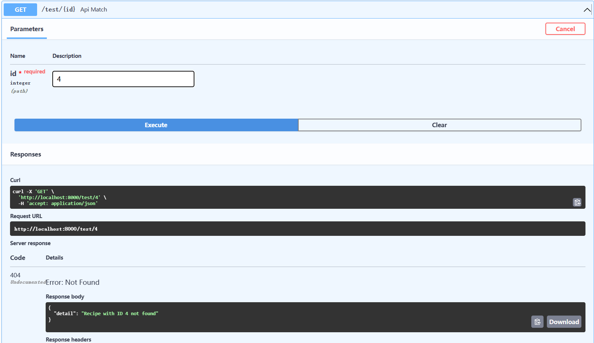

# 基本错误处理方法

在FastAPI教程的第5部分，我们将看看基本的错误处理。

## 实践部分--添加基本的错误处理

:::note 代码
在`./backend/main.py`文件中，你会发现以下新代码：

```Python
    import uvicorn
from fastapi import FastAPI
from api.api import api_router

# 导入Any类
from typing import Optional, Any

from recipe_schemas import RecipeSearchResults, Recipe, RecipeCreate
from recipe_data import RECIPES

# 导入Query, HTTPException类
from fastapi import Query, HTTPException

app = FastAPI()
app.include_router(api_router, prefix="/api")


@app.get("/")
async def root():
    return {"message": "Hello World"}

# 修改部分
@app.get("/test/{id}", status_code=200, response_model=Recipe)
def api_match(*, id: int) -> Any: # dict->Any
    # print(type(id))  # added
    result = [recipe for recipe in RECIPES if recipe["id"] == id]
    # 增加not限定词，以及满足条件的新语句
    if not result: 
        raise HTTPException(status_code=404, detail=f"Recipe with ID {id} not found")
    return result[0]


@app.get("/search/", status_code=200, response_model=RecipeSearchResults)
def api_search(keyword: Optional[str] = None, max_results: Optional[int] = 10) -> dict:
    if not keyword:
        return {"results": RECIPES[:max_results]}

    results = filter(lambda recipe: keyword.lower() in recipe["title"].lower(), RECIPES)
    return {"results": list(results)[:max_results]}


@app.post("/recipe/", status_code=201, response_model=Recipe)
def api_creat(*, recipe_in: RecipeCreate) -> dict:
    new_entry_id = len(RECIPES) + 1
    recipe_entry = Recipe(
        id=new_entry_id,
        title=recipe_in.title,
        instructions=recipe_in.instructions,
        url=recipe_in.url,
    )
    RECIPES.append(recipe_entry.dict())
    return recipe_entry


if __name__ == "__main__":
    uvicorn.run("main:app", reload=True, host="localhost", port=8000)

```

代码中的注释部分详细的说明了代码的变更，现在我们点击运行进行测试。

:::

:::tip 提示
Query 是 FastAPI 框架中的一个工具，用于在请求参数中进行查询参数的验证和解析。它允许你指定参数的名称、类型、默认值、验证规则等，并提供了一些方便的功能，如字符串转换、长度限制等。你可以在路由函数的参数中使用 Query 来声明查询参数，并根据需要进行验证和处理。

HTTPException 是 FastAPI 框架中的异常类，用于处理 HTTP 请求过程中的异常情况。它可以帮助你在需要时返回适当的 HTTP 响应，并提供了一些常见的 HTTP 状态码和错误信息。你可以在代码中使用 HTTPException 来抛出异常，并在异常处理器中捕获并处理这些异常。

Any 是 Python 的一个特殊类型注解，表示任意类型。它可以用作变量、函数参数、函数返回值等的类型注解，表示该位置可以接受任何类型的值。

使用 Any 类型注解的变量或参数可以接受任意类型的值，并且在静态类型检查时不会引发类型错误。这在需要处理多种类型的值或在动态类型场景中非常有用。
:::

:::info 访问

进入API管理界面,在默认对象的API Match上进行测试：



得到预期的回应，证明我们错误处理成功！至此我们教程的初级内容已经全部结束~
:::

**练习一下：**

尝试POST到/recipe端点，创建一个ID为4的配方，然后重试你的GET请求（你不应该再得到404）。记住，在我们目前的应用程序的基本形式下，创建的条目在你CTRL+C和重启服务器后不会被持久化。

本节的文件目录图：

```bash
E:.
│  .gitignore
│  LICENSE
│  README.md
│  
├─.vscode
│      settings.json
│      
└─backend
    │  main.py
    │  recipe_data.py
    │  recipe_schemas.py
    │  __init__.py
    │
    ├─api
    │  │  api.py
    │  │  todos.py
    │  │  users.py
    │  └─  __init__.py
    │
    ├─models
    └─schemas
       │  todo.py
       │  token.py
       │  user.py
       └─  __init__.py

```
