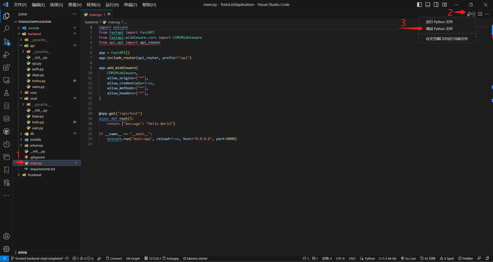

# VS Code Debug FastAPI 代码

:::info
当您开发应用程序时，调试是一个非常重要的工具，可以帮助您查找和修复代码中的错误。在 Visual Studio Code (VS Code) 中，您可以使用内置的调试功能来调试您的代码。下面是详细介绍如何在 VS Code 中进行调试的步骤：

1. 安装所需扩展：首先，在 VS Code 中安装适用于您的编程语言的相应扩展。例如，如果您使用 Python 进行开发，则需要安装 Python 扩展。

2. 配置调试器：在 VS Code 中，打开要调试的项目文件夹。然后，点击左侧的调试图标（或按下 Ctrl+Shift+D 快捷键），并点击 "创建 launch.json 文件"。选择与您的编程语言相对应的调试配置模板，如 "Python" 或 "Node.js"。

3. 配置调试任务：在 launch.json 文件中，您将看到一个包含调试配置的模板。根据您的项目需求，配置以下属性：

- "name"：调试配置的名称，可以自定义。
- "type"：调试器的类型，例如 "python"、"node" 等。
- "request"：调试器的请求类型，通常是 "launch"。
- "program"：指定要调试的主程序文件。
- 其他适用于特定语言和框架的配置选项。

4. 设置断点：在您希望在代码中停止执行的位置设置断点。在 VS Code 的编辑器中，单击行号区域左侧的空白处，以在该行上设置断点。断点将显示为红色圆点。

5. 启动调试会话：点击调试面板顶部的绿色播放按钮，或按下 F5 键来启动调试会话。调试器将启动并开始执行您的代码。

6. 执行调试操作：当代码执行到断点时，调试器将会暂停执行，并显示调试器的界面。您可以使用调试器提供的工具来逐步执行代码、查看变量的值、观察堆栈跟踪等。常用的调试操作包括：

- 单步执行：逐行执行代码，并观察执行过程。
- 断点跳过：在不执行断点上的代码的情况下，继续执行代码。
- 直接跳转到下一个断点：在当前断点之后，直接跳转到下一个断点。
- 检查变量值：观察和调试变量的值，可以查看当前变量的值或监视特定变量。
- 修改变量值：在调试过程中，可以修改变量的值以测试不同的代码路径。

7. 查看调试输出：在调试会话期间，您可以在 VS Code 的调试控制台中查看调试输出。控制台显示程序的日志、错误消息和其他调试信息。

8. 结束调试会话：在调试完成后，可以点击调试面板顶部的停止按钮，或按下 Shift+F5 键来结束调试会话。

:::

**下面我们以一个示例来看看Debug的具体操作**

首先我们先看一下一个完整API的具体运行情况，我们以todoapp代码为例子，看一下创建一个todo的具体过程。

1. 打开`main.py`文件，点开右上键运行菜单，点击调试python文件。

2. 用浏览器打开看看我们的跟路由，然后进入API管理界面，如果已经鉴权记得要登录root权限的账号。

3. 在管理界面点开我们要测试的API，然后回到vscode，在`/crud/todo.py`中找到我们要测试api函数，在函数定义部分的下一行打上断点，然后回到api管理界面，点击try it out，再点击execute，然后看到loading一直转圈圈，回到vscode，此时我们已经成功进入调试模式。

4. 先点击单步调试（F11）然后点击逐步调试（F10），时刻注意左侧的变量变化。

5. 在几次逐步调试之后会切换到`/api/todos.py`文件中,在此逐步过程，进入到`/api/deps.py`文件中，由此可见api的运行过程一目了然，在此点击逐步过程调试结束。

此时数据库中也有了我们创建的新todo：

在此过程中，如果哪一个逐步过程后有报错，证明所在行代码有问题，这是就需要同学们通过观察变量，查看报错，谷歌等方式去解决，然后在重复调试操作。