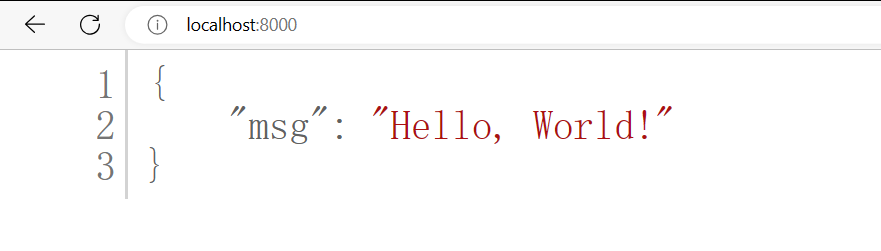
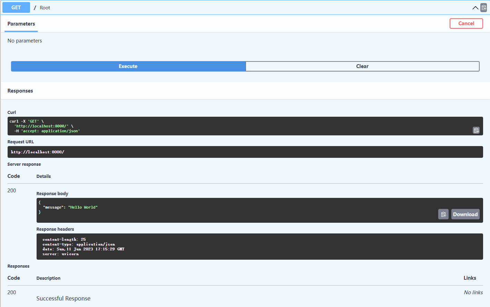
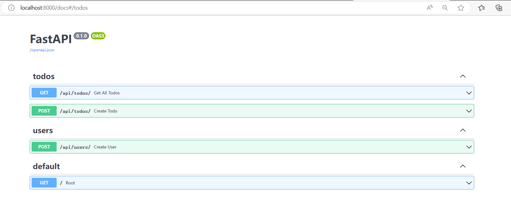
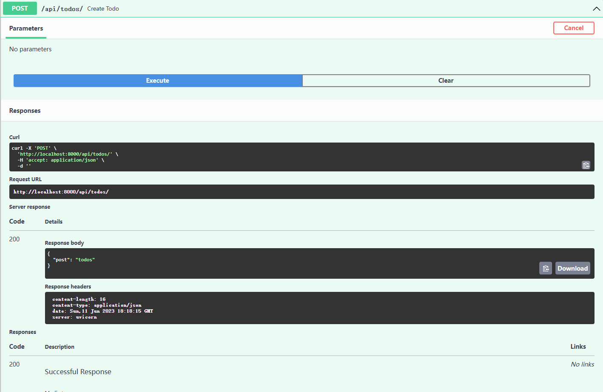

# 根路由 hello world

首先在项目的根目录下创建一个新的文件夹，起名为`backend`表示我们的后端代码。

在`./backend/`路径创建`main.py`和`__init__.py`空文件主文件，后续我们只使用此文件启动后端所有代码。

:::warning 警告
`__init__.py` 文件在 Python 中具有特殊的作用，它主要用于标识一个目录是一个 Python 包。

其在 Python 包中具有重要的作用，它定义了包的初始化行为，为包提供了命名空间，并可以包含包级别的代码和定义。
:::

打开`main.py`文件,新建一个终端

:::tip 提示
创建一个 FastAPI 示例。首先，确保您已经安装了 FastAPI 和 Uvicorn。如果没有，请于终端下使用以下命令安装：

```bash
pip install fastapi uvicorn
```

:::note 操作

输入下列代码：

```python
# 导入所需要的类
import uvicorn
from fastapi import FastAPI

# 创建名为app的FastAPI应用
app = FastAPI()

# 创建一个default端口的跟路由
@app.get("/")
async def root():
    return {"message": "Hello World"}

# 为了方面Debug
if __name__ == "__main__":
    uvicorn.run("main:app", reload=True, host="localhost", port=8000)
```

:::
:::info 访问
[导航到本地主机](http://localhost:8000/)：您应该看到：



如果您可以看到“Hello， World！”响应，则您的 API 正在工作。

接下来，[访问本地主机](http://localhost:8000/docs)：8000/docs，你应该看到一个这样的屏幕：


这是 FastAPI 提供的开箱即用的交互式文档，因为框架 是围绕OpenAPI标准构建的。这些文档页面是交互式的，并且会更加详细地介绍我们添加更多端点并描述预期的输入/输出值 我们的代码。

尝试您的终端节点：

- 通过单击展开 GET 端点
- 点击“试用”按钮
- 按下大的“执行”按钮
- 按出现的较小的“执行”按钮



您可以看到 API 响应正文（我们的“Hello， World！”消息）以及命令 FastAPI 已经在引擎盖下为您运行。我们将在整个过程中使用此功能 教程系列可轻松检查我们的端点。
:::

根据需求分析，我会用到不止default一个路由器对象。

然后为了保证代码简洁我们会用到大量的封装，我们在`./backend`目录下创建`api`文件夹用于存放我们所有的API路由器对象。

根据需求分析我们需要另外几个路由器对象，在`./backend/api/`路径创建`todos.py`,`users.py`,`__init__.py`。

:::note 代码

```python
todos.py

# 导入APIRouter类
from fastapi import APIRouter 

# 创建名为router的对象
router = APIRouter()

# 创建get方法的跟路由，用于得到所有todos
@router.get("/")
def get_all_todos():
    return {"get": "todos"}

# 创建post方法的根路由，用于创建todo
@router.post("/")
def create_todo():
    return {"post": "todos"}
```

```python
users.py

#导入APIRouter类
from fastapi import APIRouter

# 创建名为router的对象
router = APIRouter()

# 创建post方法的根路由，用于创建user
@router.post("/")
def create_user():
    return {"post": "users"}
```

此处我们仅仅是建立了API，暂时没有实现应用的功能，后续我们会逐渐补齐每个API的功能。

```python
api.py

# 导入APIRouter类和APIRouter用法
from fastapi import APIRouter
from api.todos import router as todos_router
from api.users import router as users_router

# 创建名为api_router的对象,以及嵌套路由用法
api_router = APIRouter()
api_router.include_router(todos_router, prefix="/todos", tags=["todos"])
api_router.include_router(users_router, prefix="/users", tags=["users"])

```

这三个代码均储存在`./backend/api/`路径下，其中`todos`和`users`封装在`api`中。

```python
main.py

import uvicorn
from fastapi import FastAPI

# 新增导入封装的类
from api.api import api_router

app = FastAPI()

# 应用方法
app.include_router(api_router, prefix="/api")


@app.get("/")
async def root():
    return {"message": "Hello World"}


if __name__ == "__main__":
    uvicorn.run("main:app", reload=True, host="localhost", port=8000)
```

别忘记要在主文件中调用刚才新增的对象哦！
:::

:::tip 提示
APIRouter是FastAPI框架中的一个类，用于定义和组织API路由。

在FastAPI中，使用APIRouter可以创建一个路由器对象，用于定义API的路径、操作和处理函数。通过将路由器对象添加到应用程序中，可以将不同的API路径组织在一起，使代码更具结构和可读性。

使用APIRouter可以实现以下功能：

- 定义API路径：使用路由器对象的装饰器方法（如router.get()、router.post()等）可以指定不同HTTP方法的API路径。

- 组织API处理函数：将处理函数与特定的API路径和HTTP方法关联起来，使代码更清晰和易于维护。

- 嵌套路由：可以创建多个路由器对象，并将其嵌套在一起以实现更复杂的路由结构。这使得代码的组织和管理更加灵活。

:::

下面我们看看导航界面有什么变化。

:::info 访问

访问API文件界面：





同学们可以自己进行更多测试。
:::

至此我们关于TODOList APP 后端开发的第一节内容就结束了，下一节内容我们会学习带参数的路由等更多知识。

本节课程的文件路径图_(`__pycache__`是自动生成的)。
```bash
E:.
│  .gitignore
│  LICENSE
│  README.md
│  
├─.vscode
│      settings.json
│      
└─backend
    │  main.py
    │
    └─api
      │api.py
      │  todos.py
      │  users.py
      └─ __init__.py
      


```
