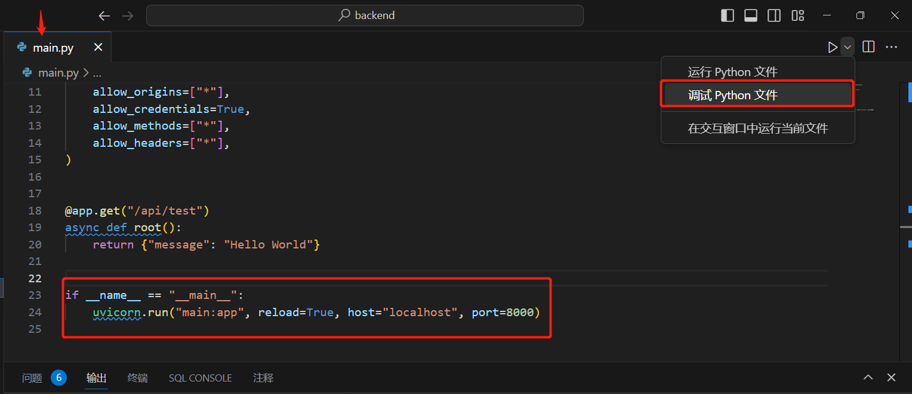
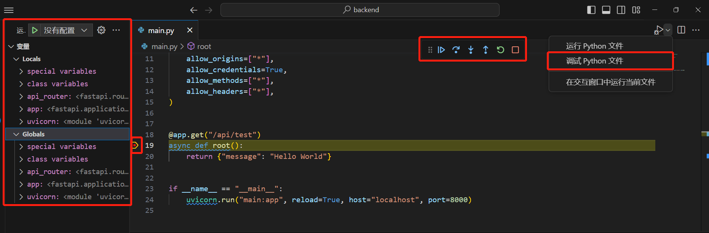
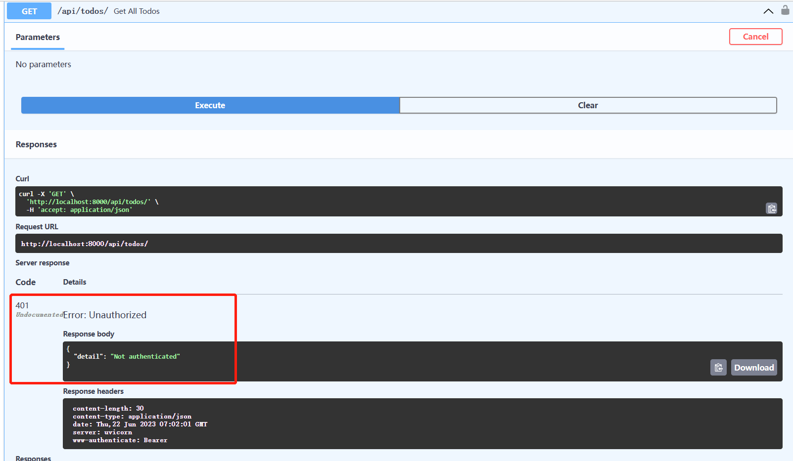

# 学前介绍

欢迎来到FastAPI教程系列。该系列是基于TODOApplication项目的 教程，我们将在其中构建cooking API方法。每篇文章都会逐渐添加更复杂的功能，展示 FastAPI 的功能，并以一个逼真的、生产就绪的 REST API 结束。该系列旨在按顺序遵循，请同学们耐心学习。

下面我们会介绍在开始之前必要的一些准备。

:::tip 提示
在大多数情况下，Python安装时会自动附带pip包管理工具。然而，如果你在安装Python时未选择安装pip或者需要手动安装pip，可以按照以下步骤进行安装：

1. 首先，确保你已经安装了Python。可以在终端或命令提示符中运行以下命令来检查是否安装了Python：

```bash
python --version
```

2. 如果显示Python的版本号，则表示已经安装了Python。

下载 `get-pip.py` 脚本。可以在 `https://bootstrap.pypa.io/get-pip.py` 下载该脚本。你可以在浏览器中打开该链接，然后将页面上的内容保存到一个名为 `get-pip.py` 的文件中。

3. 打开终端或命令提示符，切换到包含 `get-pip.py` 文件的目录。

4. 运行以下命令来安装pip：

```bash
python get-pip.py
```

这将运行 `get-pip.py` 脚本，并安装pip包管理工具。

5. 安装完成后，可以使用以下命令来验证pip是否成功安装：

```bash
pip --version
```

如果显示pip的版本号，则表示pip已成功安装。

注意：如果你使用的是Python 3.4 版本或更高版本，那么pip可能已经随着Python的安装自动包含在内。你可以直接尝试在终端或命令提示符中使用pip命令来验证是否安装了pip。
:::

:::warning 注意
开始项目之前，确保你已经下载并安装好了vscode编辑器，并且安装好了相应的python扩展。

要想使用 Fast API ，首先请保证你的Python版本在3.6+。
:::

# Debug

:::tip 提示
调试（Debug）是指通过查找和修复代码中的错误和问题，以确保程序按预期执行的过程。调试是软件开发过程中的关键环节，它帮助开发人员定位和解决程序中的错误、异常和逻辑问题。

调试的主要功能包括：

1. 错误定位：调试工具可以帮助开发人员精确定位代码中的错误所在位置。当程序出现异常、崩溃或产生错误结果时，调试器可以提供有关错误发生位置、上下文和堆栈跟踪等信息，帮助开发人员快速找到问题所在。

2. 变量监视：调试器可以监视程序执行过程中的变量值，并提供实时的变量状态。这使得开发人员可以跟踪变量的值和变化，检查其正确性和逻辑，帮助发现问题并验证程序的执行过程。

3. 单步执行：调试器允许开发人员逐行或逐语句地执行程序。通过单步执行，开发人员可以深入了解程序的执行流程，检查每一步的结果，从而找到错误和问题的根源。

4. 断点设置：调试器允许开发人员在代码中设置断点，即指定程序执行到某个位置时中断执行。在断点处，开发人员可以检查变量的值、执行上下文和调用堆栈，以便更详细地分析程序状态和调试问题。

5. 条件断点：除了简单的断点，调试器还可以设置条件断点。条件断点允许开发人员指定一个条件，只有当条件满足时，程序才会在断点处中断执行。这对于在特定条件下进行调试非常有用。

6. 运行追踪：调试器可以记录程序的执行轨迹和调用关系，提供完整的执行历史。通过运行追踪，开发人员可以回溯程序的执行路径，了解函数之间的调用顺序和参数传递，帮助分析和解决问题。

7. 异常处理：调试器可以捕获和处理程序中的异常，提供异常信息和上下文，帮助开发人员理解异常的原因和产生的条件。这有助于开发人员识别和解决潜在的错误和异常情况。
:::

在FastAPI中我们已经告诉大家如何用命令行运行我们的API，但是命令行执行代码相对不方便调试。

于是我们使用下面代码块：

```python
if __name__ == "__main__":
    uvicorn.run("main:app", reload=True, host="localhost", port=8000)
```

:::info提示
`if __name__ == "__main__"`: 条件判断语句用于确保以下的代码只在该模块被直接运行时才执行，而不是在被其他模块导入时执行。

`uvicorn.run("main:app", reload=True, host="localhost", port=8000)` 是用于启动一个基于ASGI（异步服务器网关接口）的Web服务器。它使用了uvicorn库，并传入了参数"main:app"，表示主模块是"main.py"且应用对象为"app"。其他参数包括自动重载（reload=True），服务器主机地址（host="localhost"），以及服务器端口号（port=8000）。

当你直接运行该模块时，`if __name__ == "__main__"`: 条件为True，代码块中的内容将被执行，启动uvicorn服务器。但如果该模块被其他模块导入，则`if __name__ == "__main__"`: 条件为False，代码块中的内容将不会被执行。
:::

此时我们就可以方便的使用debug了。

:::note Debug具体操作
1. 在`main.py`文件中的末尾加上上述代码块后，此时直接点击运行python文件，以代替命令行执行。同样调试python也是Debug的直接入口。



2. 在需要测试的装饰器定义函数坐在行打上断点，然后点击调试python。



3. 点击单步调试或者直接按F11快捷键


4. 点击逐步过程，结合变量的改变以及API管理界面的提示，找出错误原因。


:::

更详细请看官方文档。