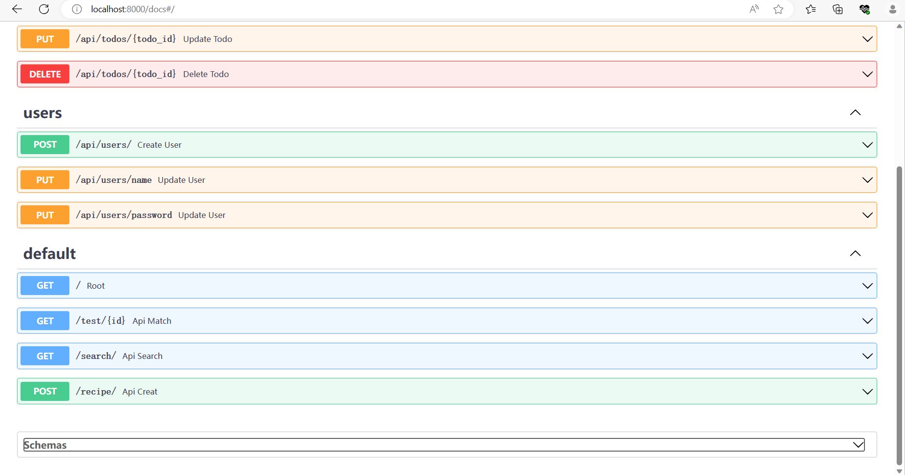
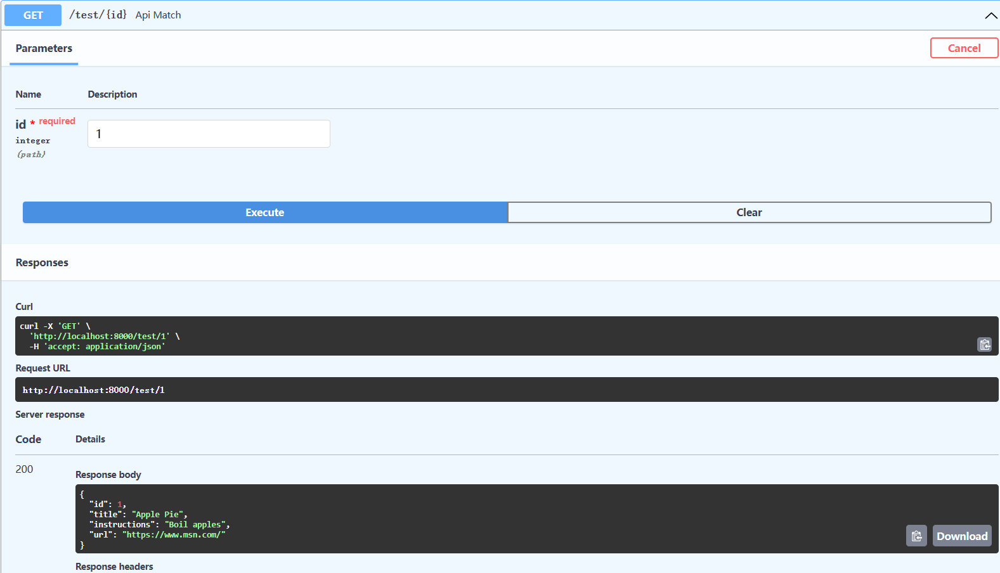
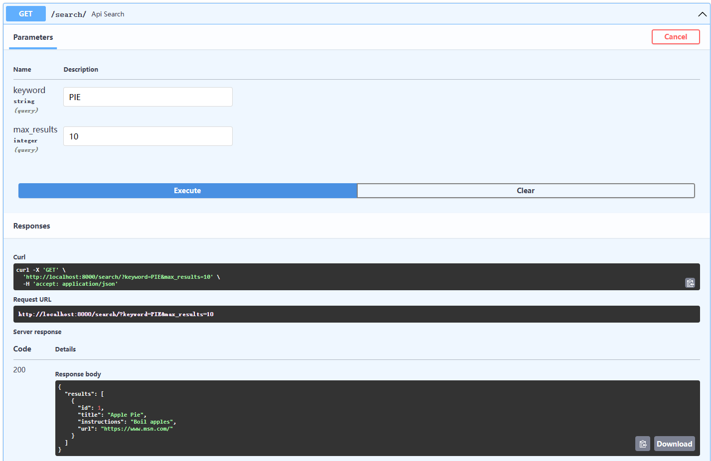
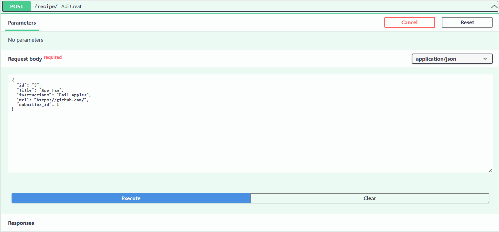
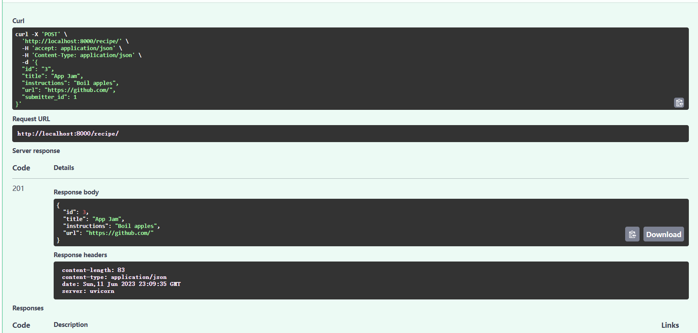

# Pydantic Schemas & Data Validation

在FastAPI教程的第4部分，我们将看一下带有Pydantic验证的API端点。

:::tip 提示
如果你是第一次使用 Pydantic ，那么你需要先安装它：

```bash
pip install pydantic
```

:::

## Pydantic简介

:::note
Pydantic将自己描述为： 使用python类型注释的数据验证和设置管理。

它是一种工具，可以使你的数据结构更加精确。例如，到目前为止，我们一直在依靠一个字典来定义我们项目中的典型配方。有了Pydantic，我们可以这样定义一个配方：

```Python
    from pydantic import BaseModel

    class Recipe(BaseModel):
        id: int
        label: str
        source: str

    raw_recipe = {'id': 1, 'label': 'Lasagna', 'source': 'Grandma Wisdom'}
    structured_recipe = Recipe(**raw_recipe)
    print(structured_recipe.id)
    #> 1
```

在这个简单的例子中，该类继承自Pydantic ，而且我们可以使用标准的Python类型提示来定义它的每个预期字段及其类型。`RecipeBaseModel`

除了使用该模块的`标准类型`之外，您可以像这样递归使用 Pydantic 模型：`typing`

```Python
    from pydantic import BaseModel

    class Car(BaseModel):
        brand: str
        color: str
        gears: int


    class ParkingLot(BaseModel):
        cars: List[Car]  # recursively use `Car`
        spaces: int
```

组合这些功能时，可以定义非常复杂的对象。这只是 Pydantic 的表面功能，以下是其优点的快速摘要：

- 无需学习新的微语言（这意味着它可以很好地与 IDE/linter 配合使用）
- 非常适合“验证此请求/响应数据”和加载配置
- 验证复杂的数据结构 - Pydantic 提供极其精细的验证器
- 可扩展 - 可以创建自定义数据类型
- 使用 Python 数据类
- 非常快

:::

看完上面的官方简单代码实例后，下面我们将讲解如何运用到实战

## 实用部分 - 使用Pydantic与FastAPI

再开始本节实用部分之前，我们需要准备对代码进行封装，这有利于代码整洁。

在`./backend/`文件夹下创建`schemas`,`models`文件夹，并在`./backend/`文件夹下创建`recipe_data.py`和`recipe_schemas.py`文件。

我们将数据字典内容移动到`recipe_data.py`文件中，此时我们发现代码已经不能跑了，我们要用 Pydantic 让他恢复生机。

:::note 代码部分
提出数据字典：

```python
recipe_data.py

RECIPES = [
    {
        "id": 1,
        "title": "Apple Pie",
        "instructions": "Boil apples",
        "url": "https://www.msn.com/",
    },
    {
        "id": 2,
        "title": "Apple Salad",
        "instructions": "Raw apples",
        "url": "https://www.msn.com/",
    },
]

```

```python
recipe_schemas.py

# 导入pydantic包中的BaseModel类和HttpUrl类
from pydantic import BaseModel, HttpUrl

# 导入 Python 中的 Sequence 类。
from typing import Sequence

# 定义Recipe数据模型，用于创建对象
class Recipe(BaseModel):
    id: int
    title: str
    instructions: str
    url: HttpUrl

# 定义RecipeSearchResults数据模型，用于创建对象
class RecipeSearchResults(BaseModel):
    results: Sequence[Recipe]

# 定义RecipeCreate数据模型，用于创建对象
class RecipeCreate(BaseModel):
    id: str
    title: str
    instructions: str
    url: HttpUrl
    submitter_id: int

```

```python
main.py

import uvicorn
from fastapi import FastAPI
from api.api import api_router
from typing import Optional
# 导入新的类
from recipe_schemas import RecipeSearchResults, Recipe, RecipeCreate
from recipe_data import RECIPES

app = FastAPI()
app.include_router(api_router, prefix="/api")


@app.get("/")
async def root():
    return {"message": "Hello World"}


@app.get("/test/{id}", status_code=200, response_model=Recipe)
def api_match(*, id: int) -> dict:
    # print(type(id))  # added
    result = [recipe for recipe in RECIPES if recipe["id"] == id]
    if result:
        return result[0]


@app.get("/search/", status_code=200, response_model=RecipeSearchResults)
def api_search(keyword: Optional[str] = None, max_results: Optional[int] = 10) -> dict:
    if not keyword:
        return {"results": RECIPES[:max_results]}

    results = filter(lambda recipe: keyword.lower() in recipe["title"].lower(), RECIPES)
    return {"results": list(results)[:max_results]}

# 新增添加数据的API
@app.post("/recipe/", status_code=201, response_model=Recipe)
def api_creat(*, recipe_in: RecipeCreate) -> dict:
    new_entry_id = len(RECIPES) + 1
    recipe_entry = Recipe(
        id=new_entry_id,
        title=recipe_in.title,
        instructions=recipe_in.instructions,
        url=recipe_in.url,
    )
    RECIPES.append(recipe_entry.dict())
    return recipe_entry


if __name__ == "__main__":
    uvicorn.run("main:app", reload=True, host="localhost", port=8000)

```

Sequence 是 typing 模块中定义的一种泛型类型，表示一个序列（即可迭代的对象）。
通过导入 Sequence，你可以在代码中使用它来标注函数参数、函数返回值或变量类型，以提供类型提示和类型检查。

BaseModel 是 pydantic 提供的一个基类，用于定义数据模型。通过继承 BaseModel，你可以定义具有属性和验证规则的数据类。这些验证规则可以确保输入数据符合预期的格式和类型。在创建数据模型时，你可以定义属性的类型、默认值、验证规则等。通过使用 BaseModel，你可以轻松地进行数据验证、转换和序列化操作。

HttpUrl 是 pydantic 提供的一个预定义类型，用于表示 HTTP 或 HTTPS 的 URL。它是一个字符串类型，但具有特定的验证规则，确保它符合 URL 的格式。当你需要验证输入数据是否是有效的 URL 时，可以使用 HttpUrl 类型进行标注。
:::

:::info 访问
进入API管理界面：


分别测试我们使用pydantic工具是否与FastAPI结合成功





结果是我们成功了！再去测试一下我们增加数据的API。



填入属性值



自动生成json文件，只需要复制`Response body`部分到`recip_data.py`文件中即可。

```python
recipe_data.py

RECIPES = [
    {
        "id": 1,
        "title": "Apple Pie",
        "instructions": "Boil apples",
        "url": "https://www.msn.com/",
    },
    {
        "id": 2,
        "title": "Apple Salad",
        "instructions": "Raw apples",
        "url": "https://www.msn.com/",
    },
    {
        "id": 3,
        "title": "App Jam",
        "instructions": "Boil apples",
        "url": "https://github.com/",
    },
]
```

:::

本节的知识点到这里就结束了，下面我们要进行的是贴合实战。

## 实战部分 - 以TodoListApp使用Pydantic与FastAPI

在`./backend/schemas/`文件夹中创建`todos.py`,`users.py`文件

```python
todos.py

#导入时间类和BaseModel类
from datetime import datetime 
from pydantic import BaseModel


# 定义TodoBase数据模型。
class TodoBase(BaseModel):
    is_done: bool
    content: str

# 定义TodoCreate数据模型。
class TodoCreate(TodoBase):
    pass

# 定义Todo数据模型。
class Todo(TodoBase):
    id: int

# 定义TodoInDB数据模型。
class TodoInDB(Todo):
    user_id: int
    created_at: datetime
    updated_at: datetime

    class Config:
        orm_mode = True

```

```python
users.py

# 同上
from datetime import datetime
from pydantic import BaseModel, EmailStr

# 定义UserBase数据模型。
class UserBase(BaseModel):
    name: str
    email: EmailStr

# 定义UserCreate数据模型。
class UserCreate(UserBase):
    password: str

# 定义UserUpdateName数据模型。
class UserUpdateName(BaseModel):
    name: str

# 定义UserUpdatePassword数据模型。
class UserUpdatePassword(BaseModel):
    password: str

# 定义UserInDB数据模型。
class UserInDB(UserBase):
    id: int
    created_at: datetime
    updated_at: datetime

    class Config:
        orm_mode = True

```

打开`./backend/api/`文件夹，我们需要增加一部分代码

```python
todos.py

from fastapi import APIRouter
# 导入schemas包中的todo类
from schemas import todo as schemas_todo

router = APIRouter()

# 增加了response_model参数
@router.get("/", response_model=list[schemas_todo.TodoInDB])
def get_all_todos():
    return {"get": "todos"}

# 增加了response_model和todo_params参数
@router.post("/", response_model=schemas_todo.TodoInDB)
def create_todo(todo_params: schemas_todo.TodoCreate):
    return {"post": "todos"}

# 增加了response_model参数和todo_params参数
@router.put("/{todo_id}", response_model=schemas_todo.TodoInDB)
def update_todo(todo_id: int, todo_params: schemas_todo.TodoCreate):
    todo_id = 1  # 根据实际需要赋予一个值

    return {"todo_id": todo_id}

# 增加了response_model参数
@router.delete("/{todo_id}", response_model=schemas_todo.TodoInDB)
def delete_todo(todo_id: int):
    q: str = None
    todo_id = 2  # 根据实际需要赋予一个值

    return {"todo_id": todo_id, "q": q}

```

`users.py`文件与上面的类似

```python
users.py

from fastapi import APIRouter
from schemas import user as schemas_user

router = APIRouter()


@router.post("/", response_model=schemas_user.UserInDB)
def create_user(user_params: schemas_user.UserCreate):
    return {"post": "users"}


@router.put("/name", response_model=schemas_user.UserInDB)
def update_user(user_params: schemas_user.UserUpdateName):
    return {"name": "tom"}


@router.put("/password", response_model=schemas_user.UserInDB)
def update_user(user_params: schemas_user.UserUpdatePassword):
    return {"password": 123}

```

其他文件不用改变，这是实战中Pydantic与FastAPI的初步结合，并没有更多的输出。

在下一部分中，我们将介绍示例项目终结点的更多基本错误处理，并向中级难度过渡。

本节代码文件目录图：

```bash
E:.
│  .gitignore
│  LICENSE
│  README.md
│  
├─.vscode
│      settings.json
│      
└─backend
    │  main.py
    │  recipe_data.py
    │  recipe_schemas.py
    │  __init__.py
    │
    ├─api
    │  │  api.py
    │  │  todos.py
    │  │  users.py
    │  │  __init__.py
    │  │
    │  └─__pycache__
    │          api.cpython-311.pyc
    │          todos.cpython-311.pyc
    │          users.cpython-311.pyc
    │          __init__.cpython-311.pyc
    │
    ├─models
    └─schemas
      │  todo.py
      │  token.py
      │  user.py
      └─  __init__.py


```
