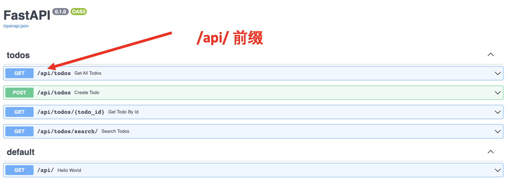

# 实际项目目录结构

:::tip

本课程网站内容请仔细阅读后再进行实操。因未仔细阅读内容，出现任何错误后果自负（逃～～～逃～～～逃

请切换到 `backend_project_structure_start` 分支，开始此教程代码的编写。

**所有的代码请不要复制粘贴，请手敲每一行代码。复制粘贴不会让你动脑子，而手敲每一个行代码会让你自然而然地去动脑子会想每一行代码的含义和原理**
:::

随着项目的增长，我们不可能把所有的代码都写在一个 `main.py` 文件里面，因此我们需要对项目代码进行拆分，通过不同的文件和目录结构实现代码合理有序的组织。如何组织代码各有各的偏好，本教程提供一个大家比较通用的最佳实践的方案。

```bash

E:.
│  .gitignore
│  main.py
│  requirements.txt
│  __init__.py
│
├─api
│      __init__.py
│
├─core
│      __init__.py
│
├─crud
│      __init__.py
│
├─db
│     __init__.py
│  
├─models
│      __init__.py
│
└─schemas
        __init__.py

```

:::warning `__init__.py`
`__init__.py` 文件在 Python 中具有特殊的作用，它主要用于标识一个目录是一个 Python 包。

其在 Python 包中具有重要的作用，它定义了包的初始化行为，为包提供了命名空间，并可以包含包级别的代码和定义。
:::

接下来我们解释最佳实践中各个文件夹和文件的含义:

- `.gitignore`: 用来指定 Git 版本控制系统忽略哪些文件或目录的配置文件，具体如何使用请查看 Git 的相关内容进行学习。
- `main.py`： 是整个FastAPI应用程序的入口，通过 `main.py` 将代码组织在一起。
- `requirements.txt`: 是一种常见的用于记录Python项目所依赖的软件包及其版本的文本文件。(建议先不考虑该文件)
- `api`: 存放所有API代码的文件夹。
- `core`: 存放安全、密码校验等代码的文件夹。
- `curd`: 存放所有数据库增删改查代码的文件夹。
- `db`: 存放数据库设置和数据库迁移代码的文件夹。（后面会讲解数据库迁移内容）
- `models`: 存放所有ORM代码的文件夹。（后面会讲解ORM内容）
- `schemas`: 存放所有Pydantic校验类的文件夹。


## 新建文件夹

请根据最佳实践，新建对应的文件和文件夹。


## 改造 Pydantic 部分代码

在 `schemas` 文件夹中新建 `todo.py` 文件。

```bash
E:.
│  .gitignore
│  main.py
...
│
└─schemas
        __init__.py
        todo.py

```

用 VS Code 打开 `schemas/todo.py` 文件，输入如下代码：

``` python
from pydantic import BaseModel

class TodoCreate(BaseModel):
    content: str
    is_done: bool

class Todo(TodoCreate):
    id: int

```

## 改造 API 部分代码

在 `api` 文件夹中新建 `todos.py` 和 `api.py` 文件。

```bash
E:.
│  .gitignore
│  main.py
...
│
├─api
│      __init__.py
│      api.py
│      todos.py
│
...

```
用 VS Code 打开 `api/todos.py` 文件，输入如下代码：

``` python showLineNumbers
from fastapi import APIRouter
from schemas import todo as schemas_todo

from typing import Optional

router = APIRouter()

TODOS = [
    {
        "id": 1,
        "content": "Init todo1",
        "is_done": False
    },
    {
        "id": 2,
        "content": "Init todo2",
        "is_done": False
    },
]


@router.get("/todos", response_model=list[schemas_todo.Todo])
def get_all_todos():
    return TODOS


@router.get("/todos/{todo_id}", response_model=schemas_todo.Todo)
def get_todo_by_id(todo_id: int):
    result = None
    for todo in TODOS:
        if todo["id"] == todo_id:
            result = todo

    if result:
        return result
    
@router.get("/todos/search/",  response_model=list[schemas_todo.Todo])
def search_todos(
    keyword: Optional[str] = None, max_results: Optional[int] = 10  
):
    """
    Search for todos based on keyword
    """
    if not keyword:
        # we use Python list slicing to limit results
        # based on the max_results query parameter
        return {"results": TODOS[:max_results]} 

    results = filter(lambda todo: keyword.lower() in todo["content"].lower(), TODOS)  
    return {"results": list(results)[:max_results]}

@router.post("/todos", response_model=schemas_todo.Todo)
def create_todo(*, todo_in: schemas_todo.TodoCreate):  # 2
    """
    Create a new todo (in memory only)
    """
    new_entry_id = len(TODOS) + 1
    todo_entry = schemas_todo.Todo(
        id=new_entry_id,
        content=todo_in.content,
        is_done=todo_in.is_done
    )
    TODOS.append(todo_entry.dict())  # 3

    return todo_entry

```

- `from schemas import todo as schemas_todo`: 导入 `schemas/todo.py`代码文件，并且给它一个别名 `schemas_todo`。别名的作用是为了更好的区别不同模块可能存在同名的内容，如果不做却别代码会报错。由于 `schemas` 文件夹里面有 `__init__.py`，所有 `schemas` 变成了 Python 的一个包，因此可以通过上述方式导入。
- `router = APIRouter()`: 在 FastAPI 中，APIRouter() 是一个用于创建独立路由器的类。它的作用是将相关的 API 路由和处理程序组织在一起，以便更好地管理和组织代码。
- `@router.get` 和  `@router.post` 与之前的  `@app.get` 和 `@app.post`作用相同。


用 VS Code 打开 `api/api.py` 文件，输入如下代码：

```python showLineNumbers
from fastapi import APIRouter
from api.todos import router as todos_router

api_router = APIRouter()
api_router.include_router(todos_router, tags=["todos"])

@api_router.get("/")
def hello_world():
    return {"message": "Hello world"}

```

- `from api.todos import router as todos_router`: 导入 `api/todos.py` 代码中定义的 `router` 实例，并且给它一个别名 `todos_router`。
- `api_router.include_router(todos_router, tags=["todos"])`: 将 `api/todos.py` 中的 `router` 挂在到 `api_router`实例上。在 FastAPI 中，`include_router` 是一个用于将 `APIRouter` 实例添加到应用程序中的方法。它允许将不同的路由器组合在一起，以便统一注册和管理路由。

## 改造 `main.py` 代码

用 VS Code 打开 `main.py` 文件，将代码更改成如下内容：

```python showLineNumbers
import uvicorn
from fastapi import FastAPI
from fastapi.middleware.cors import CORSMiddleware

from api.api import api_router

app = FastAPI()
app.include_router(api_router, prefix="/api")

app.add_middleware(
    CORSMiddleware,
    allow_origins=["*"],
    allow_credentials=True,
    allow_methods=["*"],
    allow_headers=["*"],
)

if __name__ == "__main__":
    uvicorn.run("main:app", reload=True, host="127.0.0.1", port=8000)
```

- `app.include_router(api_router, prefix="/api")`: 将 `api/api.py` 中的 `api_router` 挂在到 FastAPI `app`实例上, 同时增加一个 "/api" 前缀。增加前缀的目的是为了和 Web 前端的URL做区别，所有Web后端提供的API的URL都是以 `/api/xxx`的形式提供的。比如 `GET Todos` 的API 的URL变成了: `http://localhost:8000/api/todos`。



:::tip CORS(跨域资源共享)

CORS，即跨域资源共享（Cross-Origin Resource Sharing），是一种用于解决浏览器跨域访问限制的机制。同源策略（Same-Origin Policy）是浏览器的一种安全特性，它限制了在不同源（域名、协议或端口）之间的资源共享。

同源策略的限制意味着，通过浏览器加载的网页只能访问同一源（域名、协议和端口）下的资源，而无法直接访问其他源的资源。这种限制是为了保护用户隐私和安全，防止恶意网站通过脚本等方式窃取用户的敏感信息。

然而，跨域访问在某些情况下是必要的，例如，当网页需要访问其他域名下的 API 或资源时。这就需要使用 CORS 机制来允许跨域资源共享。

CORS 允许服务器在响应中设置特定的 HTTP 头部，告诉浏览器允许来自其他源的网页访问资源。浏览器在发送跨域请求时会先发送一个预检请求（OPTIONS 请求），服务器在预检请求的响应中指定是否允许跨域访问，并设置允许的 HTTP 方法、头部等。

通过使用 CORS，服务器可以灵活地配置允许访问的来源、允许的 HTTP 方法和头部，以满足应用程序的需求和安全策略。这样，浏览器就可以安全地从其他源加载资源，并将其展示给用户。

为了避免 FastAPI 自带的 CORS 方案导致我们 Web 前端不能访问 Web 后端的 API，我们对增加了如下代码：

```python
from fastapi.middleware.cors import CORSMiddleware

# skiping...

app.add_middleware(
    CORSMiddleware,
    allow_origins=["*"],  # 支持所有源
    allow_credentials=True,  # 支持Cookie
    allow_methods=["*"],  # 支持所有HTTP方法
    allow_headers=["*"],   # 支持所有HTTP头
)

# skiping...
```

**实际项目中关于CORS方案，请根据具体的需求来进行对应限制，而不是完全代开**。详细内容请查看：https://fastapi.tiangolo.com/tutorial/cors/

:::

接下来是测试阶段，请用浏览器打开 http://localhost:8000/docs(打开 URL 前请确保我们的FastAPI 应用是运行起来的)对我们改造后的所有API进行测试。


:::tip

可以切换 `backend_project_structure_finished` 分支，查看最终正确实现的代码。

:::