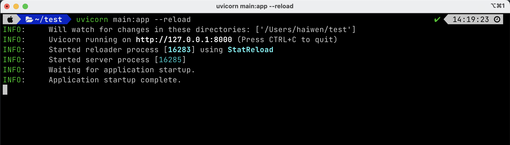
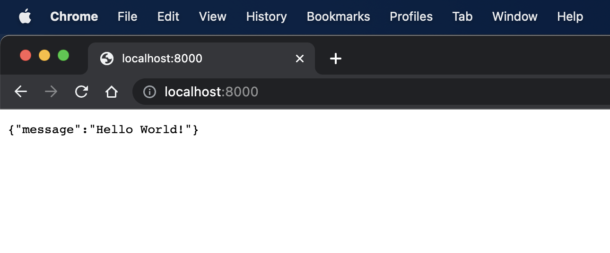

# 第一个HTTP的API

## 安装FastAPI的依赖

:::tip

本课程网站内容请仔细阅读后再进行实操。因未仔细阅读内容，出现任何错误后果自负（逃～～～逃～～～逃

**所有的代码请不要复制粘贴，请手敲每一行代码。复制粘贴不会让你动脑子，而手敲每一个行代码会让你自然而然地去动脑子会想每一行代码的含义和原理**

:::

```bash
pip install fastapi
pip install "uvicorn[standard]"
```

## 实现HTTP的API应用

事实上用FastAPI去实现一个或者多个HTTP APIs，都可以遵守如下流程：

1. 定一个FastAPI的API对象，例如: `app=FastAPI()`；
2. 使用Pydantic去定义数据类型（在当前案例中不会使用到这一步，但请记住这一步骤，这在真正的项目开发中会用到）；
3. 将HTTP方法和URL映射到相关的Python函数。前面提到的不同HTTP方法可以分别通过`@app.get()`，`@app.post()`，`@app.put()`, `@app.delete()`等装饰器进行调用，并且可以在装饰器里面传入URL，例如：`@app.get("/path")`
4. 运行该API应用。在命令行终端中输入如下命令：

```bash
uvicorn main:app --reload
```
其中 main 指的是 Python 文件名，app 指的是在第一步创建的API对象。

如下是一个代码实例：

```python showLineNumbers
# 0. Import Python Library
from fastapi import FastAPI
from pydantic import BaseModel

# 1. Define an API object
app = FastAPI()

# 2. Define data type
# This application is not using this feature

# 3. Map HTTP method and path to Python function
@app.get("/")
def root():
    return {"message": "Hello World!"}

# 4. Start the API application (on command line)
# !uvicorn main:app --reload
```

请用 VS Code 打开 `backend` 目录，在 `backend` 目录中新建一个 `main.py` 文件，
将上述代码复制到 `main.py` 文件中。

## 运行 FastAPI 应用程序

命令行中输入 `uvicorn main:app --reload`命令后，可以看到类似如下的日志:



则说明该FastAPI应用程序已经成功运行。默认的FastAPI应用程序运行在`http://127.0.0.1:8000`,
请打开Chrome浏览器，并在浏览器地址栏中输入如下URL：`http://127.0.0.1:8000`。不如意外的话，
你可以在浏览器中看到如下内容。



如果你在浏览器中看到上诉内容，那你就实现了你人生中第一个Web后端的API。当然这个API很简单，这个API实现了给（`http://127.0.0.1:8000`）URL发送HTTP `GET`请求，Web后端的应用服务（FastAPI应用程序）返回 `{"message": "Hello World!"}`。