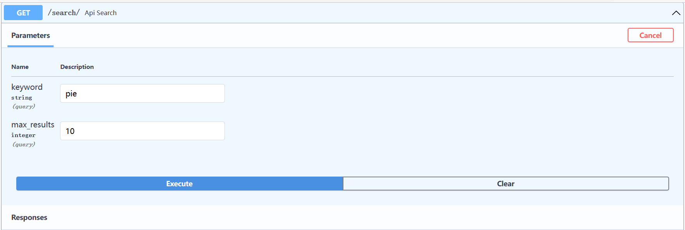
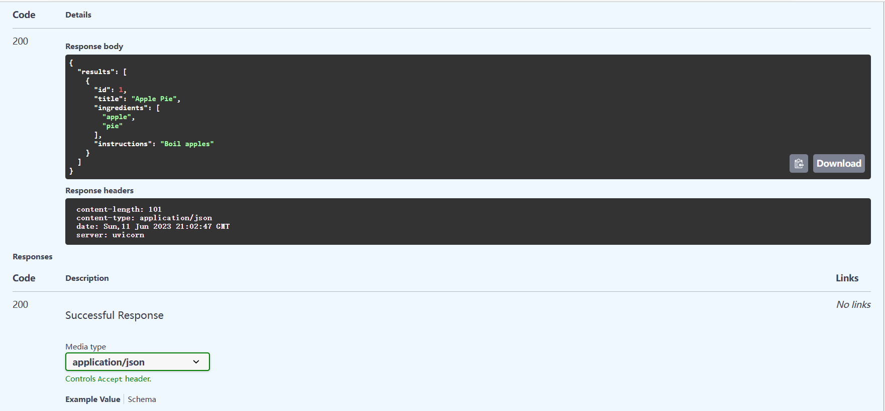

:::tip 源代码改动

为了不污染后续所要实现功能的路由对象，我们将上一节中的测试API和数据字典移至`main.py`（default对象）中，顺便更改了定义的函数名。

只需要改变所属对象的名称即可

```python
main.py

import uvicorn
from fastapi import FastAPI
from api.api import api_router

app = FastAPI()
app.include_router(api_router, prefix="/api")

# 移动的数据字典
RECIPES = [
    {
        "id": 1,
        "title": "Apple Pie",
        "ingredients": ["apple", "pie"],
        "instructions": "Boil apples",
    },
    {
        "id": 2,
        "title": "Apple Pie",
        "ingredients": ["apple", "salad"],
        "instructions": "Raw apples",
    },
]


@app.get("/")
async def root():
    return {"message": "Hello World"}

# 更改对象名字为app,更改定义函数名为app_match
@app.get("/test/{id}", status_code=200)
def api_match(*, id: int) -> dict:
    # print(type(id))  # added
    result = [recipe for recipe in RECIPES if recipe["id"] == id]
    if result:
        return result[0]


if __name__ == "__main__":
    uvicorn.run("main:app", reload=True, host="localhost", port=8000)

```

:::

# SRC查询参数

本节内容，我们会定义具有查询参数的API,并对其进行测试，为此我们在`main.py`文件中进行增加：

:::note 代码

```python
main.py

import uvicorn
from fastapi import FastAPI
from api.api import api_router
# 导入新的需要使用的类
from typing import Optional

app = FastAPI()
app.include_router(api_router, prefix="/api")

RECIPES = [
    {
        "id": 1,
        "title": "Apple Pie",
        "ingredients": ["apple", "pie"],
        "instructions": "Boil apples",
    },
    {
        "id": 2,
        "title": "Apple Salad",
        "ingredients": ["apple", "salad"],
        "instructions": "Raw apples",
    },
]


@app.get("/")
async def root():
    return {"message": "Hello World"}


@app.get("/test/{id}", status_code=200)
def api_match(*, id: int) -> dict:
    # print(type(id))  # added
    result = [recipe for recipe in RECIPES if recipe["id"] == id]
    if result:
        return result[0]

# 新增查询API
@app.get("/search/", status_code=200)
def api_search(keyword: Optional[str] = None, max_results: Optional[int] = 10) -> dict:
    if not keyword:
        return {"results": RECIPES[:max_results]} # 设置默认值
    # 我们使用 Python 过滤器功能在我们的数据集上进行非常基本的关键字搜索。搜索完成后，数据将被序列化 通过框架到 JSON。
    results = filter(lambda recipe: keyword.lower() in recipe["title"].lower(), RECIPES)
    return {"results": list(results)[:max_results]}


if __name__ == "__main__":
    uvicorn.run("main:app", reload=True, host="localhost", port=8000)

```

其他文件保持不变，点击运行按钮。
:::

:::info 访问
导航到位于localhost:8000/docs

尝试使用API：

- 通过单击展开 GET 端点
- 点击“try”按钮
- 为关键字输入值“pie”
- 按下大的“exe”按钮
- 按出现的较小的“exe”按钮




尝试用更多的关键词测试查询参数API叭~
:::

在本教程的下一部分中，我们将介绍使用 Pydantic 模型进行更高级的终结点输入和输出验证， 以及处理 POST 端点和请求正文数据。

本节课程的文件路径图

```bash
E:.
│  .gitignore
│  LICENSE
│  README.md
│
├─.vscode
│      settings.json
│
└─backend
    │  main.py
    │
    ├─api
    │  │  api.py
    │  │  todos.py
    │  │  users.py
    │  │  __init__.py
    │  │
    │  └─__pycache__
    │          api.cpython-311.pyc
    │          todos.cpython-311.pyc
    │          users.cpython-311.pyc
    │          __init__.cpython-311.pyc
    │
    └─__pycache__
            main.cpython-311.pyc

```