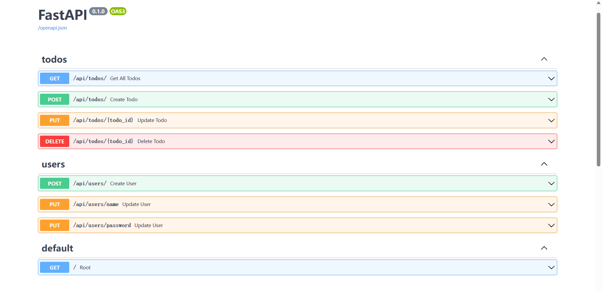

# 增加中级难度所需要的代码

在之后的FastAPI教程中，我们先不要用到更多相关fastapi操作，比如model和crud

这是中级阶段的第一篇文章。我们将在这篇文章中涵盖相当多的内容，因为有很多部分都是一起工作的，因此如果孤立地介绍，会更加令人困惑（因为如果没有所有的部分，你就不能轻易地在本地旋转和运行它）。

在`./backend/`路径创建`models`和`crud`文件夹。

`models`文件夹中创建`todo.py`,`user.py`,`__init__.py`文件，代表单个user的单个todo数据模型

:::note 代码

```python
todo.py

# 导入datetime类和sqlalchemy包，方面用于后续的数据库操作
from datetime import datetime
from sqlalchemy import TIMESTAMP, Boolean, Column, Integer, Text, ForeignKey

# 定义Todo数据模型
class Todo:
    __tablename__ = "todos" # 表名

    id = Column(Integer, primary_key=True, index=True) # 属性
    is_done = Column(Boolean, default=False)
    content = Column(Text, nullable=False)
    user_id = Column(Integer, ForeignKey("users.id"), nullable=True)
    created_at = Column(
        TIMESTAMP(timezone=True), nullable=False, default=datetime.utcnow
    )
    updated_at = Column(
        TIMESTAMP(timezone=True),
        nullable=False,
        onupdate=datetime.utcnow,
        default=datetime.utcnow,
    )

```

```python
user.py
# 同上
from datetime import datetime
from sqlalchemy import TIMESTAMP, Column, Integer, String


class User:
    __tablename__ = "users"

    id = Column(Integer, primary_key=True, index=True)
    name = Column(String(200), nullable=False)
    email = Column(String(200), unique=True, index=True, nullable=False)
    hashed_password = Column(String(200), nullable=False)
    created_at = Column(
        TIMESTAMP(timezone=True), nullable=False, default=datetime.utcnow
    )
    updated_at = Column(
        TIMESTAMP(timezone=True),
        nullable=False,
        onupdate=datetime.utcnow,
        default=datetime.utcnow,
    )
```

`user.py`与`todo.py` 变更类似。

```python
__init__.py

from models.todo import Todo
from models.user import User
```

此处`__init__.py`必须加上上面两个语句，否则代码无法运行。
:::

`crud`文件夹中创建`todo.py`,`user.py`,`__init__.py`,用于定义数据操作的数据模型

在下一节我们会详细编辑crud中的代码。

在`./backend/`路径，打开`main.py`,为了保证代码整洁，我们删除掉与需求分析无关功能的代码。

:::note 代码

```python
main.py

import uvicorn
from fastapi import FastAPI
from api.api import api_router


app = FastAPI()
app.include_router(api_router, prefix="/api")


@app.get("/")
async def root():
    return {"message": "Hello World"}


if __name__ == "__main__":
    uvicorn.run("main:app", reload=True, host="localhost", port=8000)

```

:::

:::info 访问
进入API管理界面：



准备进入下一节。

:::

本节文件目录图：

```bash
E:.
│  .gitignore
│  LICENSE
│  README.md
│
├─.vscode
│      settings.json
│
└─backend
    │  main.py
    │  __init__.py
    │
    ├─api
    │  │  api.py
    │  │  todos.py
    │  │  users.py
    │  └─  __init__.py
    │
    ├─crul
    │      todo.py
    │      user.py
    │      __init__.py
    │
    ├─models
    │      todo.py
    │      user.py
    │      __init__.py
    │
    └─schemas
       │  todo.py
       │  token.py
       │  user.py
       └─  __init__.py
 
```

##  Pydantic DB 模式和 CRUD 实用程序

在crud文件夹中创建`todo.py`,`user.py`,`base.py`文件。

:::note 代码

```python
todo.py

from fastapi.encoders import jsonable_encoder
from sqlalchemy.orm import Session
from crud.base import CRUDBase
from models import Todo as ModelsTodo
from typing import Any, Optional


class CRUDTodo(CRUDBase):

    def get_by_id_with_user_id(self, db:Session, id: Any, user_id: Any):
        return db.query(self.model).filter(self.model.id == id).filter(self.model.user_id == user_id).first()

    def get_all_by_user_id(self, db: Session, user_id: Any):
         return db.query(self.model).filter(self.model.user_id == user_id).all()

    def create(self, db: Session, user_id: Any, todo_params):
        todo_data = jsonable_encoder(todo_params)
        todo = self.model(**todo_data)
        todo.user_id = user_id
        db.add(todo)
        db.commit()
        db.refresh(todo)
        return todo

    def update(self, db: Session, id: Any, user_id: Any, todo_params):

        todo = db.query(self.model).filter(self.model.id == id).filter(self.model.user_id == user_id).first()

        todo_params_dict = todo_params.dict(exclude_unset=True)
        for key, value in todo_params_dict.items():
            setattr(todo, key, value)

        db.commit()
        db.refresh(todo)
        return todo


crud_todo = CRUDTodo(ModelsTodo)

```

```python
user.py

from fastapi.encoders import jsonable_encoder
from sqlalchemy.orm import Session
from crud.base import CRUDBase
from models import User as ModelsUser


class CRUDUser(CRUDBase):
    def get_by_email(self, db: Session, email: str):
        return db.query(self.model).filter(self.model.email == email).first()

    def create(self, db: Session, user_params):
        user = ModelsUser(
            name=user_params.name,
            email=user_params.email,
            hashed_password=get_password_hash(user_params.password),
        )
        db.add(user)
        db.commit()
        db.refresh(user)
        return user

    def authenticate(self, db: Session, email, password):
        user = self.get_by_email(db, email=email)
        if not user:
            return None
        if not verify_password(password, user.hashed_password):
            return None
        return user

    def update_name(self, db: Session, id, user_params):
        user = self.get_by_id(db=db, id=id)
        user.name = user_params.name
        db.commit()
        db.refresh(user)
        return user

    def update_password(self, db: Session, id, user_params):
        user = self.get_by_id(db=db, id=id)
        user.hashed_password = get_password_hash(user_params.password)
        db.commit()
        db.refresh(user)
        return user


crud_user = CRUDUser(ModelsUser)

```

```python
base.py


from typing import Any, Optional
from sqlalchemy.orm import Session


class CRUDBase:
    def __init__(self, model) -> None:
        self.model = model

    def get_by_id(self, db: Session, id: Any):
        return db.query(self.model).filter(self.model.id == id).first()

    def get_all(self, db: Session):
        return db.query(self.model).all()

    def remove(self, db: Session, id: Any):
        obj = db.query(self.model).get(id)
        db.delete(obj)
        db.commit()
        return obj

```

::;