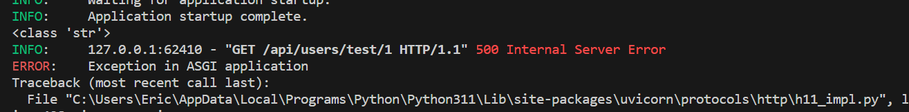

# URL路径参数和类型提示

## 实用部分 - 具有路径参数的端点

本节内容，我们会定义带参数的API，并对其进行测试，为此我们在前一节的文件中继续编写：

根据需求分析，我们todos对象和users对象中还缺少一些对应功能的路由，比如todos中更新或删除todo，users中用户名或者密码的更新。(思考更新路由是对已经存在的路由进行更新，那么我们怎么去分辨已经存在的路由呢？)

答案就是参数，如果每个数据都有参数，那么我们就能区分它们，让路由识别参数从而达到操作特定id数据的行为，下面我们创建带参数的路由，并测试。

下面对`./backend/api/`路径下的`todos.py`和`users.py`文件进行增加。
:::note 代码

```python
todos.py

from fastapi import APIRouter

router = APIRouter()


@router.get("/")
def get_all_todos():
    return {"get": "todos"}


@router.post("/")
def create_todo():
    return {"post": "todos"}

# 新增简单的带参数路由
@router.put("/{todo_id}")
def update_todo():
    todo_id: int
    todo_id = 1  # 根据实际需要赋予一个值

    return {"todo_id": todo_id}

# 新增一个有局部变量的带参路由
@router.delete("/{todo_id}")
def delete_todo():
    todo_id: int
    q: str = None
    todo_id = 2  # 根据实际需要赋予一个值

    return {"todo_id": todo_id, "q": q}
```

上面文件中新增部分的是带参数路由的简单案例，下面我们根据需求分析补充users对象中的部分资源，并学习带有路径参数路由的特点。

```python
users.py

from fastapi import APIRouter

router = APIRouter()

# 字典列表中创建了一些示例配方数据，之后我们会连接到数据库，使用数据库中的数据。
RECIPES = [
    {
        "id": 1,
        "title": "Apple Pie",
        "ingredients": ["apple", "pie"],
        "instructions": "Boil apples",
    },
    {
        "id": 2,
        "title": "Apple Pie",
        "ingredients": ["apple", "salad"],
        "instructions": "Raw apples",
    },
]


@router.post("/")
def create_user():
    return {"post": "users"}

#我们创建了一个新的端点。这里的大括号表示参数值，需要与端点函数采用的参数之一匹配。
@router.get("/test/{id}", status_code=200)
def update_user(*, id: int) -> dict: # 指向数据结构
    result = [recipe for recipe in RECIPES if recipe["id"] == id] # 返回类型被注解为 `dict`，表示返回的是一个字典对象。
    if result:
        return result[0]

# 新建两个后续要使用的端点
@router.put("/name")
def update_user():
    return {"name": "tom"}


@router.put("/password")
def update_user():
    return {"password": 123}

```

本节代码内容`api.py`和`main.py`文件无需改动(这是封装的优点)，下一步，只需要打开`main.py`点击运行即可。
:::

:::tip 提示
`dict`,字典（Dictionary）是 Python 中的一种数据结构，用于存储键-值对（Key-Value Pair）的集合。字典是可变的、无序的，并且可以通过键来快速访问值。

`result = [recipe for recipe in RECIPES if recipe["id"] == id]`
这行代码使用了列表推导式（List comprehension）来筛选出符合条件的字典。假设 RECIPES 是一个包含多个字典的列表，每个字典表示一个食谱，其中包含一个名为 "id" 的键来标识食谱的唯一标识符。
:::

:::info 访问

导航到localhost:8000/docs,我们可以看到：


您发现比起前一节，此时多出了几个带参数路由的API。

尝试使用users中的结点：

- 通过单击展开 GET 端点
- 点击“试用”按钮
- 输入值“1”作为id
- 按下大的“执行”按钮
- 按出现的较小的“执行”按钮


试试其他参数得到的反应叭~
:::

## 基本类型提示问题

让我们添加一个 print 语句来进一步了解端点中发生的情况：

```python
@router.get("/test/{id}", status_code=200)
def update_user(*, id: int) -> dict:
    print(type(id))  # ADDED
    result = [recipe for recipe in RECIPES if recipe["id"] == id]
    if result:
        return result[0]

```

现在，当您试用端点时，您将在终端中看到：


现在将类型提示更改为字符串：

```python
def update_user(*, id: str) -> dict:
# skipping...
```

现在，在终端中，当您调用端点时，您将看到正在打印的字符串。

这是因为 FastAPI 根据函数参数类型提示强制输入参数类型。 这是防止输入错误的便捷方法。 您会注意到，将recipe_id更改为字符串后，您将不再获得对 API 调用的响应。

请思考为什么会有这样的结果。

:::warning 答案
由于 是字符串，因此列表推导式中的匹配项不再与整数 ID 匹配 字典列表中的值。这是一个非常简单的例子，说明 FastAPI 如何与类型提示集成 可以防止许多输入错误，而无需我们在代码中编写额外的检查（更少的代码意味着更少的错误）。`id==RECIPES`
:::

我们只是触及了 FastAPI 如何使用类型提示的表面，在接下来的几个中将对此进行更多介绍教程的部分内容。

本节课程的文件路径图

```bash
E:.
│  .gitignore
│  LICENSE
│  README.md
│
├─.vscode
│      settings.json
│
└─backend
    │  main.py
    │
    ├─api
    │  │  api.py
    │  │  todos.py
    │  │  users.py
    │  │  __init__.py
    │  │
    │  └─__pycache__
    │          api.cpython-311.pyc
    │          todos.cpython-311.pyc
    │          users.cpython-311.pyc
    │          __init__.cpython-311.pyc
    │
    └─__pycache__
            main.cpython-311.pyc

```