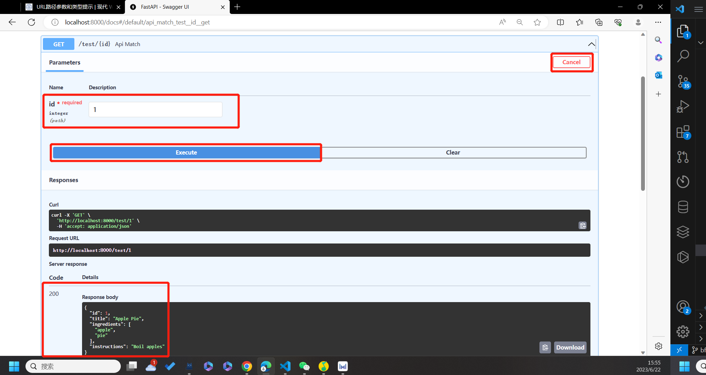
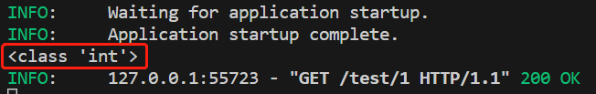
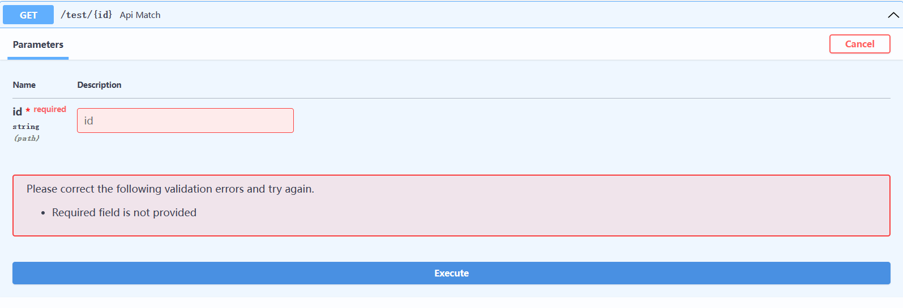

# URL路径参数和类型提示

## 实用部分 - 具有路径参数的端点

本节内容，我们会定义带参数的API，并对其进行测试，为此我们在前一节的文件中继续编写：

思考更新路由是对已经存在的路由进行更新，那么我们怎么去分辨已经存在的路由呢？

答案就是参数，如果每个数据都有参数，那么我们就能区分它们，让路由识别参数从而达到操作特定id数据的行为，下面我们创建带参数的路由，并测试。

:::note 代码
先增加`./backend/recipe_data.py`文件作为数据字典。

```python
RECIPES = [
    {
        "id": 1,
        "title": "Apple Pie",
        "ingredients": ["apple", "pie"],
        "instructions": "Boil apples",
    },
    {
        "id": 2,
        "title": "Apple Pie",
        "ingredients": ["apple", "salad"],
        "instructions": "Raw apples",
    },
]

```

下面对`./backend/main.py`增加


```python
import uvicorn
from fastapi import FastAPI
from recipe_data import RECIPES
from typing import Optional

app = FastAPI()


@app.get("/")
async def root():
    return {"message": "Hello World"}


@app.get("/test/{id}", status_code=200)  # 路由带参
def api_match(*, id: int) -> dict:
    # print(type(id))  # added
    result = [recipe for recipe in RECIPES if recipe["id"] == id]
    if result:
        return result[0]


if __name__ == "__main__":
    uvicorn.run("main:app", reload=True, host="localhost", port=8000)
```

上面文件中新增部分的是带参数路由的简单案例，参数API一般存在两种，一个是在路由中带参数的API，一个是在函数体中带参数的API。
:::info 访问

进入API管理界面



在测试新增的路由，发现结果成功。
:::

## 数据类型提示

:::note

让我们增加一个print语句进一步了解API中发生了什么。

```python
main.py

@app.get("/test/{id}", status_code=200)  # 路由带参
def api_match(*, id: int) -> dict:
    # print(type(id))  # added
    print(type(id))
    result = [recipe for recipe in RECIPES if recipe["id"] == id]
    if result:
        return result[0]
```



现在将类型提示更改为字符串：

```python
def api_match(*, id: str) -> dict:

```



出现报错，现在，在终端中，当您调用端点时，您将看到正在打印的字符串。

这是因为 FastAPI 根据函数参数类型提示强制输入参数类型。 这是防止输入错误的便捷方法。 您会注意到，将recipe_id更改为字符串后，您将不再获得对 API 调用的响应。
:::